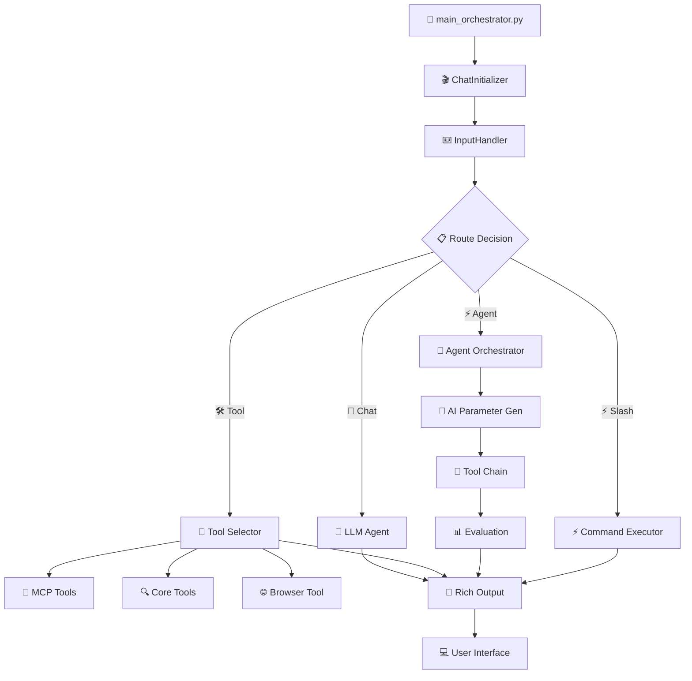
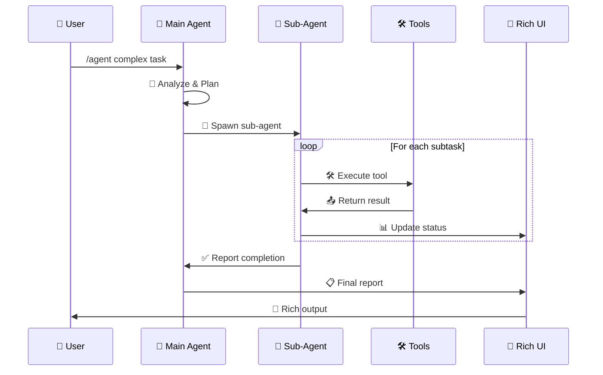

# 🤖 AI-Agent-Workflow

<div align="center">

```text
    ╔══════════════════════════════════════════════════════════════════╗
    ║     🧠  AI-AGENT-WORKFLOW  🧠                                    ║
    ║     Enterprise-Grade Desktop AI Assistant                        ║
    ║     LangGraph • MCP • OpenAI/NVIDIA • Browser Automation        ║
    ╚══════════════════════════════════════════════════════════════════╝
```

[](https://www.python.org/downloads/)
[](https://langchain-ai.github.io/langgraph/)
[](https://opensource.org/licenses/MIT)
[]()

**Production-ready desktop AI assistant with multi-agent architecture, dynamic MCP integration, hybrid AI models, and browser automation.**

</div>

---

## 🧭 Table of Contents

- [🚀 What's New](#-whats-new)
- [✨ Current Status](#-current-status)
- [🌟 What Makes This Special](#-what-makes-this-special)
- [⚡ Slash Commands](#-slash-commands)
- [🛠️ Tool Ecosystem (18 Tools)](#️-tool-ecosystem-18-tools)
- [🔧 Dynamic MCP Integration](#-dynamic-mcp-integration)
- [⚙️ Configuration](#️-configuration)
- [🚀 Quick Start](#-quick-start)
- [🗺️ Project Architecture](#️-project-architecture)
  - [🚀 Entry Points](#-entry-points)
  - [🤖 Agents (LangGraph)](#-agents-langgraph)
  - [⚡ Slash Commands](#-slash-commands-1)
  - [🛠️ Tools + Wrappers](#️-tools--wrappers)
  - [🔌 MCP Integration](#-mcp-integration)
  - [📝 Logging System](#-logging-system)
  - [🎨 UI + CLI Input](#-ui--cli-input)
  - [🔧 Utils + Listeners](#-utils--listeners)
  - [🧠 RAG](#-rag)
  - [🧪 Tests](#-tests)
- [🔄 Data Flow](#-data-flow)
- [🤖 Agent Workflow](#-agent-workflow)
- [📝 Logging System](#-logging-system-1)
- [🎯 Roadmap](#-roadmap)
- [📄 License](#-license)

---

## 🧩 Quick Mental Model (1-minute)

If you remember only *one* picture, remember this:

```text
┌───────────────────────────────────────────────────────────────────────┐
│  You type in CLI  →  Router decides  →  Agent/Tool/MCP runs  → Output  │
│     (prompt_toolkit)       (core)            (tools/mcp)        (ui)   │
└───────────────────────────────────────────────────────────────────────┘
```

---

## 🚀 **What's New**

### v1.9.1 – December 2025 (Latest)
| Feature | Description |
|---------|-------------|
| ⌨️ **Modern CLI Input** | Beautiful autocomplete with prompt_toolkit |
| 🎯 **Slash Command Autocomplete** | Type `/` to see dropdown with commands |
| ⚡ **Custom Key Bindings** | Tab/Enter/Escape for intuitive navigation |
| 🎨 **Cursor/Warp Theme** | Modern dark theme with purple accents |

### v1.9.0 – December 2025
| Feature | Description |
|---------|-------------|
| 📝 **Professional Logging** | Multi-file routing with 84% code reduction |
| 🗂️ **Category Logging** | Separate files: MCP, API, Tools, Agent, Errors |
| 🔄 **Dynamic Routing** | Keyword-based automatic categorization |
| 🏗️ **SOLID Architecture** | Extensible handlers, formatters, routers |

### v1.8.0 – September 2025
| Feature | Description |
|---------|-------------|
| 🌐 **Browser Automation** | browser-use integration for web tasks |
| ⚡ **Slash Commands** | Modular /clear, /help, /agent, /exit |
| 🔌 **Dynamic MCP** | .mcp.json server registration |
| 🛡️ **Circuit Breaker** | OpenAI retry/backoff/fallback |

---

## ✨ **Current Status**

| Component | Status | Details |
|-----------|--------|---------|
| 🚀 **Production Ready** | 95% | Circuit breaker + MCP hardening |
| ⌨️ **CLI Input** | ✅ | Modern autocomplete via prompt_toolkit |
| 📝 **Logging** | ✅ | Multi-file with dynamic routing |
| 🔌 **MCP** | ✅ | Dynamic via `.mcp.json` |
| 🤖 **Agent Mode** | ✅ | Reliable parameter generation |
| 🌐 **Browser** | ✅ | browser-use integration |
| 🐳 **Docker** | ⏳ | Dockerfile ready, compose WIP |
| 🐍 **Python** | 3.13+ | Legacy 3.11 supported |

---

## 🌟 **What Makes This Special**

```
┌─────────────────────────────────────────────────────────────────────────┐
│                         CORE CAPABILITIES                               │
├─────────────────────────────────────────────────────────────────────────┤
│                                                                         │
│  🤖 HYBRID AI          ─→  Ollama (local) + OpenAI/NVIDIA (cloud)      │
│  ⚡ AGENT MODE          ─→  /agent multi-tool orchestration             │
│  🌐 BROWSER             ─→  Automated web browsing & interaction        │
│  🛠️  18 TOOLS            ─→  3 core + 14 MCP filesystem + 1 browser     │
│  📝 LOGGING             ─→  Professional multi-file system              │
│  ⌨️  CLI INPUT           ─→  Modern autocomplete with styling           │
│  🎨 RICH UI             ─→  Beautiful tracebacks & debug windows        │
│                                                                         │
└─────────────────────────────────────────────────────────────────────────┘
```

---

## ⚡ **Slash Commands**

```bash
╭──────────────────────────────────────────────────────────────╮
│  COMMAND        DESCRIPTION                                  │
├──────────────────────────────────────────────────────────────┤
│  /help          📖 Show available commands                   │
│  /agent <task>  🤖 Multi-tool AI orchestration              │
│  /clear         🧹 Clear conversation history               │
│  /exit          👋 Gracefully exit application              │
│  /tool          🔧 Use specific tool directly               │
│  /chat          💬 Normal chat mode                         │
╰──────────────────────────────────────────────────────────────╯
```

**Usage Examples:**
```bash
/agent search for Python tutorials and save to a file
/help
/clear
/exit
```

---

## 🛠️ **Tool Ecosystem (18 Tools)**

| Category | Tools | Description |
|----------|-------|-------------|
| **🔍 Core (3)** | `google_search`, `rag_search`, `translate` | Search, RAG, translation |
| **📂 MCP Filesystem (14)** | `read_file`, `write_file`, `list_directory`, etc. | File operations via MCP |
| **🌐 Browser (1)** | `browser_tool` | Automated web browsing |

---

## 🔧 **Dynamic MCP Integration**

Create `.mcp.json` at project root:

```json
{
  "servers": {
    "filesystem": {
      "command": "npx",
      "args": ["-y", "@modelcontextprotocol/server-filesystem@latest", "<PATH>"]
    },
    "memory": {
      "command": "npx",
      "args": ["-y", "@modelcontextprotocol/server-memory@latest"]
    },
    "github": {
      "command": "npx", 
      "args": ["-y", "@modelcontextprotocol/server-github@latest"]
    }
  }
}
```

**Features:**
- ✅ Auto-discovery and registration
- ✅ Universal MCP routing
- ✅ Dynamic tool→server mapping
- ✅ Robust subprocess I/O

---

## ⚙️ **Configuration**

### Environment Variables (`.env`)

```env
# ═══════════════════════════════════════════════════════════════
#                        API KEYS
# ═══════════════════════════════════════════════════════════════
OPENAI_API_KEY=your_nvidia_or_openai_key

# ═══════════════════════════════════════════════════════════════
#                        MODELS
# ═══════════════════════════════════════════════════════════════
DEFAULT_MODEL=llava-llama3:latest
GPT_MODEL=openai/gpt-oss-120b
CLASSIFIER_MODEL=llama3.1:8b

# ═══════════════════════════════════════════════════════════════
#                        TIMEOUTS
# ═══════════════════════════════════════════════════════════════
OPENAI_TIMEOUT=60
OPENAI_CONNECT_TIMEOUT=10
MCP_TIMEOUT=30
BROWSER_USE_TIMEOUT=1300

# ═══════════════════════════════════════════════════════════════
#                        SOCKETS
# ═══════════════════════════════════════════════════════════════
SOCKET_HOST=localhost
SOCKET_PORT=5390

# ═══════════════════════════════════════════════════════════════
#                        LOGGING
# ═══════════════════════════════════════════════════════════════
LOG_DISPLAY_MODE=separate_window
LOG_LEVEL=INFO

# ═══════════════════════════════════════════════════════════════
#                        FEATURES
# ═══════════════════════════════════════════════════════════════
BROWSER_USE_ENABLED=true
MCP_ENABLED=true
DEBUG=false
```

### Key Settings Summary

| Category | Setting | Default |
|----------|---------|---------|
| **API** | `OPENAI_API_KEY` | Required |
| **Models** | `GPT_MODEL` | `openai/gpt-oss-120b` |
| **Timeout** | `OPENAI_TIMEOUT` | 60s |
| **Socket** | `SOCKET_PORT` | 5390 |
| **Browser** | `BROWSER_USE_TIMEOUT` | 1300s |
| **MCP** | `MCP_TIMEOUT` | 30s |
| **Logging** | `LOG_DISPLAY_MODE` | `separate_window` |

---

## 🚀 **Quick Start**

```bash
# 1. Clone
git clone https://github.com/PIRATE-E/ai-workflow-task-agent.git
cd ai-workflow-task-agent

# 2. Virtual Environment
python -m venv .venv
.venv\Scripts\activate          # Windows
# source .venv/bin/activate     # Linux/Mac

# 3. Install
pip install -r requirements.txt

# 4. Configure
cp .env.example .env
# Edit .env with your API keys

# 5. Run
python src/main_orchestrator.py
```

---

## 🗺️ **Project Architecture**

> The goal of this section is **navigation**. If you're new, start from **Entry Points**, then follow the arrows.

```text
ENTRY → CORE → (SLASH | AGENT | TOOLS | MCP) → UI/LOGS
```

### 🚀 Entry Points

```text
src/
├── main_orchestrator.py         ✅ Program entry (boot + wiring)
└── core/
    ├── chat_initializer.py      ✅ Starts chat loop, registers tools/commands
    └── chat_destructor.py       ✅ Cleanup (exit flow, shutdown)
```

### 🤖 Agents (LangGraph)

```text
src/agents/
├── agent_mode_node.py           # /agent orchestration node
├── classify_agent.py            # route user input (chat/tool/agent/slash)
├── router.py                    # routing logic
├── tool_selector.py             # selects tools for tasks
├── node_factory.py              # builds graph nodes
├── chat_llm.py                  # talks to LLM
├── agents_schema/               # typed schemas
│   └── agents_schema.py
└── agentic_orchestrator/        # hierarchical orchestration
    ├── AgentGraphCore.py
    └── hierarchical_agent_prompts.py
```

### ⚡ Slash Commands

```text
src/slash_commands/
├── parser.py                    # parse '/command args'
├── executionar.py               # run command handler
├── protocol.py                  # SlashCommand dataclasses
├── on_run_time_register.py      # runtime registry (singleton)
└── commands/
    ├── help.py                  # /help
    ├── clear.py                 # /clear
    ├── exit.py                  # /exit
    └── core_slashs/
        ├── agent.py             # /agent
        ├── chat_llm.py          # /chat
        └── use_tool.py          # /tool
```

### 🛠️ Tools + Wrappers

```text
src/tools/
└── lggraph_tools/
    ├── tool_assign.py
    ├── tool_selector.py
    ├── tool_response_manager.py
    ├── tools/
    │   ├── google_search_tool.py
    │   ├── browser_tool.py
    │   ├── browser_subprocess_runner.py
    │   ├── translate_tool.py
    │   ├── run_shell_command_tool.py
    │   ├── rag_search_classifier_tool.py
    │   └── mcp_integrated_tools/
    │       ├── filesystem.py
    │       └── universal.py
    ├── wrappers/
    │   ├── google_wrapper.py
    │   ├── browser_use_wrapper.py
    │   ├── translate_wrapper.py
    │   ├── rag_search_classifier_wrapper.py
    │   ├── run_shell_comand_wrapper.py
    │   └── mcp_wrapper/
    │       ├── filesystem_wrapper.py
    │       └── uni_mcp_wrappers.py
    └── tool_schemas/
        └── tools_structured_classes.py
```

### 🔌 MCP Integration

```text
src/mcp/
├── load_config.py               # reads .mcp.json
├── manager.py                   # starts/stops MCP servers
├── dynamically_tool_register.py # registers discovered MCP tools
└── mcp_register_structure.py

.mcp.json                         # MCP servers config (at repo root)
```

### 📝 Logging System

```text
src/system_logging/
├── protocol.py                  # LogEntry + enums
├── adapter.py                   # DebugMessage → LogEntry
├── router.py                    # keyword routing
├── dispatcher.py                # dispatch to handlers
├── formatter.py                 # pretty formatting
├── on_time_registry.py          # singleton registry
└── handlers/
    └── handler_base.py          # TextHandler (+ rotation)

src/basic_logs/                   # output log files
├── log_MCP_SERVER.txt
├── log_API_CALL.txt
├── log_TOOL_EXECUTION.txt
├── log_AGENT_WORKFLOW.txt
└── log_OTHER.txt
```

### 🎨 UI + CLI Input

```text
src/ui/
├── chatInputHandler.py          # ⌨️ prompt_toolkit input + autocomplete
├── print_banner.py
├── print_history.py
├── print_message_style.py
├── rich_error_print.py
└── diagnostics/
    ├── debug_helpers.py
    ├── debug_message_protocol.py
    └── rich_traceback_manager.py
```

### 🔧 Utils + Listeners

```text
src/utils/
├── open_ai_integration.py       # OpenAI/NVIDIA integration + circuit breaker
├── model_manager.py             # model loading/switching
├── socket_manager.py            # socket plumbing
├── error_transfer.py            # log receiver server
├── argument_schema_util.py
└── listeners/
    ├── event_listener.py
    ├── exit_listener.py
    └── rich_status_listen.py
```

### 🧠 RAG

```text
src/RAG/
└── RAG_FILES/
    ├── rag.py
    ├── neo4j_rag.py
    ├── sheets_rag.py
    └── chromaDB_patents/
```

### 🧪 Tests

```text
tests/
├── run_tests.py
├── error_handling/
├── event_listener/
├── integration/
├── model_manager_tests/
├── serialization/
├── slashcommands/
├── test_agent_workflow/
└── test_browser_use/
```

---

## 🔄 **Data Flow**



---

## 🤖 **Agent Workflow**



---

## 📝 **Logging System**

```
┌─────────────────────────────────────────────────────────────────────────┐
│                    PROFESSIONAL LOGGING ARCHITECTURE                     │
├─────────────────────────────────────────────────────────────────────────┤
│                                                                          │
│   Your Code                                                             │
│      │                                                                   │
│      ▼                                                                   │
│   debug_info("MCP", "Server started")                                   │
│      │                                                                   │
│      ▼                                                                   │
│   ┌─────────────────┐                                                   │
│   │ ProtocolAdapter │ ──→ Converts to LogEntry                         │
│   └────────┬────────┘                                                   │
│            ▼                                                            │
│   ┌─────────────────┐                                                   │
│   │     Router      │ ──→ Keyword-based routing                        │
│   └────────┬────────┘                                                   │
│            ▼                                                            │
│   ┌─────────────────┐    ┌────────────────────────────────────────┐    │
│   │   TextHandler   │───→│ log_MCP_SERVER.txt    (MCP logs)       │    │
│   │   (with rotation)│───→│ log_API_CALL.txt      (API logs)       │    │
│   │                 │───→│ log_TOOL_EXECUTION.txt (Tool logs)      │    │
│   │                 │───→│ log_AGENT_WORKFLOW.txt (Agent logs)     │    │
│   │                 │───→│ log_OTHER.txt         (Other logs)      │    │
│   └─────────────────┘    └────────────────────────────────────────┘    │
│                                                                          │
│   Features: 84% code reduction, SOLID principles, file rotation         │
│                                                                          │
└─────────────────────────────────────────────────────────────────────────┘
```

---

## 🎯 **Roadmap**

### Near-term (3 months)
- [ ] 99% Agent Mode reliability
- [ ] 50% faster responses
- [ ] Extended MCP server support

### Medium-term (6-12 months)
- [ ] Complete Docker deployment
- [ ] User profiles & preferences
- [ ] REST API for integrations
- [ ] Multi-agent collaboration

### Long-term (1+ year)
- [ ] Advanced reasoning
- [ ] Industry-specific solutions
- [ ] Open-source ecosystem

---

## 📄 **License**

MIT License - See [LICENSE](LICENSE) for details.

---

<div align="center">

**Built with ❤️ for enterprise-grade AI agent development**

*AI-Agent-Workflow v1.9.1 – December 2025*

```
╔══════════════════════════════════════════════════════════════════╗
║  🧠 Transforming AI assistant development                       ║
║     with enterprise-grade architecture                           ║
╚══════════════════════════════════════════════════════════════════╝
```

</div>
