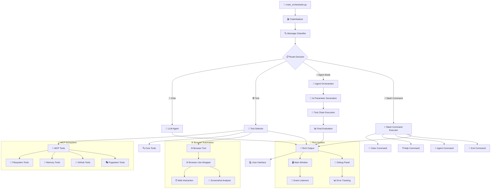
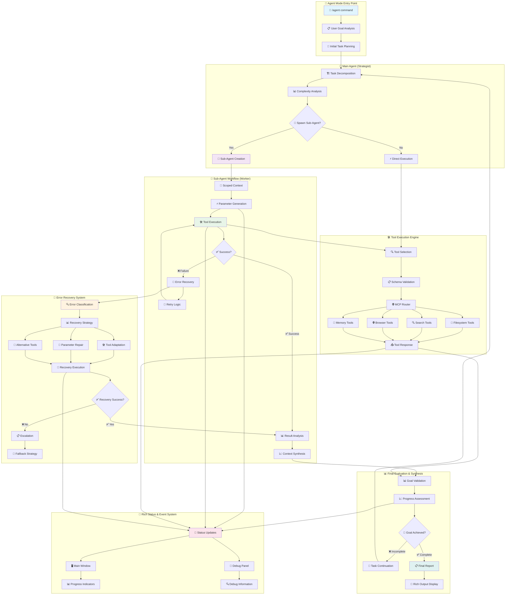
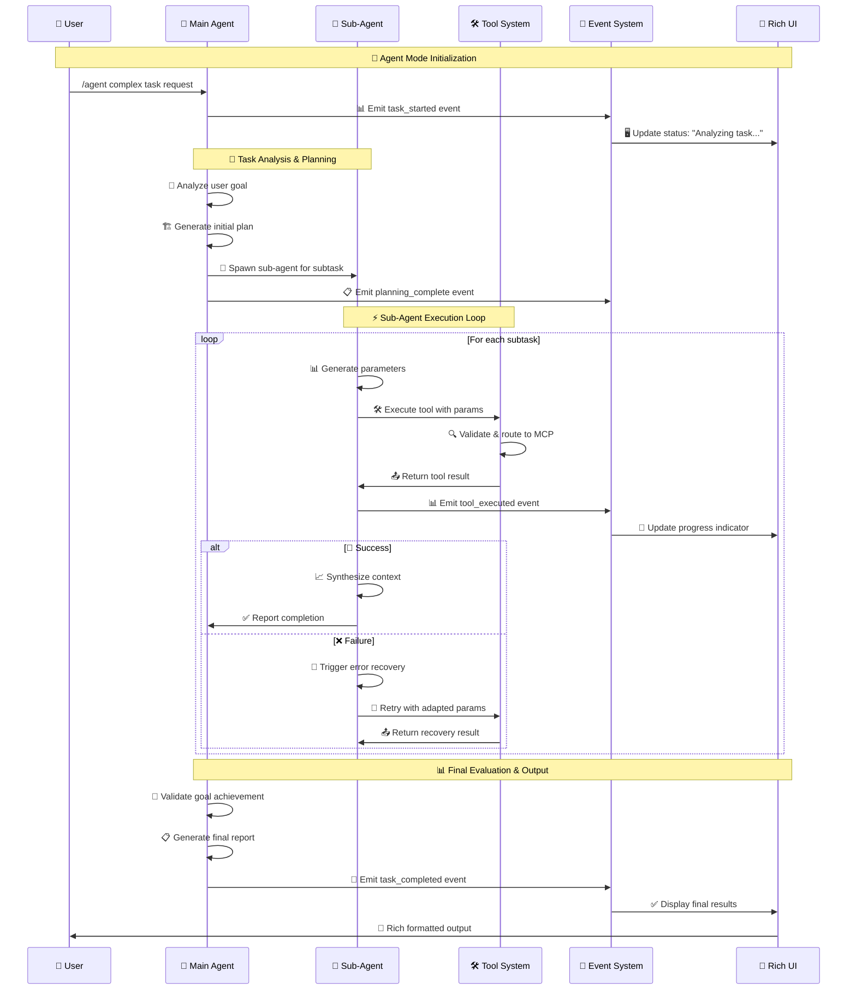
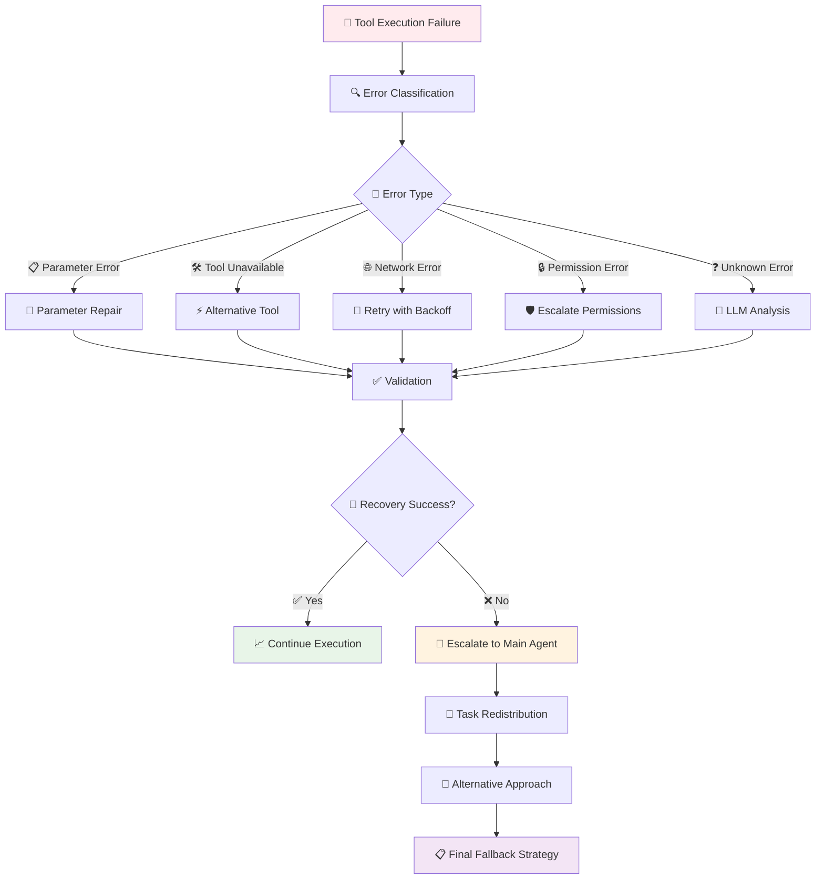

# 🤖 AI-Agent-Workflow Project

> Enterprise-grade desktop AI assistant with LangGraph multi-agent architecture, dynamic MCP integration via .mcp.json, universal MCP routing, hybrid OpenAI/NVIDIA integration (with circuit breaker), local Ollama support, Rich Traceback, browser automation, and professional workflows.

[](https://www.python.org/downloads/)
[](https://langchain-ai.github.io/langgraph/)
[](https://opensource.org/licenses/MIT)
[]()

---

## 🚀 What's New (v1.8.0 – September 2025)
- ✅ **Browser Agent Integration** - Automated web browsing with browser-use tool wrapper
- ✅ **Slash Commands System** - Modular command framework (/clear, /help, /agent, /exit)
- ✅ **Enhanced Tool Ecosystem** - Now 18 total tools with browser automation
- ✅ **Dynamic MCP Integration** - Server registration from .mcp.json (no code edits required)
- ✅ **Universal MCP Routing** - UniversalMCPWrapper with static+dynamic tool→server mapping
- ✅ **Robust MCP Manager** - ServerConfig/Command enum, safer subprocess I/O, encoding fallbacks
- ✅ **OpenAI Circuit Breaker** - Automatic failure detection, retry/backoff, fallback responses
- ✅ **Rich Traceback System** - Visual debugging with separate debug windows
- ✅ **Dockerization** - Dockerfile + docker-compose for simple container runs (NOT IMPLEMENTED YET)
- ✅ **Python 3.13** - Updated target via pyproject.toml

## ✨ Current Status
- **Production Readiness**: 95% → Stability improved via circuit breaker + MCP hardening
- **MCP**: Fully dynamic via .mcp.json at project root (path set in settings.MCP_CONFIG.MCP_CONFIG_PATH)
- **Agent Mode**: More reliable parameter generation and MCP tool execution
- **Browser Automation**: Integrated browser-use tool for web automation tasks
- **DevOps**: Container-first workflow supported (build and run via docker-compose)
- **Compatibility**: Python 3.13 baseline; legacy 3.11 works with requirements.txt

---

## 🌟 **What Makes This Special?**

This is a **production-ready consumer desktop AI assistant** with enterprise-grade architecture featuring:

- **🤖 Hybrid AI Integration**: Seamless switching between local Ollama models and OpenAI/NVIDIA API with intelligent rate limiting (30 requests/minute)
- **⚡ Agent Mode**: Revolutionary `/agent` command triggering multi-tool orchestration with AI-powered parameter generation
- **🌐 Browser Automation**: Intelligent web browsing with browser-use integration for automated web tasks
- **🛠️ 18-Tool Ecosystem**: 3 fundamental tools + 14 dynamic MCP filesystem tools + 1 browser automation tool
- **🎨 Rich Traceback System**: Enterprise-grade error handling with visual debugging and separate debug windows
- **📡 Event-Driven Architecture**: Complete listener system with Rich.status integration for real-time updates
- **⚡ Slash Commands**: Modular command system for enhanced user interaction
- **🔒 Privacy-First Design**: Local processing with optional cloud model integration
- **🏗️ LangGraph Multi-Agent**: Production-ready conversation orchestration with StateAccessor singleton pattern

---

## ✨ **Core Features**

### 🧠 **Hybrid AI System**
- **Local Ollama Support**: Privacy-focused local model processing
- **OpenAI/NVIDIA Integration**: Cloud models with intelligent rate limiting (30 requests/minute)
- **Automatic Model Switching**: Seamless hybrid operation based on availability and preferences
- **Rate Limit Management**: Built-in protection against API rate limit violations

### ⚡ **Agent Mode (`/agent` Command)**
- **Multi-Tool Orchestration**: Intelligent tool chain execution with AI parameter generation
- **Context-Aware Execution**: Maintains execution history and reasoning chains for better results
- **Tool Fallback Support**: Automatic recovery with alternative tools when primary tools fail
- **Simplified Final Evaluation**: Streamlined workflow quality assessment (v4.0)

### 🌐 **Browser Automation**
- **Automated Web Browsing**: Intelligent web navigation and interaction
- **Browser-Use Integration**: Advanced browser automation capabilities
- **Web Task Execution**: Form filling, data extraction, page navigation
- **Visual Web Interaction**: Screenshot-based interaction understanding

### 🛠️ **Comprehensive Tool System (18 Total)**

#### **Fundamental Tools (3)**
- **google_search**: Web search capabilities for current information
- **rag_search**: Knowledge base search using retrieval-augmented generation
- **Translate**: Language translation services

#### **MCP Filesystem Tools (14)**
- **File Operations**: Read, write, create, delete files with proper encoding
- **Directory Management**: List, create, navigate directory structures
- **Search Capabilities**: Find files and content across the filesystem
- **JSON-RPC Protocol**: Professional MCP integration with dynamic tool discovery

#### **Browser Automation Tool (1)**
- **Browser Tool**: Automated web browsing and interaction capabilities
- **Browser-Use Wrapper**: Integration with browser-use for intelligent web automation

### 🎨 **Rich Traceback & Debugging System**
- **Visual Error Handling**: Beautiful tracebacks with syntax highlighting and variable inspection
- **Separate Debug Windows**: Error routing to dedicated debug panel vs user notifications
- **Structured Diagnostics**: Transport-agnostic logging with metadata-rich events
- **Socket-Based Routing**: Network-based log aggregation for clean separation
- **Performance Monitoring**: Error categorization, frequency tracking, and debugging statistics

### 📡 **Event-Driven Architecture**
- **RichStatusListener**: Automatic status updates with Rich.status integration
- **EventManager**: Singleton pattern with thread-safe event processing
- **Variable Change Detection**: Automatic event emission when object properties change
- **Memory Leak Prevention**: WeakKeyDictionary for automatic cleanup
- **Event Filtering**: Targeted event routing with metadata-based filtering

### ⚡ **Slash Commands System**
- **Modular Command Framework**: Extensible slash command architecture
- **Built-in Commands**: `/clear`, `/help`, `/agent`, `/exit` with proper lifecycle management
- **Runtime Registry**: Dynamic command registration and execution
- **Command Lifecycle**: Proper initialization, execution, and cleanup handling

---

## ⚡ **Slash Commands**

The AI-Agent-Workflow includes a comprehensive slash command system for enhanced user interaction:

### **Available Commands**
```bash
/clear      # Clear conversation history and reset context
/help       # Display available commands and usage information  
/agent      # Trigger multi-tool agent orchestration mode
/exit       # Gracefully exit the application with cleanup
```

### **Command Features**
- **Modular Architecture**: Each command is independently implemented and registered
- **Runtime Registry**: Commands are dynamically registered during initialization
- **Lifecycle Management**: Proper command initialization, execution, and cleanup
- **Exit Flow**: Two-emit ticket system ensures graceful shutdown with farewell messages

### **Usage Examples**
```bash
# Clear conversation and start fresh
/clear

# Get help with available commands
/help

# Trigger intelligent agent mode for complex tasks
/agent search for Python tutorials and save the best ones to a file

# Exit the application gracefully
/exit
```

---

## 🔧 Dynamic MCP Integration

The AI-Agent-Workflow now supports **dynamic MCP server registration** through a simple `.mcp.json` configuration file placed at the project root.

### Configuration
Place `.mcp.json` at repo root. Example:
```json
{
  "servers": {
    "filesystem": { "command": "npx", "args": ["-y","@modelcontextprotocol/server-filesystem@latest","<ABS_PATH>"] },
    "memory": { "command": "npx", "args": ["-y","@modelcontextprotocol/server-memory@latest"] },
    "github": { "command": "npx", "args": ["-y","@modelcontextprotocol/server-github@latest"] },
    "puppeteer": { "command": "npx", "args": ["-y","@modelcontextprotocol/server-puppeteer@latest"] }
  }
}
```

### Features
- **Universal MCP Routing**: UniversalMCPWrapper with static+dynamic tool→server mapping
- **Auto Registration**: ChatInitializer loads and starts servers asynchronously; discovered tools are auto-registered
- **Robust Manager**: ServerConfig/Command enum, safer subprocess I/O, encoding fallbacks, tool discovery mapping
- **Configuration Path**: Set via `settings.MCP_CONFIG.MCP_CONFIG_PATH` (defaults to project root `.mcp.json`)

---

## ⚙️ **Settings Configuration**

The AI-Agent-Workflow Project provides comprehensive configuration through environment variables and settings files:

### **🔧 Core Settings (src/config/settings.py)**

#### **API Configuration**
```python
# OpenAI/NVIDIA API Settings
OPEN_AI_API_KEY = "your_nvidia_api_key_here"      # NVIDIA API key for cloud models
OPENAI_TIMEOUT = 30                                # Request timeout in seconds
OPENAI_BASE_URL = "https://integrate.api.nvidia.com/v1"  # NVIDIA endpoint

# Local Model Settings  
OLLAMA_HOST = "http://localhost:11434"             # Ollama server endpoint
GPT_MODEL = "llama3.2:latest"                     # Default local model
```

#### **MCP Configuration**
```python
# MCP Server Management
MCP_CONFIG_PATH = ".mcp.json"                     # Path to MCP configuration file
MCP_TIMEOUT = 30                                  # MCP server startup timeout
MCP_RETRY_COUNT = 3                               # Retry attempts for failed servers
```

#### **Rate Limiting**
```python
# API Rate Limiting
OPENAI_RATE_LIMIT = 30                            # Requests per minute
RATE_LIMIT_BUFFER = 5                             # Buffer for rate limiting
```

#### **Debug & Monitoring**
```python
# Debug Configuration
LOG_DISPLAY_MODE = True                           # Enable visual debug windows
RICH_TRACEBACK_ENABLED = True                    # Enable Rich traceback system
DEBUG_SOCKET_PORT = 5390                         # Debug message socket port

# Monitoring
SENTRY_DSN = "your_sentry_dsn_here"              # Sentry error monitoring
PERFORMANCE_MONITORING = True                    # Enable performance tracking
```

#### **Agent Mode Settings**
```python
# Agent Orchestration
AGENT_MAX_TOOLS = 10                             # Maximum tools per agent execution
AGENT_TIMEOUT = 300                              # Agent execution timeout (seconds)
AGENT_RETRY_COUNT = 2                            # Retry attempts for failed operations
```

### **🌍 Environment Variables (.env)**
Create a `.env` file in the project root:
```env
# Required API Keys
OPEN_AI_API_KEY=your_nvidia_api_key_here
SENTRY_DSN=your_sentry_dsn_here

# Model Configuration
OLLAMA_HOST=http://localhost:11434
GPT_MODEL=llama3.2:latest

# Timeouts & Limits
OPENAI_TIMEOUT=30
OPENAI_RATE_LIMIT=30

# Debug Settings
LOG_DISPLAY_MODE=true
DEBUG_SOCKET_PORT=5390

# MCP Configuration
MCP_CONFIG_PATH=.mcp.json
MCP_TIMEOUT=30
```

### **📋 Settings Categories**

| Category | Purpose | Key Settings |
|----------|---------|--------------|
| **API** | Cloud model integration | `OPEN_AI_API_KEY`, `OPENAI_TIMEOUT`, `OPENAI_BASE_URL` |
| **Local** | Ollama configuration | `OLLAMA_HOST`, `GPT_MODEL` |
| **MCP** | Tool server management | `MCP_CONFIG_PATH`, `MCP_TIMEOUT`, `MCP_RETRY_COUNT` |
| **Debug** | Development & troubleshooting | `LOG_DISPLAY_MODE`, `DEBUG_SOCKET_PORT`, `RICH_TRACEBACK_ENABLED` |
| **Agent** | Multi-tool orchestration | `AGENT_MAX_TOOLS`, `AGENT_TIMEOUT`, `AGENT_RETRY_COUNT` |
| **Monitor** | Performance & error tracking | `SENTRY_DSN`, `PERFORMANCE_MONITORING` |

---

## ⚙️ OpenAI/NVIDIA Circuit Breaker

Enhanced OpenAI integration with enterprise-grade reliability features:

- **Circuit Breaker Pattern**: Automatic failure detection and recovery
- **Retry Logic**: Exponential backoff for failed requests
- **Fallback Responses**: Graceful degradation when API unavailable
- **Streaming Safety**: Robust handling of streaming/non-streaming responses
- **Rate Limiting**: Improved UX and diagnostics for async rate limiting

---

## 🐳 Dockerization

Container-first workflow for simplified deployment:

```bash
# Quick start with docker-compose
docker compose up --build

# Or build and run manually
docker build -t ai-agent .
docker run --rm -it -p 8000:8000 -v ./src:/app/src ai-agent
```

---

## 🚀 **Quick Start**

### **Prerequisites**
```bash
Python 3.13+ (recommended)
Virtual environment (recommended)
Node.js (for MCP servers)
Docker (optional, for containerized deployment)
```

### **Installation**
```bash
# Clone the repository
git clone https://github.com/PIRATE-E/AI-Agent-Workflow-Project.git
cd AI-Agent-Workflow-Project

# Create virtual environment
python -m venv .venv
.venv\Scripts\activate  # Windows
# source .venv/bin/activate  # Linux/Mac

# Install dependencies
pip install -r requirements.txt
```

### **Configuration**
Create `.env` file in the project root (see Settings Configuration section above for complete details).

Create `.mcp.json` file in the project root (see Dynamic MCP Integration section for examples).

### **Run the Application**
```bash
python src/main_orchestrator.py
```

---

## 💬 **Usage Guide**

### **Basic Conversation**
```
You: What is the capital of France?
AI: The capital of France is Paris...
```

### **Slash Commands**
```bash
# Clear conversation history
/clear

# Get help with commands
/help

# Trigger agent mode for complex tasks
/agent search for the latest AI developments and create a summary

# Exit the application
/exit
```

### **Tool Commands**
```bash
# Force web search
search latest AI developments

# Force LLM response  
explain quantum computing

# Browser automation
navigate to github.com and search for AI projects
```

### **Agent Mode Examples**
```bash
# Multi-step file operations
/agent read the README file, summarize it, and create a project overview

# Web research and documentation
/agent search for Python best practices and save them to a markdown file

# Complex automation workflows
/agent browse to a website, extract data, and create a report
```

---

## 🏗️ **Project Architecture**

The AI-Agent-Workflow Project follows a modular, enterprise-grade architecture with clear separation of concerns:

### **🎯 Core System Components**
```
📁 src/
├── 🚀 main_orchestrator.py                    # Application entry point with Rich Traceback
├── 📁 agents/                                 # Multi-agent orchestration system
│   ├── 🤖 agent_mode_node.py                 # Agent mode orchestration with context tracking
│   ├── 💬 chat_llm.py                        # LLM communication and response handling
│   ├── 🔍 classify_agent.py                  # Message classification for routing
│   ├── 🧭 router.py                          # Message routing between processing nodes
│   ├── 🛠️ tool_selector.py                   # Tool selection logic based on user input
│   └── 📁 agentic_orchestrator/              # Hierarchical agent workflow system
│       ├── 🏗️ AgentGraphCore.py              # Core hierarchical agent orchestration
│       └── 📝 hierarchical_agent_prompts.py  # Depth-aware prompt templates
├── 📁 config/                                # Configuration management
│   ├── ⚙️ settings.py                        # Application settings and configuration variables
│   └── 📝 configure_logging.py               # Logging configuration and setup helpers
├── 📁 core/                                  # Core system components
│   ├── 🎬 chat_initializer.py                # Chat system initialization and setup
│   └── 📁 graphs/                            # LangGraph workflow definitions
├── 📁 models/                                # Data models and state management
│   └── 🔄 state.py                           # State management with StateAccessor singleton
├── 📁 prompts/                               # AI prompt templates
│   ├── 🎯 agent_mode_prompts.py              # Prompts for agent mode operations
│   └── 💭 open_ai_prompt.py                  # OpenAI-specific prompt templates
├── 📁 slash_commands/                        # Slash command system
│   ├── ⚡ parser.py                          # Command parsing and validation
│   ├── 🔧 executor.py                        # Command execution engine
│   ├── 📋 handlers/                          # Individual command handlers
│   │   ├── 🧹 clear.py                       # Clear conversation command
│   │   ├── ❓ help.py                        # Help and usage command  
│   │   ├── 🤖 agent.py                       # Agent mode command
│   │   └── 🚪 exit.py                        # Exit application command
│   └── 🏗️ commands/                          # Command infrastructure
├── 📁 tools/lggraph_tools/                   # Tool ecosystem (18 tools)
│   ├── 📋 tool_assign.py                     # Tool registry and assignment management
│   ├── 📤 tool_response_manager.py           # Response handling from tool executions
│   ├── 📁 tools/                             # Core tool implementations
│   │   ├── 🔍 google_search_tool.py         # Google search functionality
│   │   ├── 🧠 rag_search_tool.py            # Knowledge base search (RAG)
│   │   ├── 🌐 translate_tool.py             # Translation services
│   │   ├── 💻 run_shell_command_tool.py     # Shell command execution
│   │   ├── 🌐 browser_tool.py               # Browser automation tool
│   │   └── 📁 mcp_integrated_tools/         # MCP filesystem integration
│   │       └── 📂 filesystem.py             # File operations (14 dynamic tools)
│   ├── 📁 wrappers/                          # Tool wrapper implementations
│   │   └── 🌐 browser_use_wrapper.py        # Browser-use integration wrapper
│   └── 📁 tool_schemas/                      # Tool argument schemas and validation
│       └── 🏗️ tools_structured_classes.py   # Structured tool class definitions
├── 📁 utils/                                 # Supporting infrastructure utilities
│   ├── 🔀 model_manager.py                   # Hybrid model management (Ollama/OpenAI)
│   ├── 🌐 open_ai_integration.py             # OpenAI/NVIDIA API integration with circuit breaker
│   ├── 🔧 argument_schema_util.py            # Tool argument schema extraction and validation
│   ├── 📡 error_transfer.py                  # Raw socket server for debug messages and error logs
│   ├── 🔌 socket_manager.py                  # Subprocess log server management with legacy bridge
│   └── 📁 listeners/                         # Event-driven architecture
│       ├── 📡 event_listener.py              # Core event management system
│       └── 🎨 rich_status_listen.py          # Rich status integration
└── 📁 ui/                                    # User interface and diagnostics
    ├── 🎨 print_message_style.py             # Message formatting and styling
    ├── 🎪 print_banner.py                    # Application banner display
    └── 📁 diagnostics/                       # Rich Traceback system
        ├── 🔧 rich_traceback_manager.py      # Enterprise-grade error handling
        ├── 🛟 debug_helpers.py               # Debug message helpers
        └── 📨 debug_message_protocol.py      # Debug transport protocol
```

### **🔌 Enhanced MCP Integration**
```
📁 src/mcp/
├── 🎛️ manager.py                            # MCP server lifecycle management
├── 🔄 dynamically_tool_register.py          # Dynamic MCP tool registration
├── 📥 load_config.py                        # MCP configuration loading (.mcp.json)
└── 🏗️ mcp_register_structure.py            # MCP registration structure definitions
```

### **🧠 Next-Gen RAG System**
```
📁 src/RAG/
└── 📁 RAG_FILES/                            # Knowledge base and retrieval files
    ├── 🗄️ neo4j_rag.py                      # Neo4j graph database integration
    └── 📚 knowledge_base/                   # Document storage and indexing
```

### **🧪 Testing Infrastructure**
```
📁 tests/
├── 🔬 run_tests.py                          # Test suite execution
├── 📁 event_listener/                       # Event system testing
│   ├── 🎯 quick_validation.py              # Fast event system validation
│   ├── 🧪 test_event_listener_realistic.py # Realistic event testing scenarios
│   └── 📊 run_listener_test.py             # Comprehensive listener testing
├── 📁 integration/                          # Integration testing
│   ├── 🔗 test_mcp_integration.py          # MCP server integration tests
│   └── 🤖 test_agent_mode.py               # Agent mode functionality tests
└── 📁 slashcommands/                        # Slash command testing
    ├── 📝 test_parser.py                    # Command parsing tests
    ├── 🔧 test_handlers.py                  # Handler functionality tests
    ├── ⚡ test_executor.py                  # Execution engine tests
    └── 🌊 test_full_flow.py                 # End-to-end command flow tests
```

### **📊 Configuration & DevOps**
```
📁 Project Root
├── 🐳 Dockerfile                           # Container deployment configuration
├── 🐙 docker-compose.yml                   # Multi-container orchestration
├── ⚙️ .mcp.json                            # Dynamic MCP server configuration
├── 🔧 pyproject.toml                       # Python project configuration
├── 📦 requirements.txt                     # Python dependencies
├── 🌍 .env                                 # Environment variables
├── 🔒 uv.lock                              # Dependency lock file
└── 📁 copilot_instructions/                # Development guidelines
    └── 📘 mcp_instructions.md              # MCP integration guidelines
```

---

## 🔄 **Data Flow Architecture**



---

## 🤖 **Agent Workflow (Visualization)**

The Agent Mode represents the most sophisticated component of the AI-Agent-Workflow Project, featuring intelligent multi-tool orchestration with hierarchical task decomposition and context-aware execution.

### **🎯 Hierarchical Agent Orchestration Flow**



### **🔄 Agent Mode Execution Phases**



### **🧠 Agent Intelligence Features**

| Feature | Description | Implementation |
|---------|-------------|----------------|
| **🎯 Context Scoping** | Prevents prompt dilution by providing focused context to sub-agents | `scoped_context` parameter in spawning |
| **⚡ Just-in-Time Parameters** | Generates tool parameters dynamically based on current context | `AI parameter generation` before each tool call |
| **🔄 Recursive Spawning** | Sub-agents can spawn their own sub-agents for complex decomposition | `hierarchical task breakdown` with depth limits |
| **🛠️ Tool Adaptation** | Automatically selects alternative tools when primary tools fail | `fallback tool selection` in error recovery |
| **📊 Progress Tracking** | Real-time progress updates with Rich status integration | `event-driven status updates` throughout execution |
| **🔧 Error Recovery** | Multi-tiered error handling with systematic recovery strategies | `classification → strategy → execution → validation` |
| **🎨 Visual Debugging** | Rich traceback integration for detailed execution visibility | `debug panel routing` with structured diagnostics |
| **📈 Goal Validation** | Semantic validation of task completion against original user intent | `goal achievement analysis` before finalization |

### **🔧 Error Recovery Strategies**



### **🎯 Agent Mode Benefits**

- **🚀 Intelligent Automation**: Converts complex user requests into executable multi-step workflows
- **🧠 Context Awareness**: Maintains execution history and reasoning chains for better decision-making
- **🔄 Self-Healing**: Automatic error recovery with systematic fallback strategies
- **⚡ Dynamic Adaptation**: Real-time tool selection and parameter adjustment based on execution context
- **📊 Progress Transparency**: Rich visual feedback with detailed execution visibility
- **🎨 Professional UX**: Enterprise-grade user experience with polished error handling
- **🔧 Extensible Architecture**: Modular design enabling easy addition of new tools and capabilities

---

## 📄 License

This project is licensed under the MIT License - see the [LICENSE](LICENSE) file for details.

### MIT License Summary
- **Commercial Use** - Permitted
- **Modification** - Permitted
- **Distribution** - Permitted
- **Private Use** - Permitted
- **Liability** - Limited
- **Warranty** - None provided

---


## 🎯 Roadmap

### Near-term Goals (Next 3 months)
- **Complete Agent Mode Optimization** - Achieve 99% reliability
- **Performance Improvements** - 50% faster response times
- **Extended MCP Server Support** - Support for custom MCP implementations
- **Enhance Dynamic Agent Capabilities** - Improved task decomposition and context handling and task failure recovery

### Medium-term Vision (6-12 months)
- **Production Deployment Capabilities** - Container orchestration and CI/CD
- **Advanced AI Agent Orchestration** - Multi-agent collaboration patterns
- **Enterprise Integration Features** - SSO, audit logging, compliance features
- **User Experience Enhancements** - GUI interface, user onboarding, tutorials
- **Actually implement Dockerization** - Finalize Dockerfile and docker-compose setup (currently NOT IMPLEMENTED YET)
- **HANDLE USER PROFILES** - Save and load user preferences, chat, instructions and settings
- **EXPAND TO API** - Provide REST API for external integrations

### Long-term Vision (1+ years)
- **Advanced Reasoning Capabilities** - Enhanced planning and execution
- **Industry-Specific Solutions** - Specialized agent configurations
- **Open-Source Ecosystem** - Community-driven tool and server development

---

**Built with ❤️ for enterprise-grade AI agent development**

*AI-Agent-Workflow Project v1.8.0 - Transforming AI assistant development with enterprise-grade architecture and professional workflows.*
