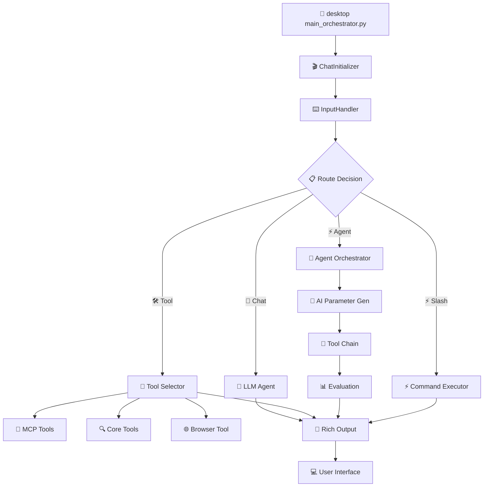
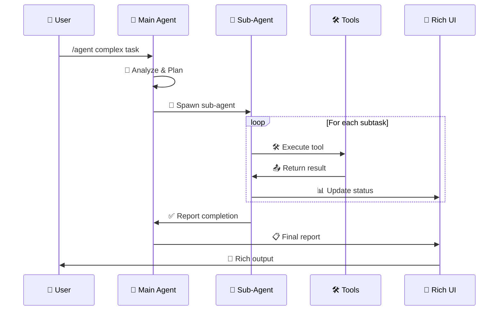

# ❄️ Cold Wind AI

<div align="center">

```text
    ╔══════════════════════════════════════════════════════════════════╗
    ║                ❄️  COLD WIND AI  ❄️                                ║
    ║      Multi-Platform AI System — Desktop today, Server + Mobile    ║
    ║      uv Workspace • LangGraph • MCP • Browser Automation           ║
    ╚══════════════════════════════════════════════════════════════════╝
```

[](https://www.python.org/downloads/)
[](https://docs.astral.sh/uv/)
[](https://langchain-ai.github.io/langgraph/)
[](https://opensource.org/licenses/MIT)
[](<>)

**Multi-platform AI system (desktop today; server + mobile planned) built on a uv-workspace monorepo, with multi-agent orchestration, dynamic MCP integration, hybrid AI models, and browser automation.**

</div>

---

## 🧭 Table of Contents

- [🚀 What's New](#-whats-new)
- [✨ Current Status](#-current-status)
- [🌟 What Makes This Special](#-what-makes-this-special)
- [⚡ Slash Commands](#-slash-commands)
- [🛠️ Tool Ecosystem](#️-tool-ecosystem)
- [🔧 Dynamic MCP Integration](#-dynamic-mcp-integration)
- [⚙️ Configuration](#️-configuration)
- [🚀 Quick Start](#-quick-start)
- [🧊 uv Workspace & Platform Layering](#-uv-workspace--platform-layering)
- [🗺️ Project Architecture](#️-project-architecture)
  - [🚀 Entry Points](#-entry-points)
  - [🤖 Agents (LangGraph)](#-agents-langgraph)
  - [⚡ Slash Commands](#-slash-commands-1)
  - [🛠️ Tools + Wrappers](#️-tools--wrappers)
  - [🔌 MCP Integration](#-mcp-integration)
  - [📝 Logging System](#-logging-system)
  - [🖥️ Desktop Dashboard](#️-desktop-dashboard)
  - [🎨 UI + CLI Input](#-ui--cli-input)
  - [🔧 Utils + Listeners](#-utils--listeners)
  - [🧠 RAG](#-rag)
  - [🧬 Runtime, Interfaces, Models & Prompts](#-runtime-interfaces-models--prompts)
  - [🧪 Tests](#-tests)
- [🔄 Data Flow](#-data-flow)
- [🤖 Agent Workflow](#-agent-workflow)
- [📝 Logging System](#-logging-system-1)
- [🎯 Roadmap](#-roadmap)
- [📄 License](#-license)

---

## 🧩 Quick Mental Model (1-minute)

If you remember only _one_ picture, remember this:

```text
┌───────────────────────────────────────────────────────────────────────┐
│  You type in CLI  →  Router decides  →  Agent/Tool/MCP runs  → Output  │
│     (prompt_toolkit)       (core)            (tools/mcp)        (ui)   │
└───────────────────────────────────────────────────────────────────────┘
```

---

## 🚀 **What's New**

### v2.0.0 – October 2026 (Latest)

| Feature                               | Description                                                                                                                                                                            |
| ------------------------------------- | -------------------------------------------------------------------------------------------------------------------------------------------------------------------------------------- |
| 🧊 **Monorepo Restructure (Phase 1)** | `uv` workspace with `coldwind-core` + `coldwind-desktop` namespace packages; `uv sync` installs everything                                                                             |
| 🧱 **Core–Desktop Decoupling**        | Desktop imports Core; **Core never imports Desktop** — platform contracts live in `core/interfaces/`                                                                                   |
| 🧹 **Dead-Code Purge**                | ~6,800 lines of legacy code removed: `AgentGraphCore.py`, flat global `settings.py`, socket debug pipeline (`socket_manager.py`, `error_transfer.py`), orphaned UI diagnostics modules |
| ⚙️ **Runtime Context Registry**       | Live state via `ContextRegistry` — clean split between `DesktopConfig` (pure config) and `DesktopRunTimeContext` (runtime objects)                                                     |
| 🖥️ **Dashboard Transport**            | Modernized debug dashboard transport, stream framing, and configuration paths                                                                                                          |

### v1.9.1 – December 2025

| Feature                           | Description                                |
| --------------------------------- | ------------------------------------------ |
| ⌨️ **Modern CLI Input**           | Beautiful autocomplete with prompt_toolkit |
| 🎯 **Slash Command Autocomplete** | Type `/` to see dropdown with commands     |
| ⚡ **Custom Key Bindings**        | Tab/Enter/Escape for intuitive navigation  |
| 🎨 **Cursor/Warp Theme**          | Modern dark theme with purple accents      |

### v1.9.0 – December 2025

| Feature                     | Description                                    |
| --------------------------- | ---------------------------------------------- |
| 📝 **Professional Logging** | Multi-file routing with 84% code reduction     |
| 🗂️ **Category Logging**     | Separate files: MCP, API, Tools, Agent, Errors |
| 🔄 **Dynamic Routing**      | Keyword-based automatic categorization         |
| 🏗️ **SOLID Architecture**   | Extensible handlers, formatters, routers       |

### v1.8.0 – September 2025

| Feature                   | Description                           |
| ------------------------- | ------------------------------------- |
| 🌐 **Browser Automation** | browser-use integration for web tasks |
| ⚡ **Slash Commands**     | Modular /clear, /help, /agent, /exit  |
| 🔌 **Dynamic MCP**        | .mcp.json server registration         |
| 🛡️ **Circuit Breaker**    | OpenAI retry/backoff/fallback         |

---

## ✨ **Current Status**

| Component           | Status | Details                                                       |
| ------------------- | ------ | ------------------------------------------------------------- |
| 🧊 **uv Workspace** | ✅     | `coldwind-core` + `coldwind-desktop`; `server` member planned |
| 🤖 **Agent Mode**   | ✅     | Hierarchical multi-agent orchestration                        |
| 🔌 **MCP**          | ✅     | Dynamic via `.mcp.json`                                       |
| 🌐 **Browser**      | ✅     | browser-use integration                                       |
| ⌨️ **CLI Input**    | ✅     | Modern autocomplete via prompt_toolkit                        |
| 📝 **Logging**      | ✅     | Multi-file with dynamic routing + rotation                    |
| 🐳 **Docker**       | ⏳     | Dockerfile ready, compose WIP                                 |
| 🧪 **Tests**        | 🚧     | **Unmaintained — regeneration planned (TODO)**                |
| 🐍 **Python**       | 3.13+  | Managed by `uv` (no legacy 3.11 support)                      |

---

## 🌟 **What Makes This Special**

```
┌─────────────────────────────────────────────────────────────────────────┐
│                         CORE CAPABILITIES                               │
├─────────────────────────────────────────────────────────────────────────┤
│                                                                         │
│  🤖 HYBRID AI          ─→  Ollama (local) + OpenAI/NVIDIA/Kimi (cloud)  │
│  ⚡ AGENT MODE          ─→  /agent multi-tool hierarchical orchestration │
│  🌐 BROWSER             ─→  Automated web browsing & interaction         │
│  🛠️ TOOLS               ─→  Core tools + MCP-integrated + browser       │
│  📝 LOGGING             ─→  Multi-file routing + dashboard transport     │
│  ⌨️ CLI INPUT           ─→  Modern autocomplete with styling             │
│  🎨 RICH UI             ─→  Beautiful tracebacks & dashboard            │
│  🧊 WORKSPACE           ─→  uv monorepo, core/desktop decoupled         │
│                                                                         │
└─────────────────────────────────────────────────────────────────────────┘
```

---

## ⚡ **Slash Commands**

```bash
╭──────────────────────────────────────────────────────────────╮
│  COMMAND        DESCRIPTION                                  │
├──────────────────────────────────────────────────────────────┤
│  /help          📖 Show available commands                   │
│  /agent <task>  🤖 Multi-tool AI orchestration              │
│  /clear         🧹 Clear conversation history               │
│  /exit          👋 Gracefully exit application              │
│  /tool          🔧 Use specific tool directly               │
│  /chat          💬 Normal chat mode                         │
╰──────────────────────────────────────────────────────────────╯
```

**Usage Examples:**

```bash
/agent search for Python tutorials and save to a file
/help
/clear
/exit
```

---

## 🛠️ **Tool Ecosystem**

| Category              | Tools                                                                      | Description                                 |
| --------------------- | -------------------------------------------------------------------------- | ------------------------------------------- |
| **🔍 Core**           | `google_search`, `rag_search_classifier`, `translate`, `run_shell_command` | Search, RAG, translation, shell             |
| **📂 MCP-Integrated** | filesystem + universal wrappers                                            | File operations & universal routing via MCP |
| **🌐 Browser**        | `browser_tool`                                                             | Automated web browsing (browser-use)        |

Tools are registered via `core/src/coldwind/core/tools/lggraph_tools/tool_assign.py` and exposed to the LangGraph agents.

---

## 🔧 **Dynamic MCP Integration**

Create `.mcp.json` at project root (this is the runtime MCP config — resolved via `mcp_config_path` on `DesktopConfig`, loaded by `core/src/coldwind/core/mcp/load_config.py`):

```json
{
  "servers": {
    "filesystem": {
      "command": "npx",
      "args": ["-y", "@modelcontextprotocol/server-filesystem@latest", "<PATH>"]
    },
    "memory": {
      "command": "npx",
      "args": ["-y", "@modelcontextprotocol/server-memory@latest"]
    },
    "github": {
      "command": "npx",
      "args": ["-y", "@modelcontextprotocol/server-github@latest"]
    }
  }
}
```

**Features:**

- ✅ Auto-discovery and registration
- ✅ Universal MCP routing
- ✅ Dynamic tool→server mapping
- ✅ Robust subprocess I/O

---

## ⚙️ **Configuration**

Settings are typed [pydantic-settings](https://docs.pydantic.dev/latest/concepts/pydantic_settings/) classes: `CoreSettinngs` in `core/src/coldwind/core/config/coreSettings.py`, extended by `DesktopConfig` in `desktop/src/coldwind/desktop/config/DesktopConfig.py`. They load from a `.env` file at the project root.

### Environment Variables (`.env`)

```env
# ═══════════════════════════════════════════════════════════════
#                        API KEYS
# ═══════════════════════════════════════════════════════════════
OPENAI_API_KEY=your_openai_or_nvidia_key

# ═══════════════════════════════════════════════════════════════
#                        MODELS
# ═══════════════════════════════════════════════════════════════
DEFAULT_MODEL=nvidia/nemotron-3-ultra-550b-a55b
GPT_MODEL=openai/gpt-oss-120b
CLASSIFIER_MODEL=llama3.1:8b
CYPHER_MODEL=deepseek-r1:8b
KIMI_MODEL=moonshotai/kimi-k2.6

# ═══════════════════════════════════════════════════════════════
#                        TIMEOUTS
# ═══════════════════════════════════════════════════════════════
OPENAI_TIMEOUT=60
OPENAI_CONNECT_TIMEOUT=10
MCP_TIMEOUT=30
MCP_START_TIMEOUT=30
BROWSER_USE_TIMEOUT=1300

# ═══════════════════════════════════════════════════════════════
#                        NEO4J
# ═══════════════════════════════════════════════════════════════
NEO4J_URI=bolt://localhost:7687
NEO4J_USERNAME=neo4j
NEO4J_PASSWORD=your_password
NEO4J_DATABASE=neo4j

# ═══════════════════════════════════════════════════════════════
#                        LOGGING
# ═══════════════════════════════════════════════════════════════
LOG_LEVEL=INFO
LOG_DISPLAY_MODE=separate_window

# ═══════════════════════════════════════════════════════════════
#                        FEATURES
# ═══════════════════════════════════════════════════════════════
BROWSER_USE_ENABLED=true
MCP_ENABLED=true
DEBUG=false

# ═══════════════════════════════════════════════════════════════
#                        SERVER
# ═══════════════════════════════════════════════════════════════
SOCKET_HOST=localhost
SOCKET_PORT=5390
```

### Key Settings Summary

| Category    | Setting                             | Default                             |
| ----------- | ----------------------------------- | ----------------------------------- |
| **API**     | `OPENAI_API_KEY`                    | Required                            |
| **Models**  | `DEFAULT_MODEL`                     | `nvidia/nemotron-3-ultra-550b-a55b` |
| **Models**  | `GPT_MODEL`                         | `openai/gpt-oss-120b`               |
| **Timeout** | `OPENAI_TIMEOUT`                    | 60s                                 |
| **MCP**     | `MCP_TIMEOUT` / `MCP_START_TIMEOUT` | 30s                                 |
| **Browser** | `BROWSER_USE_TIMEOUT`               | 1300s                               |
| **Neo4j**   | `NEO4J_URI`                         | `bolt://localhost:7687`             |
| **Logging** | `LOG_LEVEL` / `LOG_DISPLAY_MODE`    | `INFO` / `separate_window`          |

> **Config vs runtime:** settings classes hold _pure configuration only_. Live runtime objects (Neo4j driver, message classes, listeners, …) never live on settings — they are registered on the active runtime context via `ContextRegistry` (see [uv Workspace & Platform Layering](#-uv-workspace--platform-layering)).

---

## 🚀 **Quick Start**

```bash
# 1. Clone
git clone https://github.com/PIRATE-E/ai-workflow-task-agent.git
cd ai-workflow-task-agent

# 2. Install — uv workspace (creates .venv, installs coldwind-core + coldwind-desktop)
uv sync

# 3. Activate
# source .venv/bin/activate
# uv doesnt need this !!

# 4. Configure — create a .env file in the project root (see Configuration above)

# 5. Run
uv run --package coldwind-desktop coldwind
```

---

## 🧊 uv Workspace & Platform Layering

This is a **uv workspace monorepo** with namespace packages under `coldwind.*`:

```text
ai-workflow-task-agent/
├── core/      → coldwind-core      Shared agent layer: config, state, MCP protocol,
│                                  tools, RAG, logging, engine, agents, interfaces
├── desktop/   → coldwind-desktop   Desktop CLI layer: entry point, slash commands,
│                                  UI (prompt_toolkit + rich), dashboard, runtime context
└── server/    → planned            Cloud backend (declared workspace member, not yet created)
```

**Layering invariant (enforced):** Desktop imports Core. **Core never imports Desktop.** Core only knows the abstract contracts defined in `core/interfaces/` — never concrete platform implementations.

**Config vs runtime split:**

- **Pure configuration** → pydantic-settings classes (`CoreSettinngs` → `DesktopConfig`).
- **Live runtime objects** → the active runtime context, obtained via `ContextRegistry.get()`, with core services registered/retrieved through the dynamic enum-keyed store: `context.register_service(CoreRunTimeObjects.<name>, value)` / `context.get_service(CoreRunTimeObjects.<name>)`.

---

## 🗺️ **Project Architecture**

> The goal of this section is **navigation**. If you're new, start from **Entry Points**, then follow the arrows.

```text
ENTRY (desktop) → CORE (engine/agents) → (SLASH | AGENT | TOOLS | MCP) → UI/DASHBOARD/LOGS
```

### 🚀 Entry Points

```text
desktop/src/coldwind/desktop/
└── main_orchestrator.py         ✅ Program entry (boot + wiring: config, runtime context, destructor)

core/src/coldwind/core/engine/
├── chat_initializer.py          ✅ Boots the LangGraph graph, registers tools + slash commands
├── chat_destructor.py           ✅ Cleanup (exit flow, shutdown)
└── graphs/
    └── node_assign.py           ✅ GraphBuilder(State).compile_graph()
```

### 🤖 Agents (LangGraph)

```text
core/src/coldwind/core/agents/
├── agent_mode_node.py            # /agent orchestration node
├── classify_agent.py             # route user input (chat/tool/agent/slash)
├── router.py                     # routing logic
├── tool_selector.py              # selects tools for tasks
├── node_factory.py               # builds graph nodes
├── chat_llm.py                   # talks to LLM
├── agents_schema/
│   └── agents_schema.py          # typed schemas
└── agentic_orchestrator/         # hierarchical multi-agent orchestration
    ├── graphCore.py              # core orchestrator (LangGraph workflow structure)
    ├── spawn_agent.py            # hierarchical sub-agent spawner
    ├── agent_core_helpers.py     # tool pre-filtering, schema resolution, execution helpers
    ├── agent_status.py           # real-time task/workflow status notifications
    ├── pydantic_models.py        # WorkflowStateModel, TASK, AgentState
    └── hierarchical_agent_prompts.py  # depth-aware prompt templates
```

### ⚡ Slash Commands

```text
desktop/src/coldwind/desktop/slash_commands/
├── parser.py                     # parse '/command args'
├── executionar.py                # run command handler
├── protocol.py                   # SlashCommand dataclasses
├── on_run_time_register.py       # runtime registration (singleton)
├── registry.py                   # command registry
└── commands/
    ├── help.py                   # /help
    ├── clear.py                  # /clear
    ├── exit.py                   # /exit
    └── core_slashs/
        ├── agent.py              # /agent
        ├── chat_llm.py           # /chat
        └── use_tool.py           # /tool
```

### 🛠️ Tools + Wrappers

```text
core/src/coldwind/core/tools/lggraph_tools/
├── tool_assign.py                # tool registration into the graph
├── tool_selector.py              # tool selection for agent tasks
├── tool_response_manager.py      # response handling
├── tools/
│   ├── google_search_tool.py
│   ├── translate_tool.py
│   ├── run_shell_command_tool.py
│   ├── rag_search_classifier_tool.py
│   ├── browser_tool_main.py
│   ├── browser_tool/             # Handler, runner, config, utils/, subprocess runner
│   └── mcp_integrated_tools/
│       ├── filesystem.py
│       └── universal.py
├── wrappers/
│   ├── google_wrapper.py
│   ├── translate_wrapper.py
│   ├── browser_use_wrapper.py
│   ├── rag_search_classifier_wrapper.py
│   ├── run_shell_comand_wrapper.py
│   └── mcp_wrapper/
│       ├── filesystem_wrapper.py
│       └── uni_mcp_wrappers.py
└── tool_schemas/
    └── tools_structured_classes.py
```

### 🔌 MCP Integration

```text
core/src/coldwind/core/mcp/
├── load_config.py                # reads .mcp.json from project root
├── manager.py                    # starts/stops MCP servers
├── mcp_manager_util.py           # manager helpers
├── dynamically_tool_register.py  # registers discovered MCP tools
└── mcp_register_structure.py

.mcp.json                          # MCP servers config (project root)
```

### 📝 Logging System

```text
core/src/coldwind/core/system_logging/
├── protocol.py                   # LogEntry + enums (LogCategory, LogLevel)
├── adapter.py                    # protocol conversion
├── router.py                     # keyword-based routing
├── dispatcher.py                 # dispatch to handlers
├── formatter.py                  # formatting
├── registry.py / on_time_registry.py
├── handlers/
│   └── handler_base.py           # TextHandler (+ rotation)
└── debug_protocol/
    ├── debug_callers_api.py      # developer-facing debug_* API (see Logging System below)
    └── dashboard_transport/      # live dashboard streaming

basic_logs/                        # per-category output files
├── log_MCP_SERVER.txt
├── log_API_CALL.txt
├── log_TOOL_EXECUTION.txt
├── log_AGENT_WORKFLOW.txt
├── log_ERROR_TRACEBACK.txt
└── log_OTHER.txt
```

### 🖥️ Desktop Dashboard

```text
desktop/src/coldwind/desktop/dashboard/
├── dashboard_handler.py          # dashboard event handling
├── dashboard_printer.py          # rich rendering
├── dashboard_transport.py        # stream framing + transport
└── runner_server.py              # local dashboard server
```

### 🎨 UI + CLI Input

```text
desktop/src/coldwind/desktop/ui/
├── chatInputHandler.py           # ⌨️ prompt_toolkit input + autocomplete
├── print_banner.py               # startup banner
├── print_message_style.py        # user/ai/tool message panels
└── diagnostics/
    └── rich_traceback_manager.py # beautiful exception tracebacks
```

### 🔧 Utils + Listeners

```text
core/src/coldwind/core/utils/
├── model_manager.py              # model loading/switching (Ollama + OpenAI)
├── open_ai_integration.py        # OpenAI/NVIDIA integration + circuit breaker
├── argument_schema_util.py       # tool argument schema helpers
├── timestamp_util.py             # formatted timestamps for logging
└── listeners/
    ├── event_listener.py         # observer-pattern events
    ├── exit_listener.py          # two-ticket graceful shutdown
    └── rich_status_listen.py     # rich status updates
```

### 🧠 RAG

```text
core/src/coldwind/core/RAG/
└── RAG_FILES/
    ├── rag.py
    ├── neo4j_rag.py
    └── sheets_rag.py
```

### 🧬 Runtime, Interfaces, Models & Prompts

```text
core/src/coldwind/core/
├── runtime/
│   ├── CoreContextRegistry.py    # ContextRegistry — active runtime context lookup
│   └── runtime_obj_enum.py      # CoreRunTimeObjects — dynamic service store keys
├── interfaces/                   # platform contracts (Core knows ONLY these)
│   ├── runtime_interface.py
│   ├── ui_interface.py
│   ├── exception_interface.py
│   └── logging_interface.py
├── models/
│   └── state.py                  # shared state models
└── prompts/                      # prompt modules (agent, chat, RAG, tool selector, web search, …)

desktop/src/coldwind/desktop/
├── config/
│   └── DesktopConfig.py          # desktop settings (extends CoreSettinngs)
└── runtime/
    └── DesktopContext.py         # DesktopRunTimeContext (active runtime context)
```

### 🧪 Tests

```text
tests/                            🚧 UNMAINTAINED — test-suite regeneration is planned (TODO).
```

> The current `tests/` tree predates the monorepo restructure and is scheduled to be regenerated. Do not treat it as documentation of the current architecture.

---

## 🔄 **Data Flow**


```mermaid
graph TD
    A[🎯 desktop main_orchestrator.py] --> B[🎬 ChatInitializer]
    B --> C[⌨️ InputHandler]
    C --> D{📋 Route Decision}

    D -->|💬 Chat| E[🤖 LLM Agent]
    D -->|🛠️ Tool| F[🔧 Tool Selector]
    D -->|⚡ Agent| G[🎯 Agent Orchestrator]
    D -->|⚡ Slash| H[⚡ Command Executor]

    F --> I[📂 MCP Tools]
    F --> J[🔍 Core Tools]
    F --> K[🌐 Browser Tool]

    G --> L[🧠 AI Parameter Gen]
    L --> M[🔄 Tool Chain]
    M --> N[📊 Evaluation]

    E --> O[🎨 Rich Output]
    F --> O
    N --> O
    H --> O

    O --> P[💻 User Interface]
```

---

## 🤖 **Agent Workflow**


```mermaid
sequenceDiagram
    participant U as 👤 User
    participant M as 🤖 Main Agent
    participant S as 🔄 Sub-Agent
    participant T as 🛠️ Tools
    participant R as 🎨 Rich UI

    U->>M: /agent complex task
    M->>M: 🎯 Analyze & Plan

    M->>S: 🚀 Spawn sub-agent

    loop For each subtask
        S->>T: 🛠️ Execute tool
        T->>S: 📤 Return result
        S->>R: 📊 Update status
    end

    S->>M: ✅ Report completion
    M->>R: 📋 Final report
    R->>U: 🎨 Rich output
```

---

## 📝 **Logging System**

The developer-facing API lives in `core/system_logging/debug_protocol/debug_callers_api.py`:

```python
from coldwind.core.system_logging.debug_protocol.debug_callers_api import (
    debug_info,
    debug_warning,
    debug_error,
    debug_critical,
)

debug_info("MCP • SERVER_STARTED", "GitHub server started successfully")
```

Each call builds a typed `LogEntry(category, level, timestamp, message, metadata)` and hands it to the `Dispatcher`, which routes it to the registered handlers:

```text
┌─────────────────────────────────────────────────────────────────────────┐
│                    PROFESSIONAL LOGGING ARCHITECTURE                    │
├─────────────────────────────────────────────────────────────────────────┤
│                                                                          │
│   Your Code                                                             │
│      │  debug_info / debug_warning / debug_error / debug_critical       │
│      ▼                                                                   │
│   LogEntry(category, level, timestamp, message, metadata)               │
│      │                                                                   │
│      ▼                                                                   │
│   ┌─────────────────┐                                                   │
│   │    Dispatcher    │ ──→ routes the entry                             │
│   └────────┬────────┘                                                   │
│            ▼                                                            │
│   ┌─────────────────┐                                                   │
│   │     Router      │ ──→ keyword/category-based routing               │
│   └────────┬────────┘                                                   │
│            ▼                                                            │
│   ┌─────────────────┐    ┌────────────────────────────────────────┐    │
│   │   TextHandler   │───→│ log_MCP_SERVER.txt    (MCP logs)       │    │
│   │   (with rotation)│──→│ log_API_CALL.txt      (API logs)       │    │
│   │                 │───→│ log_TOOL_EXECUTION.txt (Tool logs)      │    │
│   │                 │───→│ log_AGENT_WORKFLOW.txt (Agent logs)     │    │
│   │                 │───→│ log_ERROR_TRACEBACK.txt (Errors)       │    │
│   │                 │───→│ log_OTHER.txt         (Other logs)      │    │
│   └─────────────────┘    └────────────────────────────────────────┘    │
│                                                                          │
│   Live view: debug_protocol/dashboard_transport → desktop dashboard     │
│   Files land in basic_logs/ with size/time-based rotation               │
│                                                                          │
└─────────────────────────────────────────────────────────────────────────┘
```

**Features:** clean separation of concerns (protocol, adapter, router, dispatcher, formatter, handlers, registry), extensible handlers, file rotation, and a live dashboard transport.

---

## 🎯 **Roadmap**

### Near-term

- [ ] **Major RAG ETL refinement** — modern, optimized ingestion pipeline _(next up)_
- [ ] API Server (FastAPI backend)
- [ ] Security hygiene pass
- [ ] Browser UX improvements

### Medium-term (6-12 months)

- [ ] Complete Docker deployment
- [ ] REST API for integrations
- [ ] Multi-agent collaboration
- [ ] Extended MCP server support

### Long-term (1+ year)

- [ ] Server + mobile platforms (Flutter)
- [ ] Tool marketplace (click-to-install tools)
- [ ] Advanced reasoning
- [ ] Industry-specific solutions
- [ ] Open-source ecosystem

---

## 📄 **License**

MIT License - See [LICENSE](LICENSE) for details.

---

<div align="center">

🔮 **Next up:** a major **RAG ETL refinement** — modern & optimized.

**Cold Wind AI v2.0.0 · October 2026**

</div>
