# 🤖 AI-Agent-Workflow Project

> Enterprise-grade desktop AI assistant with LangGraph multi-agent architecture, dynamic MCP integration via .mcp.json, universal MCP routing, hybrid OpenAI/NVIDIA integration (with circuit breaker), local Ollama support, Rich Traceback, and professional workflows.

[](https://www.python.org/downloads/)
[](https://langchain-ai.github.io/langgraph/)
[](https://opensource.org/licenses/MIT)
[]()

---

## 🚀 What's New (v1.8.0 – August 2025)
- ✅ **Dynamic MCP Integration** - Server registration from .mcp.json (no code edits required)
- ✅ **Universal MCP Routing** - UniversalMCPWrapper with static+dynamic tool→server mapping
- ✅ **Robust MCP Manager** - ServerConfig/Command enum, safer subprocess I/O, encoding fallbacks
- ✅ **OpenAI Circuit Breaker** - Automatic failure detection, retry/backoff, fallback responses
- ✅ **Dockerization** - Dockerfile + docker-compose for simple container runs
- ✅ **Python 3.13** - Updated target via pyproject.toml
- ✅ **Enhanced Diagnostics** - Expanded logging and tests for MCP routing and circuit breaker

## ✨ Current Status
- **Production Readiness**: 95% → Stability improved via circuit breaker + MCP hardening
- **MCP**: Fully dynamic via .mcp.json at project root (path set in settings.MCP_CONFIG.MCP_CONFIG_PATH)
- **Agent Mode**: More reliable parameter generation and MCP tool execution
- **DevOps**: Container-first workflow supported (build and run via docker-compose)
- **Compatibility**: Python 3.13 baseline; legacy 3.11 works with requirements.txt

---

## 🌟 **What Makes This Special?**

This is a **production-ready consumer desktop AI assistant** with enterprise-grade architecture featuring:

- **🤖 Hybrid AI Integration**: Seamless switching between local Ollama models and OpenAI/NVIDIA API with intelligent rate limiting (30 requests/minute)
- **⚡ Agent Mode**: Revolutionary `/agent` command triggering multi-tool orchestration with AI-powered parameter generation
- **🛠️ 17-Tool Ecosystem**: 3 fundamental tools + 14 dynamic MCP filesystem tools
- **🎨 Rich Traceback System**: Enterprise-grade error handling with visual debugging and separate debug windows
- **📡 Event-Driven Architecture**: Complete listener system with Rich.status integration for real-time updates
- **🔒 Privacy-First Design**: Local processing with optional cloud model integration
- **🏗️ LangGraph Multi-Agent**: Production-ready conversation orchestration with StateAccessor singleton pattern

---

## ✨ **Core Features**

### 🧠 **Hybrid AI System**
- **Local Ollama Support**: Privacy-focused local model processing
- **OpenAI/NVIDIA Integration**: Cloud models with intelligent rate limiting (30 requests/minute)
- **Automatic Model Switching**: Seamless hybrid operation based on availability and preferences
- **Rate Limit Management**: Built-in protection against API rate limit violations

### ⚡ **Agent Mode (`/agent` Command)**
- **Multi-Tool Orchestration**: Intelligent tool chain execution with AI parameter generation
- **Context-Aware Execution**: Maintains execution history and reasoning chains for better results
- **Tool Fallback Support**: Automatic recovery with alternative tools when primary tools fail
- **Simplified Final Evaluation**: Streamlined workflow quality assessment (v4.0)

### 🛠️ **Comprehensive Tool System (17 Total)**

#### **Fundamental Tools (3)**
- **GoogleSearch**: Web search capabilities for current information
- **RAGSearch**: Knowledge base search using retrieval-augmented generation
- **Translate**: Language translation services

#### **MCP Filesystem Tools (14)**
- **File Operations**: Read, write, create, delete files with proper encoding
- **Directory Management**: List, create, navigate directory structures
- **Search Capabilities**: Find files and content across the filesystem
- **JSON-RPC Protocol**: Professional MCP integration with dynamic tool discovery

### 🎨 **Rich Traceback & Debugging System**
- **Visual Error Handling**: Beautiful tracebacks with syntax highlighting and variable inspection
- **Separate Debug Windows**: Error routing to dedicated debug panel vs user notifications
- **Structured Diagnostics**: Transport-agnostic logging with metadata-rich events
- **Socket-Based Routing**: Network-based log aggregation for clean separation
- **Performance Monitoring**: Error categorization, frequency tracking, and debugging statistics

### 📡 **Event-Driven Architecture**
- **RichStatusListener**: Automatic status updates with Rich.status integration
- **EventManager**: Singleton pattern with thread-safe event processing
- **Variable Change Detection**: Automatic event emission when object properties change
- **Memory Leak Prevention**: WeakKeyDictionary for automatic cleanup
- **Event Filtering**: Targeted event routing with metadata-based filtering

---

## 🔧 Dynamic MCP Integration

The AI-Agent-Workflow now supports **dynamic MCP server registration** through a simple `.mcp.json` configuration file placed at the project root.

### Configuration
Place `.mcp.json` at repo root. Example:
```json
{
  "servers": {
    "filesystem": { "command": "npx", "args": ["-y","@modelcontextprotocol/server-filesystem@latest","<ABS_PATH>"] },
    "memory": { "command": "npx", "args": ["-y","@modelcontextprotocol/server-memory@latest"] },
    "github": { "command": "npx", "args": ["-y","@modelcontextprotocol/server-github@latest"] }
  }
}
```

### Features
- **Universal MCP Routing**: UniversalMCPWrapper with static+dynamic tool→server mapping
- **Auto Registration**: ChatInitializer loads and starts servers asynchronously; discovered tools are auto-registered
- **Robust Manager**: ServerConfig/Command enum, safer subprocess I/O, encoding fallbacks, tool discovery mapping
- **Configuration Path**: Set via `settings.MCP_CONFIG.MCP_CONFIG_PATH` (defaults to project root `.mcp.json`)

---

## ⚙️ OpenAI/NVIDIA Circuit Breaker

Enhanced OpenAI integration with enterprise-grade reliability features:

- **Circuit Breaker Pattern**: Automatic failure detection and recovery
- **Retry Logic**: Exponential backoff for failed requests
- **Fallback Responses**: Graceful degradation when API unavailable
- **Streaming Safety**: Robust handling of streaming/non-streaming responses
- **Rate Limiting**: Improved UX and diagnostics for async rate limiting

---

## 🐳 Dockerization

Container-first workflow for simplified deployment:

```bash
# Quick start with docker-compose
docker compose up --build

# Or build and run manually
docker build -t ai-agent .
docker run --rm -it -p 8000:8000 -v ./src:/app/src ai-agent
```

---

## 🚀 **Quick Start**

### **Prerequisites**
```bash
Python 3.13+ (recommended)
Virtual environment (recommended)
Node.js (for MCP servers)
Docker (optional, for containerized deployment)
```

### **Installation**
```bash
# Clone the repository
git clone https://github.com/PIRATE-E/AI-Agent-Workflow-Project.git
cd AI-Agent-Workflow-Project

# Create virtual environment
python -m venv .venv
.venv\Scripts\activate  # Windows
# source .venv/bin/activate  # Linux/Mac

# Install dependencies
pip install -r requirements.txt
```

### **Configuration**
Create `.env` file in the project root:
```env
# OpenAI/NVIDIA API Configuration (Optional - for cloud models)
OPEN_AI_API_KEY=your_nvidia_api_key_here
OPENAI_TIMEOUT=30

# Sentry Monitoring (Optional)
SENTRY_DSN=your_sentry_dsn_here

# Local Model Configuration (Ollama)
OLLAMA_HOST=http://localhost:11434
GPT_MODEL=llama3.2:latest  # or your preferred local model

# MCP Configuration
MCP_CONFIG_PATH=.mcp.json  # Path to MCP configuration file
```

Create `.mcp.json` file in the project root (see Dynamic MCP Integration section for examples).

### **Run the Application**
```bash
python src/main_orchestrator.py
```

---

## 💬 **Usage Guide**

### **Basic Conversation**
```
You: What is the capital of France?
AI: The capital of France is Paris...
```

### **Tool Commands**
```bash
# Force web search
/search latest AI developments

# Force LLM response
/use ai explain quantum computing

# Force tool selection
/use tool translate "hello" to Spanish

# Shell command execution
/shell dir
/shell python --version
```

### **Agent Mode**
```bash
# Trigger intelligent agent orchestration
/agent search for Python tutorials and save the best ones to a file

# Agent will automatically:
# 1. Use GoogleSearch to find Python tutorials
# 2. Evaluate and filter results
# 3. Use filesystem tools to save content
# 4. Provide comprehensive summary
```

### **Application Control**
```bash
exit           # Graceful shutdown with cleanup
Ctrl+C         # Emergency exit
```

---

## 🏗️ **Project Architecture**

The AI-Agent-Workflow Project follows a modular, enterprise-grade architecture with clear separation of concerns, designed for scalability and maintainability:

### **🎯 Core System Components**
```
📁 src/
├── 🚀 main_orchestrator.py                    # Application entry point with Rich Traceback
├── 📁 agents/                                 # Multi-agent orchestration system
│   ├── 🤖 agent_mode_node.py                 # Agent mode orchestration with context tracking
│   ├── 💬 chat_llm.py                        # LLM communication and response handling
│   ├── 🔍 classify_agent.py                  # Message classification for /agent detection
│   ├── 🧭 router.py                          # Message routing between processing nodes
│   └── 🛠️ tool_selector.py                   # Tool selection logic based on user input
├── 📁 config/                                # Configuration management
│   ├── ⚙️ settings.py                        # Application settings and configuration variables
│   └── 📝 configure_logging.py               # Logging configuration and setup helpers
├── 📁 core/                                  # Core system components
│   ├── 🎬 chat_initializer.py                # Chat system initialization and setup
│   └── 📁 graphs/                            # LangGraph workflow definitions
├── 📁 models/                                # Data models and state management
│   └── 🔄 state.py                           # State management with StateAccessor singleton
├── 📁 prompts/                               # AI prompt templates
│   ├── 🎯 agent_mode_prompts.py              # Prompts for agent mode operations
│   └── 💭 open_ai_prompt.py                  # OpenAI-specific prompt templates
└── 📁 utils/                                 # Utility modules and services
    ├── 🔀 model_manager.py                   # Hybrid model management (Ollama/OpenAI)
    ├── 🌐 open_ai_integration.py             # OpenAI/NVIDIA API integration with circuit breaker
    └── 📁 listeners/                         # Event-driven architecture
        ├── 📡 event_listener.py              # Core event management system
        └── 🎨 rich_status_listen.py          # Rich status integration
```

### **🛠️ Advanced Tools Ecosystem**
```
📁 src/tools/lggraph_tools/
├── 📋 tool_assign.py                         # Tool registry and assignment management
├── 📤 tool_response_manager.py               # Response handling from tool executions
├── 📁 tools/                                # Core tool implementations
│   ├── 🔍 google_search_tool.py             # Google search functionality
│   ├── 🧠 rag_search_tool.py                # Knowledge base search (RAG)
│   ├── 🌐 translate_tool.py                 # Translation services
│   ├── 💻 run_shell_command_tool.py         # Shell command execution
│   └── 📁 mcp_integrated_tools/             # MCP filesystem integration
│       └── 📂 filesystem.py                 # File operations (14 dynamic tools)
└── 📁 tool_schemas/                          # Tool argument schemas and validation
```

### **🎨 Modern UI & Diagnostics**
```
📁 src/ui/
├── 🎨 print_message_style.py                # Message formatting and styling
├── 🎪 print_banner.py                       # Application banner display
└── 📁 diagnostics/                          # Rich Traceback system
    ├── 🔧 rich_traceback_manager.py         # Enterprise-grade error handling
    ├── 🛟 debug_helpers.py                  # Debug message helpers
    └── 📨 debug_message_protocol.py         # Debug transport protocol
```

### **🔌 Enhanced MCP Integration**
```
📁 src/mcp/
├── 🎛️ manager.py                            # MCP server lifecycle management
├── 🔄 dynamically_tool_register.py          # Dynamic MCP tool registration
├── 📥 load_config.py                        # MCP configuration loading (.mcp.json)
└── 🏗️ mcp_register_structure.py            # MCP registration structure definitions
```

### **🧠 Next-Gen RAG System**
```
📁 src/RAG/
└── 📁 RAG_FILES/                            # Knowledge base and retrieval files
    ├── 🗄️ neo4j_rag.py                      # Neo4j graph database integration
    └── 📚 knowledge_base/                   # Document storage and indexing
```

### **🧪 Testing Infrastructure**
```
📁 tests/
├── 🔬 run_tests.py                          # Test suite execution
├── 📁 event_listener/                       # Event system testing
│   ├── 🎯 quick_validation.py              # Fast event system validation
│   ├── 🧪 test_event_listener_realistic.py # Realistic event testing scenarios
│   └── 📊 run_listener_test.py             # Comprehensive listener testing
└── 📁 integration/                          # Integration testing
    ├── 🔗 test_mcp_integration.py          # MCP server integration tests
    └── 🤖 test_agent_mode.py               # Agent mode functionality tests
```

### **📊 Configuration & DevOps**
```
📁 Project Root
├── 🐳 Dockerfile                           # Container deployment configuration
├── 🐙 docker-compose.yml                   # Multi-container orchestration
├── ⚙️ .mcp.json                            # Dynamic MCP server configuration
├── 🔧 pyproject.toml                       # Python project configuration
├── 📦 requirements.txt                     # Python dependencies
├── 🌍 .env                                 # Environment variables
└── 📁 copilot_instructions/                # Development guidelines
    └── 📘 mcp_instructions.md              # MCP integration guidelines
```

---

### **🔄 Data Flow Architecture**

```mermaid
graph TD
    A[🎯 main_orchestrator.py] --> B[🎬 ChatInitializer]
    B --> C[🔍 Message Classifier]
    C --> D{📋 Route Decision}
    D -->|💬 Chat| E[🤖 LLM Agent]
    D -->|🛠️ Tool| F[🔧 Tool Selector]
    D -->|⚡ Agent Mode| G[🎯 Agent Orchestrator]
    
    F --> H[📂 MCP Tools]
    F --> I[🔍 Core Tools]
    
    G --> J[🧠 AI Parameter Generation]
    J --> K[🔄 Tool Chain Execution]
    K --> L[📊 Final Evaluation]
    
    E --> M[🎨 Rich Output]
    F --> M
    L --> M
    
    M --> N[💻 User Interface]
    
    subgraph "🔌 MCP Ecosystem"
        H --> O[📂 Filesystem Tools]
        H --> P[🧠 Memory Tools]
        H --> Q[🐙 GitHub Tools]
    end
    
    subgraph "🎨 Rich System"
        M --> R[🖥️ Main Window]
        M --> S[🔧 Debug Panel]
        R --> T[📡 Event Listeners]
        S --> U[📊 Error Tracking]
    end
```



This architecture ensures **scalability**, **maintainability**, and **enterprise-grade reliability** while maintaining a clean separation of concerns across all system components.

---

## 📁 Detailed Project Structure

```
AI-Agent-Workflow/
├── src/
│   ├── main_orchestrator.py          # Main application entry point
│   ├── agents/                       # Multi-agent orchestration layer
│   │   ├── agent_mode_node.py       # Agent mode implementation
│   │   ├── classify_agent.py        # Message classification
│   │   ├── chat_llm.py              # LLM communication
│   │   ├── router.py                # Message routing
│   │   └── tool_selector.py         # Tool selection logic
│   ├── tools/lggraph_tools/         # Tool ecosystem (17 tools)
│   │   ├── tool_assign.py           # Tool registry management
│   │   ├── tool_response_manager.py # Response handling
│   │   ├── tools/                   # Core tool implementations
│   │   │   ├── google_search_tool.py
│   │   │   ├── rag_search_tool.py
│   │   │   ├── translate_tool.py
│   │   │   ├── run_shell_command_tool.py
│   │   │   └── mcp_integrated_tools/
│   │   └── tool_schemas/            # Tool validation schemas
│   ├── utils/                       # Supporting infrastructure
│   │   ├── open_ai_integration.py   # OpenAI/NVIDIA API integration
│   │   ├── model_manager.py         # Hybrid model management
│   │   ├── socket_manager.py        # Logging infrastructure
│   │   ├── argument_schema_util.py  # Schema utilities
│   │   ├── error_transfer.py        # Error handling
│   │   └── listeners/               # Event-driven architecture
│   │       ├── event_listener.py    # Core event system
│   │       └── rich_status_listen.py # Rich status integration
│   ├── ui/diagnostics/              # Structured logging and diagnostics
│   │   ├── rich_traceback_manager.py # Rich Traceback system
│   │   ├── debug_helpers.py         # Structured debug utilities
│   │   └── debug_message_protocol.py # Debug message protocol implementation
│   ├── mcp/                         # Model Context Protocol
│   │   ├── manager.py              # MCP server management
│   │   ├── load_config.py          # Configuration loading
│   │   ├── dynamically_tool_register.py # Dynamic registration
│   │   └── mcp_register_structure.py # Registration structures
│   ├── RAG/RAG_FILES/              # Knowledge retrieval engine
│   │   └── neo4j_rag.py            # Neo4j integration
│   ├── config/                     # Configuration management
│   │   ├── settings.py             # Environment settings
│   │   └── configure_logging.py    # Logging setup
│   ├── models/                     # Data models
│   │   └── state.py               # State management
│   ├── prompts/                    # AI prompt templates
│   │   ├── agent_mode_prompts.py   # Agent prompts
│   │   └── open_ai_prompt.py       # OpenAI prompts
│   └── core/                       # Core system components
│       ├── chat_initializer.py     # Initialization
│       └── graphs/                 # LangGraph definitions
├── tests/                          # Comprehensive test suite
│   ├── run_tests.py               # Test execution
│   ├── event_listener/            # Event system tests
│   └── integration/               # Integration tests
├── examples/                       # Working demonstrations
│   └── event_listener/             # Event system examples
├── copilot_instructions/           # Development guidelines
├── reports/                        # Analysis and documentation
├── pyproject.toml                  # Python project configuration
├── requirements.txt                # Python dependencies
├── .env                           # Environment variables
├── .mcp.json                      # MCP server configuration
├── Dockerfile                     # Container configuration
├── docker-compose.yml             # Multi-container setup
└── README.md                       # This file
```

### Directory Purpose Documentation

**`src/utils/`** - Supporting infrastructure utilities
- `argument_schema_util.py` - Tool argument schema extraction and validation
- `error_transfer.py` - Raw socket server for debug messages and error logs
- `model_manager.py` - Local/OpenAI model multiplexing with hybrid switching
- `open_ai_integration.py` - NVIDIA-compatible OpenAI adapter with singleton pattern
- `socket_manager.py` - Subprocess log server management with legacy bridge
- `listeners/` - Event-driven architecture with Rich status integration

**`src/ui/diagnostics/`** - Structured logging and Rich traceback management
- `rich_traceback_manager.py` - Enterprise-grade error handling system
- `debug_helpers.py` - Structured debug utilities and message routing
- `debug_message_protocol.py` - Debug message protocol implementation

**`src/agents/`** - Multi-agent orchestration layer
- `agent_mode_node.py` - Complete agent mode implementation with tool orchestration
- `classify_agent.py` - Message classification and routing logic
- `chat_llm.py` - LLM communication and response handling
- `router.py` - Message routing between processing nodes
- `tool_selector.py` - Tool selection logic based on user input

**`src/tools/lggraph_tools/`** - 17-tool ecosystem
- 3 fundamental tools: GoogleSearch, RAGSearch, Translate
- 14 dynamic MCP filesystem tools
- Tool selection and execution logic
- Response management and validation

**`src/mcp/`** - Model Context Protocol implementation
- JSON-RPC communication with subprocess management
- Dynamic tool discovery and registration
- Server lifecycle management
- Configuration loading and validation

---

## 🤖 Agent Mode

Advanced multi-tool orchestration system with AI-powered parameter generation.

### Features
- **AI-Powered Parameter Generation** - Intelligent parameter creation for tool execution
- **Sequential Tool Processing** - Coordinated execution of multiple tools
- **Failure Recovery** - Automatic retry and error handling
- **Context Awareness** - Maintains context across tool executions
- **Final Response Evaluation** - Quality assessment and optimization (v4.0 simplified)

### Usage
Agent mode is automatically activated for complex multi-step tasks that require tool orchestration. Use `/agent` command to explicitly trigger agent mode.

### Example Workflow
```
/agent search for Python tutorials and save the best ones to a file

Agent will automatically:
1. Use GoogleSearch to find Python tutorials
2. Evaluate and filter results
3. Use filesystem tools to save content
4. Provide comprehensive summary
```

---

Addendum: Dedicated Agent Workflow (new)

A new dedicated agent workflow has been added as an internal orchestrator package. This provides a self-contained workflow for hierarchical task decomposition, just-in-time parameter generation, and robust sub-agent spawning.

- New package (visible in the project):
  - src/agents/agentic_orchestrator/
    - AgentGraphCore.py            # Core hierarchical agent workflow (planner, classifier, parameter generator, executor, synthesizer, validator, planner, finalizer)
    - hierarchical_agent_prompts.py# Depth-aware, strict prompt templates for agent nodes

Note: These files implement the "Agent Workflow" used by Agent Mode. They are internal implementation details and are invoked when `/agent` triggers multi-step orchestration.

Agent Workflow (visualization)

Below is a high-level visualization of the internal agent workflow (the main orchestrator graph) so you can see how the agent decomposes and executes tasks:


This visualization reflects the main internal loop: plan → classify → generate parameters → execute → synthesize → validate → plan/finish. Spawning creates recursive, scoped sub-agents that are injected into the same unified workflow state (preserving Dual Context: raw results + analysis).

---

## 📄 License

This project is licensed under the MIT License - see the [LICENSE](LICENSE) file for details.

### MIT License Summary
- **Commercial Use** - Permitted
- **Modification** - Permitted
- **Distribution** - Permitted
- **Private Use** - Permitted
- **Liability** - Limited
- **Warranty** - None provided

---

## 🎯 Roadmap

### Near-term Goals (Next 3 months)
- **Complete Agent Mode Optimization** - Achieve 99% reliability
- **Enhanced Tool Ecosystem** - Add 10+ additional MCP tools
- **Performance Improvements** - 50% faster response times
- **Extended MCP Server Support** - Support for custom MCP implementations

### Medium-term Vision (6-12 months)
- **Production Deployment Capabilities** - Container orchestration and CI/CD
- **Advanced AI Agent Orchestration** - Multi-agent collaboration patterns
- **Enterprise Integration Features** - SSO, audit logging, compliance features
- **Comprehensive Developer Tools** - IDE extensions, debugging tools, profilers

### Long-term Vision (1+ years)
- **Distributed Agent Networks** - Multi-node agent coordination
- **Advanced Reasoning Capabilities** - Enhanced planning and execution
- **Industry-Specific Solutions** - Specialized agent configurations
- **Open-Source Ecosystem** - Community-driven tool and server development

---

**Built with ❤️ for enterprise-grade AI agent development**

*AI-Agent-Workflow Project v1.7.0 - Transforming AI assistant development with enterprise-grade architecture and professional workflows.*
