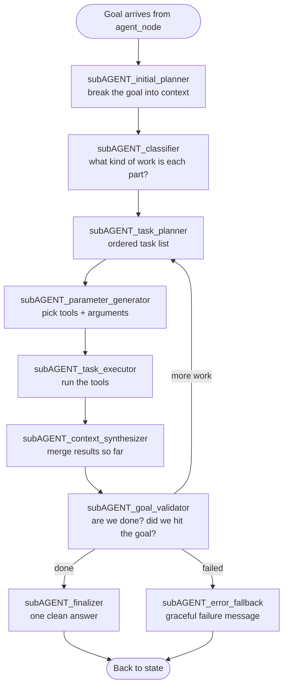

# 🧠 Agentic Orchestrator (`coldwind.core.agents.agentic_orchestrator`)

> The mission-control room: turns one big goal into a plan, spawns sub-agents, executes, and checks its own work.

**Part of:** `coldwind-core` · **Last Updated:** October 2026

---

## 🗺️ Where This Fits

```text
agents/agent_mode_node ──► AgentGraphCore (this package) ──► tools/
   "research X and         • plans the mission                search, shell,
    summarize it"           • spawns sub-agents                  browser, RAG…
                           • executes + validates
                           • returns one final answer
```

---

## 🎯 Why This Exists

- **Big goals need a plan**, not a single prompt. This package is that plan-maker.
- Sub-agents handle sub-tasks **in parallel** — one mission, many workers.
- If a step fails, the pipeline **validates and recovers** instead of crashing.

---

## 📦 Module Map

| File | Plain-English job |
|------|-------------------|
| `graphCore.py` | `AgentGraphCore` — builds and runs the whole agent pipeline |
| `spawn_agent.py` | `Spawn_subAgent` — decides when a sub-agent is needed and injects it |
| `agent_core_helpers.py` | `AgentCoreHelpers` — tool schemas, synthesis, tool recommendations |
| `agent_status.py` | `AgentStatusUpdater` — live status lines (with `FUNNY_QUOTES` for flavor) |
| `hierarchical_agent_prompts.py` | `HierarchicalAgentPrompt` — one `generate_*` prompt per pipeline stage |
| `pydantic_models.py` | Typed data contracts: `TASK`, `AgentState`, `WorkflowStateModel`, contexts |

> ⚠️ Old docs referenced a **file** named `AgentGraphCore.py` — that file was deleted in the v2.0.0 purge. The **class** `AgentGraphCore` lives in `graphCore.py` and is very much alive.

---

## 🏗️ The Pipeline (one mission, step by step)



Three **routers** decide the arrows between stages: `router_classifier`, `router_task_planner`, and `router_after_execution` — all inside `AgentGraphCore.build_graph()`.

---

## 🌀 Spawning Sub-Agents (`Spawn_subAgent`)

```text
1. analyze_spawn_requirement()      "Is this task too big for one pass?"
        │ yes
2. decompose_task_for_subAgent()    "Split it into sub-tasks"
        │
3. inject_subAgent_into_workflow()  "Add the new work into the running graph"
        │
4. spawn_subAgent_recursive()       "Repeat if sub-tasks are still big"
```

---

## 🔑 The Helpers Behind The Scenes

- **`AgentCoreHelpers`** — `get_tool_schema`, `recommend_tools_for_task`, `get_safe_tools_list`, `get_detailed_tool_context`, `perform_internal_synthesis`, and `evaluate_skip_cascade` (the SKIP feature: skip low-value steps when confidence is already high — controlled by `skip_threshold` in settings).
- **`AgentStatusUpdater.update_status`** — prints live progress, sometimes with a joke from `FUNNY_QUOTES`.
- **`HierarchicalAgentPrompt`** — 14 focused `generate_*` methods; **each pipeline stage gets its own prompt** instead of one giant blob.

---

## 📜 Data Contracts (`pydantic_models.py`)

`TASK` (a unit of work), `AgentState` / `WorkflowStateModel` (the running workflow), plus the context types that flow between stages: `MAIN_STATE`, `REQUIRED_CONTEXT`, `EXECUTION_CONTEXT`, `subAgent_CONTEXT`, `FAILURE_CONTEXT`, `FAILURE_CONTEXT_STRATEGY`.

---

## ❓ FAQ

- **Where do executed tools come from?** The `tools/` package — recommended per task by `AgentCoreHelpers`.
- **How do I watch it work live?** The status lines (`AgentStatusUpdater`) plus `basic_logs/log_AGENT_WORKFLOW.txt`.

---

**Cold Wind AI · `coldwind-core` · Updated in the v2.0.0 docs pass (old file pointed at the deleted AgentGraphCore.py file; rebuilt around the real graphCore.py pipeline).**
