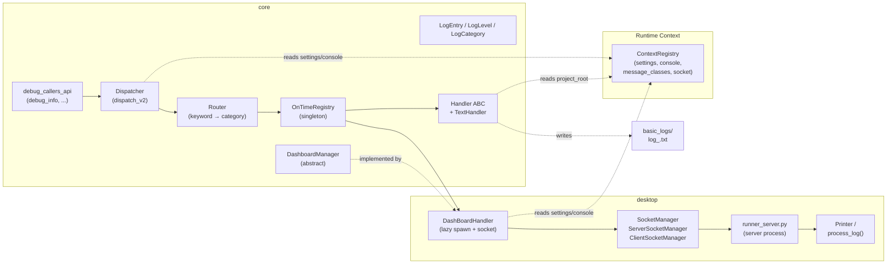

# 📋 Logging System

## Domain

| Platform | Domain Folder | Status |
|----------|---------------|--------|
| Core | `core/` | ✅ Documented |
| Desktop | `desktop/` | ✅ Documented |
| Server | `server/` | ⏳ Planned |

## Overview

The Logging System is the **producer → dispatcher → router → handler** pipeline that routes every diagnostic message in Cold Wind AI. It decouples *what the code wants to say* (level + heading + body) from *where it goes* (text files, live dashboard, future sinks).

- **Core owns**: the protocol (`LogEntry`, `LogLevel`, `LogCategory`), the public API (`debug_info`/`log_info`), the dispatcher, the router, the handler registry, the base `Handler` ABC, and the built-in `TextHandler`.
- **Desktop owns**: the `DashBoardHandler` that streams logs over TCP, the `SocketManager` server/client pair, the `runner_server.py` dashboard process, and the `Printer`/`process_log()` Rich panel renderer.
- **Contract boundary**: `core/.../debug_protocol/dashboard_transport/__init__.py` defines the abstract `DashboardManager`; `desktop/.../dashboard_transport.py` implements it. Core never imports desktop.

## Interdependence Map

**Dependency direction**: Core → Desktop (contract). Desktop → Core (uses). No reverse imports.

## Ownership Table

| Domain | Folder | Files | Documents |
|--------|--------|-------|-----------|
| Core | `core/` | `handler-architecture.md` | LogEntry protocol, debug_callers_api, Dispatcher, Router, OnTimeRegistry, Handler ABC, TextHandler, registration points, full lifecycle trace |
| Core | `core/` | `extending-handlers.md` | Handler contract, DIY recipe (ErrorJsonlHandler), registration options, routing decision table, lifecycle/cleanup, testing |
| Desktop | `desktop/` | `dashboard-transport.md` | SocketManager (ServerConfig, ServerSocketManager, ClientSocketManager), DesktopDashboardManager, TCP protocol, JSON framing |
| Desktop | `desktop/` | `dashboard-handler.md` | DashBoardHandler lazy bootstrap, 3-second first-log sequence diagram, spawn race & socket teardown details |
| Desktop | `desktop/` | `dashboard-printer.md` | runner_server.py entry point, Printer/process_log, Rich panel rendering (colors, badges, metadata grid) |

## Index

### Core Domain
- [handler-architecture.md](core/handler-architecture.md) — Every component, end-to-end lifecycle, registration, known sharp edges, glossary, Q&A
- [extending-handlers.md](core/extending-handlers.md) — DIY tutorial: contract, recipe, registration, routing table, cleanup, testing

### Desktop Domain
- [dashboard-transport.md](desktop/dashboard-transport.md) — Socket layer: config, server/client singletons, connection health, JSON wire format
- [dashboard-handler.md](desktop/dashboard-handler.md) — DashBoardHandler deep dive, sequence diagram for 3s first-log pause
- [dashboard-printer.md](desktop/dashboard-printer.md) — Dashboard process internals: runner_server, Printer, Rich rendering