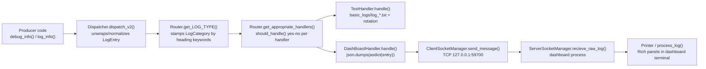

# 🧱 Core: Handler Architecture & Lifecycle (Deep Dive)

## Domain & Dependencies

**Domain:** `core` — this document covers the platform-agnostic logging infrastructure.

**Dependencies:**
- **Runtime Context** (`ContextRegistry`): provides `settings` (rotation limits, `project_root`), `console`, `message_classes`, registered services (`neo4j_driver`, socket). Read by `Dispatcher`, `TextHandler`, `Router`.
- **Desktop (contract only)**: the abstract `DashboardManager` in `core/.../debug_protocol/dashboard_transport/__init__.py`. Desktop implements it; core never imports desktop.
- **Event System** (future): exit listeners registered via `ContextRegistry.register_listener`.

---

## 1. Executive Summary

The Cold Wind AI logging system is a **producer → dispatcher → router → handler** pipeline. Code anywhere in core or desktop calls a simple function like `log_info("heading", "body", metadata)`. That call is wrapped into a structured `LogEntry` object, passed to a central `Dispatcher`, tagged with a category by the `Router`, and finally delivered to every registered `Handler` that agrees to process it. Today there are exactly two handlers shipped:

- **`TextHandler`** — writes every log to per-category text files under `basic_logs/`.
- **`DashBoardHandler`** (desktop) — streams every log over a local TCP socket to a live Rich dashboard running in a separate terminal window.

The whole design is built so that **adding a new output** (file, network, Slack, database) means *writing one small class and registering it* — nothing else in the system changes.

---

## 2. System Context

In one sentence: **every part of the app needs to report what it's doing — MCP servers starting, tools executing, errors happening — without crashing or blocking the chat UI.**

Constraints that shaped the design:

- The chat UI must stay clean — logs go *somewhere else* (files, another window).
- Logs must survive crashes — disk writes, not only stdout.
- Operators want a live view — a separate dashboard process.
- Core must never depend on Desktop — the dashboard contract lives as an abstract class in **core** (`debug_protocol/dashboard_transport/__init__.py`), and the desktop **implements** it.

**Physical metaphor:** the system is a newspaper workflow. Reporters (your code) file stories with the copy desk (`Dispatcher`). An editor (`Router`) stamps each story with a section ("sports", "politics"). The print shop (`Handler`s) then makes every copy — one edition goes to the archive (TextHandler → files), one to the newsstand (DashBoardHandler → the live dashboard window).

---

## 3. The Cast — Every Component, One by One

### 3.1 `LogLevel`, `LogCategory`, `LogEntry` — the envelope format

File: `core/src/coldwind/core/system_logging/debug_protocol/__init__.py`

Three plain definitions that everything else speaks in:

- `LogLevel` — enum: `DEBUG, INFO, WARNING, ERROR, CRITICAL`. *How loud* the message is.
- `LogCategory` — enum: `API_CALL, TOOL_EXECUTION, AGENT_WORKFLOW, MCP_SERVER, ERROR_TRACEBACK, OTHER`. *What kind* of thing happened.
- `LogEntry` — a `@dataclass` with five fields: `LOG_TYPE` (a LogCategory), `LOG_LEVEL` (a LogLevel), `TIME_STAMP` (string), `MESSAGE` (the body text, `"heading | body"` style), `METADATA` (an optional dict of extra facts).

Everything downstream — the dispatcher, the router, every handler — speaks exactly this one format. That's the "envelope": you never pass raw strings between layers.

### 3.2 The public API — `debug_callers_api.py`

File: `core/src/coldwind/core/system_logging/debug_protocol/debug_callers_api.py`

Four functions: `debug_info`, `debug_warning`, `debug_error`, `debug_critical`. Each one does the same three things:

1. Build a `LogEntry` (category starts as `OTHER` — deliberately "unknown").
2. Stamp the current time from `get_formatted_timestamp()`.
3. Hand it to `Dispatcher.dispatch_v2(...)`.

> 💡 **Core Rule:** Callers never decide the category. They say level + text; the Router later inspects the heading text and upgrades the category.

### 3.3 `OnTimeRegistry` — the handler notebook

File: `core/src/coldwind/core/system_logging/on_time_registry.py`

The registry is a **thread-safe singleton** ("singleton" = exactly one instance exists in the whole process). It keeps a plain dict mapping `handler.name → handler`.

Key behaviors:

- `register(handler)` raises `RegistryError` on a duplicate name — **no silent double-registration.**
- `get_all_handlers()` raises `RegistryError` when empty — this is *intentional*. The Dispatcher catches it and just returns, so logging during early boot (before handlers exist) is a no-op, not a crash.
- Double-checked locking in `__new__` (lock → check → create) makes it safe under threads.

### 3.4 `Router` — the categorizer

File: `core/src/coldwind/core/system_logging/router.py`

Two jobs:

**Job 1 — `get_LOG_TYPE()`:** reads the heading (from `METADATA["heading"]`, falling back to the text before the `|` in `MESSAGE`), upper-cases it, and scans `DEFAULT_KEYWORD_MAP`:

| Keyword in heading | → Category stamped |
|---|---|
| `MCP` | `MCP_SERVER` |
| `API`, `OPENAI`, `OLLAMA` | `API_CALL` |
| `TOOL` | `TOOL_EXECUTION` |
| `AGENT`, `WORKFLOW` | `AGENT_WORKFLOW` |
| `ERROR`, `FAILED`, `TRACEBACK` | `ERROR_TRACEBACK` |
| *(no match)* | `OTHER` |

First match wins. A `custom_routes` dict can extend/override the defaults without editing this file.

**Job 2 — `get_appropriate_handlers()`:** loops all registry handlers, calls `handler.should_handle(log_entry)` on each, and yields the ones that say yes. A handler that can't process this entry (e.g., a "file-only-errors" handler) just says no — zero work wasted.

### 3.5 `Dispatcher` — the traffic controller

File: `core/src/coldwind/core/system_logging/dispatcher.py`

Two entry points:

- `dispatch(message: str)` — **legacy path**. Takes a JSON *string*, converts it to a `LogEntry` via `_convert_str_log_entry()` (with a safe fallback: bad JSON becomes an `ERROR/OTHER` entry rather than a crash).
- `dispatch_v2(log_entry)` — **current path**. Takes a ready-made `LogEntry`.

Both then do the same dance:

```
handlers = OnTimeRegistry().get_all_handlers()   # RegistryError → return
router = Router(log_entry, handlers)
log_entry = router.get_LOG_TYPE(...)             # stamp category
for handler in router.get_appropriate_handlers():
    handler.handle(log_entry)
```

Note the Dispatcher **keeps no state** — the same LogEntry object is handed to each handler one after another, in registration order.

### 3.6 `Handler` — the contract everyone signs

File: `core/src/coldwind/core/system_logging/handlers/handler_base.py`

An abstract base class with two abstract methods and one strict rule:

- `should_handle(log_entry, *args) -> bool` — "do I want this one?"
- `handle(log_entry, *args)` — "process it."
- **Strict name rule:** `__init_subclass__` runs when you *define* a subclass and raises `KeyError` if the subclass has no `name` class attribute. You cannot even import a handler that forgot its name.

### 3.7 `TextHandler` — the archivist

File: `core/src/coldwind/core/system_logging/handlers/handler_base.py` (lines 58–173)

- `should_handle()` → `True` unless called with `{"force_stop": True}` — i.e. it archives essentially everything.
- `handle()` looks up `log_entry.LOG_TYPE.value` and lazily opens one file handle per category: `basic_logs/log_<CATEGORY>.txt`. File handles are cached in a *class-level* dict `writers` (shared by all instances).
- **Rotation:** `_text_file_rotation()` rewrites the file (mode `"w"` instead of `"a"`) when any of these is true: the file doesn't exist, the config flag `log_rotation_always_on` is set, size exceeds `log_text_handler_rotation_size_limit_mb`, or its mtime is older than `log_text_handler_rotation_time_limit_hours`. Both limits are read live from `ContextRegistry.get().get_settings()`.
- Formatting goes through `TextFormater.format()` (`formatter.py`), producing: `[timestamp] LEVEL - CATEGORY: message  Metadata: [k=v, ...]`
- `clean_up()` (classmethod) flushes, `fsync`s, and closes every open writer — the "save before shutdown" hook.
- The log directory is `settings.project_root / "basic_logs"` — the source of the known cleanup-crash bug (see §6): during shutdown, loggers that run inside cleanup need `DesktopConfig` to expose `project_root`.

### 3.8 `DashBoardHandler` — the live broadcaster (desktop, stubbed here)

File: `desktop/src/coldwind/desktop/dashboard/dashboard_handler.py`

**Domain:** `desktop` — included here for cross-reference only. Full details in `desktop/dashboard-handler.md`.

- `should_handle()` → always `True`. It wants every log.
- `handle()` is a lazy bootstrap:
  1. First ever call → `DesktopDashboardManager.start_dashboard()` spawns the dashboard **server process in a new terminal window** (kitty/konsole/gnome-terminal/… fallback chain), sleeps 3s for cold-start, then connects the client socket. An instance flag `_started` ensures this happens once.
  2. Every call (including the first) → `DesktopDashboardManager.send_to_dashboard(log_entry)`.

### 3.9 The socket transport — `SocketManager` + `DesktopDashboardManager` (desktop, stubbed)

File: `desktop/src/coldwind/desktop/dashboard/dashboard_transport.py`

**Domain:** `desktop` — included here for cross-reference only. Full details in `desktop/dashboard-transport.md`.

Three nested singleton classes, one manager class:

- `ServerConfig` (host `127.0.0.1`, port `59700`, 1 listener, 1 MiB bandwidth).
- `ServerSocketManager` — runs **inside the dashboard process**: `start_server()` binds+listens, accepts exactly one client; `recieve_raw_log(queue_ptr)` loops `recv()` and appends decoded strings into the shared queue.
- `ClientSocketManager` — runs **inside the main app**: `connect_to_server()`, `send_message(bytes)` with broken-pipe detection, and `is_connected_status()` — a neat trick: probe the socket for errors (`SO_ERROR`) and peek one byte (`MSG_PEEK`) to detect FIN (server closed gracefully) before sending.
- `DesktopDashboardManager(DashboardManager)` — the *dashboard contract* implementation: `start_dashboard()` resolves the emulator and flags from `DesktopConfig` (`.env`), probes candidates via in-memory `shutil.which` if set to `"auto"`, and spawns `[term_bin, *flags_before, "bash", "-c", "cd … && uv run python runner_server.py; <flags_after>"]`. `send_to_dashboard()` verifies the subprocess is alive + socket healthy, converts `LogEntry` with `asdict` + `json.dumps`, and ships the bytes.

The "core knows nothing" boundary: `core/.../debug_protocol/dashboard_transport/__init__.py` defines only `DashboardManager` (abstract: `start_dashboard`, `stop_dashboard`, `send_to_dashboard`). Desktop fulfills it.

### 3.10 The receiving end — `runner_server.py` + `Printer` (desktop, stubbed)

**Domain:** `desktop` — full details in `desktop/dashboard-printer.md`.

- `runner_server.py` (the dashboard process entry point) is 6 lines: start the server socket, then `recieve_raw_log(Printer.queue_ptr)` forever.
- `Printer` (`dashboard_printer.py`) owns a shared `deque(maxlen=1)`; every append decodes the bytes as JSON and renders it. (Per the in-flight refactor logged in memory, the production version routes through a single `process_log()` that renders full-width, centered Rich panels with per-level colors and a metadata grid.)

---

## 4. The Full Lifecycle — One Log, Start to Finish



Step-by-step trace of a real call, e.g. `debug_info("MCP • Started", "server 'x' online", {"server": "x"})`:

1. **Build** — `debug_callers_api` creates `LogEntry(OTHER, INFO, ts, "MCP • Started | server 'x' online", {"server": "x"})`.
2. **Dispatch** — `Dispatcher.dispatch_v2` fetches all registered handlers from the `OnTimeRegistry` singleton. If none exist yet, it silently returns.
3. **Route** — `Router` reads heading `"MCP • STARTED"` from metadata/message, matches keyword `MCP` → sets `LOG_TYPE = MCP_SERVER`.
4. **Filter** — `Router.get_appropriate_handlers()` asks each handler `should_handle`. Both built-ins say yes.
5. **Text path** — `TextHandler.handle` sees category `MCP_SERVER`; if `basic_logs/log_MCP_SERVER.txt` isn't open yet, it opens it (with rotation check), writes the formatted line, done. (Line-buffered `open(..., 1)`.)
6. **Dashboard path** — `DashBoardHandler.handle` makes sure the dashboard process + socket exist (spawning once on first use), serializes the entry to JSON, `sendall` over TCP.
7. **Server side** — the dashboard process appends the decoded string to `Printer.queue_ptr`; the printer decodes the JSON and renders a Rich panel into its own terminal.

⚠️ **Key gotcha:** because handlers run sequentially on the caller's thread, the very first log after boot **blocks ~3 seconds** while the dashboard terminal spawns and the socket connects.

---

## 5. Registration at Startup — Where Handlers Get Their Jobs

Two registration call-sites exist, at two different moments:

1. `main_orchestrator.boot()` (line ~148):
   ```python
   handler_registry = OnTimeRegistry()
   handler_registry.register(DashBoardHandler())
   ```

2. `ChatInitializer._register_logging_handlers()`:
   ```python
   OnTimeRegistry().register(TextHandler())
   ```

Both write into the *same* singleton, so by the time the chat loop opens, the registry holds `{ "DashBoardHandler": …, "TextHandler": … }`.

Shutdown: `ChatDestructor` runs cleanup functions registered in `boot()` (ModelManager, MCP_Manager, BrowserHandler — SocketManager cleanup is currently commented out). `TextHandler.clean_up()` exists for flush/close of all open log files.

---

## 6. Known Sharp Edges (current state)

- **`project_root` crash-on-cleanup:** `TextHandler.handle` resolves `settings.project_root / "basic_logs"` during a *shutdown-time* log call from `MCP_Manager.cleanup`; if `DesktopConfig` lacks `project_root` as a Pydantic field, cleanup crashes. (Diagnosed 2026-09-14; see Session Activity Log.)
- **First-log latency:** `DashBoardHandler.handle` sleeps 3s on first use.
- **Spawn race:** calling `start_dashboard()` twice can double-spawn terminals; the code tries `if server_process.poll() is None` but the cold-start gap (1–2 s) can mislead it. A lock-file approach is noted as TODO in-code.
- **Socket teardown:** the server now disables idle timeouts (`settimeout(None)` after `accept()`) after the `[Errno 9] Bad file descriptor` fix, but terminal-emulator availability still varies per distro; the ordered fallback list (kitty → konsole → …) plus Hyprland window-swallowing caused real-world breakage that was only fixed environment-side.

---

## 7. Quick Reference

| You want… | Do this |
|---|---|
| Produce a log | `from …debug_callers_api import debug_info; debug_info("HEADING", "body", {…})` |
| Get all handlers | `OnTimeRegistry().get_all_handlers()` (raises if empty) |
| Add a category rule | `router.custom_routes = {"MYKEY": LogCategory.API_CALL}` |
| Find today's MCP logs | `basic_logs/log_MCP_SERVER.txt` |
| Open the dashboard | happens automatically on first log (DashBoardHandler) |
| Flush files at shutdown | `TextHandler.clean_up()` |

---

## 8. Glossary

- **Handler** — a class that knows how to *output* a log (file, socket, etc.).
- **Dispatcher** — the central entry that hands each log to the router/handlers.
- **Router** — the component that assigns a category and picks eligible handlers.
- **Registry (OnTimeRegistry)** — process-wide singleton storing the handler set.
- **LogEntry** — the 5-field dataclass every log travels in.
- **LogCategory / LogLevel** — enums: *what kind* of event / *how loud* it is.
- **Rotation** — replacing a log file with a fresh one when it exceeds size/time limits.
- **DashboardManager `DashboardManager` (core)** — abstract contract desktop implements to host the live log view.

---

## 9. Q&A Log

> Q: Why does `debug_info` always create the entry with category `OTHER`?
> Because the caller API is level-only; the Router derives the real category from the heading text afterward, so one simple API supports all categories.

> Q: What happens if no handlers are registered yet (very early boot)?
> `Dispatcher` catches `RegistryError` from `get_all_handlers()` and returns — the log is dropped silently rather than crashing startup.

> Q: Can a handler receive only some logs?
> Yes — return selective logic from `should_handle`. The Router still stamps the category first, but only consenting handlers get the call.