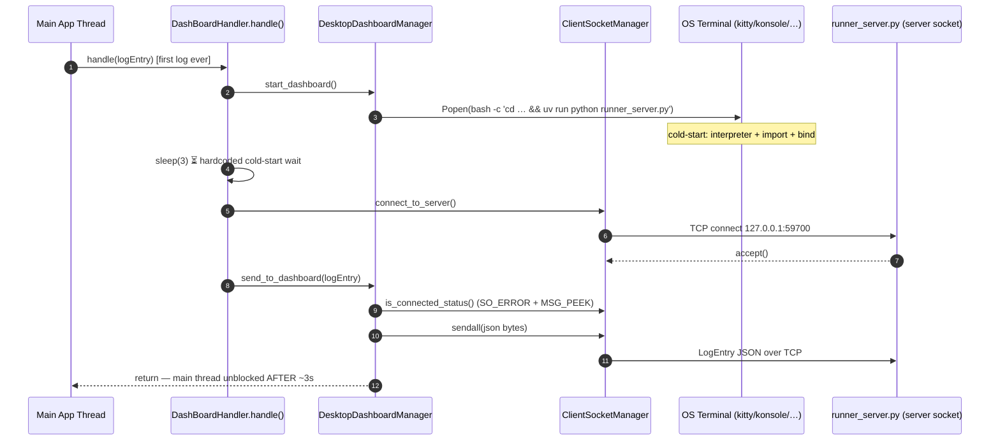

# 🖥️ Desktop: DashBoardHandler — The Live Broadcaster

## Domain & Dependencies

**Domain:** `desktop` — this document covers the desktop-specific handler that streams logs to the live dashboard window.

**Dependencies:**
- **Core Logging System** (`../core/handler-architecture.md`): the `Handler` ABC, `LogEntry`, `OnTimeRegistry`, `Router`. This file is a desktop *handler*, registered into the core singleton.
- **Dashboard Transport** (`dashboard-transport.md`): `SocketManager` (client side) + `DesktopDashboardManager` (process spawning).
- **Core Contract**: core's abstract `DashboardManager` — desktop implements the contract (inversion of control).

---

## 1. Executive Summary

`DashBoardHandler` is one of the two shipped log handlers. Its job: **every** log entry
(`should_handle()` always returns `True`) should also appear in a live, separate terminal
window running a Rich-rendered dashboard. Because that window is a *separate OS process*,
the handler's first-ever `handle()` call performs a heavy lazy bootstrap: spawn the
dashboard terminal, wait ~3 seconds, connect a TCP socket, then forward the log.

**Metaphor:** a stage manager who runs the lighting booth. The first cue takes forever
because they also have to unlock the booth and switch everything on; every cue after
that is instant.

---

## 2. The Code, Piece by Piece

File: `desktop/src/coldwind/desktop/dashboard/dashboard_handler.py`

```python
class DashBoardHandler(Handler):
    name: str = "DashBoardHandler"
    _started = False
```

- `name` — mandatory per the `Handler.__init_subclass__` contract (crash at class
  definition otherwise).
- `_started` — an instance flag guarding the *expensive* one-time bootstrap.

### `should_handle()`

```python
def should_handle(self, log_entry: LogEntry, *args) -> bool:
    return True
```

A **fan-out handler** (see `core/extending-handlers.md` §6): it wants every log.

### `handle()` — the lazy bootstrap

```python
def handle(self, log_entry: LogEntry, *args) -> None:
    if not DashBoardHandler._started:
        DesktopDashboardManager.start_dashboard()
        DashBoardHandler._started = True
        sleep(3)
        SocketManager.ClientSocketManager().connect_to_server()
    DesktopDashboardManager.send_to_dashboard(log_entry)
```

Step by step:

1. **If never started:** call `DesktopDashboardManager.start_dashboard()` — spawns a new
   terminal window running `runner_server.py` (see `dashboard-transport.md` §4), wrapped
   in a `bash -c 'cd … && uv run python …'` so the window persists.
2. **Mark started** — `_started = True` so we do this once per process.
3. **`sleep(3)`** — hardcoded cold-start allowance. The terminal + `uv run` + Python
   interpreter + socket `bind()/listen()` need ~1–3 s before they accept connections.
4. **Connect the client socket** — `SocketManager.ClientSocketManager().connect_to_server()`
   opens a TCP connection to `127.0.0.1:59700` *after* the wait.
5. **Send the log** — `DesktopDashboardManager.send_to_dashboard(log_entry)` serializes the
   entry to JSON and ships it. This line runs on *every* call, including the first.

---

## 3. Sequence Diagram — Why the First Log Costs ~3 Seconds



The dashed cost: steps 4–6 live on the **main thread**, so the chat UI is frozen for
the entire cold-start. Every log after the first takes only the last 3 steps.

---

## 4. Known Sharp Edges (handler-specific)

- **First-log UI freeze** — the `sleep(3)` blocks the caller's thread. See §3.
- **Spawn race** — `start_dashboard()` guards with `server_process.poll() is None`,
  but during the 1–2 s cold-start gap the poll test can still mislead a concurrent
  caller into spawning a second terminal. A lock-file is TODO'ed in `dashboard_transport.py`.
- **Window swallowing (Hyprland)** — compositor `misc:enable_swallow` made spawned
  terminals invisible until it was disabled environment-side (2026-09-14 session).
- **Terminal availability** — correctness depends on at least one of
  kitty/konsole/gnome-terminal/xterm/qterminal/tmux being installed.
- **Socket teardown** — `[Errno 9] Bad file descriptor` was fixed by moving the close
  out of the receive loop and `settimeout(None)` after `accept()` (server-side; see
  `dashboard-transport.md`).

---

## 5. Quick Reference

| You want… | Do this |
|---|---|
| Logs in the dashboard | nothing — it's wired by boot; first log auto-spawns the window |
| Skip the 3 s cost in tests | set `DashBoardHandler._started = True` before first dispatch + pre-connect the socket |
| Prevent double-spawn | guard `start_dashboard()` yourself or check `server_process.poll() is None` |
| Dashboard UI details | `dashboard-printer.md` |
| TCP/socket details | `dashboard-transport.md` |

---

## 6. Q&A Log

> Q: Why is `_started` an instance attribute instead of a class attribute?
> Registration in `main_orchestrator.boot()` creates the single instance at startup, so
> instance-level state is equivalent. A class variable would be cleaner because the
> router fetches handlers from the registry — but it would make the code
> reference-style confusing across dive sites.

> Q: What happens if the dashboard process dies mid-session?
> `send_to_dashboard()` checks `server_process.poll() is None` and
> `client_manager.is_connected_status()`; on failure it logs to the main terminal and
> returns (no relaunch, by design to avoid the spawn race).