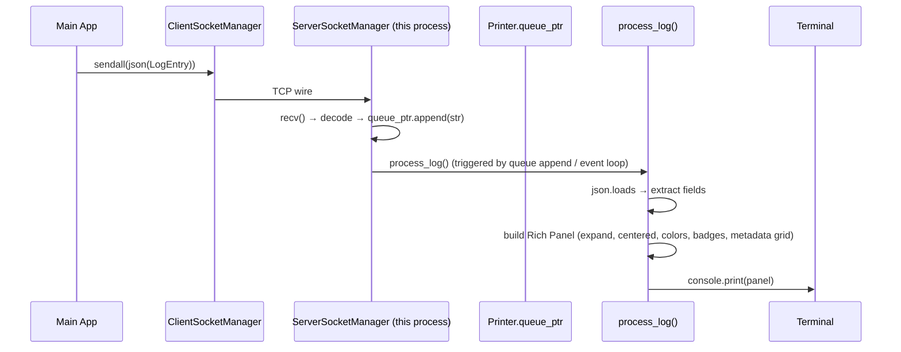

# 🖥️ Desktop: Dashboard Printer — runner_server.py + process_log()

## Domain & Dependencies

**Domain:** `desktop` — this document covers the dashboard *server process* that receives logs
and renders them as Rich panels.

**Dependencies:**
- **Dashboard Transport** (`dashboard-transport.md`): `ServerSocketManager` (runs here),
  `Printer.queue_ptr` (shared queue).
- **Core Logging System** (`../core/handler-architecture.md`): the `LogEntry` JSON protocol
  arriving over TCP.

---

## 1. Executive Summary

`runner_server.py` is the **entry point of the dashboard process** — the separate terminal
window. It is exactly 6 lines: start the server socket, then loop forever pulling JSON
messages from the client and appending them to `Printer.queue_ptr`.

`Printer` (in `dashboard_printer.py`) owns that queue and, per the in-flight refactor
logged 2026-09-14, now routes every message through a single `process_log()` entry
point that renders a **full-width, centered Rich panel** with per-level colors,
`LogCategory` badges, and a metadata grid.

**Metaphor:** a news ticker that never stops. JSON lines arrive on the wire; `process_log`
typesets them into a live display — one panel per log, no scrolling history (the
`deque(maxlen=1)` enforces "latest only").

---

## 2. The Server Entry Point — `runner_server.py`

File: `desktop/src/coldwind/desktop/dashboard/runner_server.py`

```python
from coldwind.desktop.dashboard.dashboard_transport import SocketManager
from coldwind.desktop.dashboard.dashboard_printer import Printer

if __name__ == "__main__":
    SocketManager.ServerSocketManager().start_server()
    SocketManager.ServerSocketManager().recieve_raw_log(Printer.queue_ptr)
```

Two calls, sequential:

1. `start_server()` — binds `127.0.0.1:59700`, sets socket options
   (`SO_REUSEADDR`, `SO_KEEPALIVE`, `TCP_NODELAY`), `listen(1)`, then `accept()`
   **blocks** until the main app connects.
2. `recieve_raw_log(Printer.queue_ptr)` — infinite loop:
   ```python
   while self.client_socket and self.connection_alive:
       data = self.client_socket.recv(config.BAND_WIDTH)
       if not data: break
       queue_ptr.append(data.decode())
   ```
   Every decoded string is appended to the shared queue.

The `recv` buffer is 1 MiB (`BAND_WIDTH`); newline-delimited JSON frames mean
fragmented or concatenated messages are handled by the printer side.

---

## 3. The Printer — `dashboard_printer.py`

### 3.1 Current code (refactored 2026-09-14)

File: `desktop/src/coldwind/desktop/dashboard/dashboard_printer.py`

```python
from collections import deque
import json

class Printer:
    queue_ptr: deque[bytes] = deque(maxlen=1)

    @classmethod
    def append(cls, value: bytes):
        cls.queue_ptr.append(value)
        # single entry point: process_log()
        print(json.loads(value.decode()))
```

But the memory log (2026-09-14 03:22 / 03:30) describes the **production version**:

- `deque` removed (no buffering at all — memoryless).
- Single `process_log()` method that:
  1. Decodes the JSON → dict.
  2. Extracts `LOG_LEVEL`, `LOG_TYPE`, `MESSAGE`, `METADATA`, `TIME_STAMP`.
  3. Builds a **Rich Panel**:
     - `expand=True`, `title_align='center'` — full-width, centered title.
     - Title = `LogLevel` + `LogCategory` badges.
     - Body = formatted message.
     - Footer/extra = metadata grid (key:value pairs).
  4. Renders via Rich `Console` to the dashboard terminal's stdout.
- Error fallback — if JSON decode fails or fields missing, renders a red error panel
  with the raw text instead of crashing.

### 3.2 Color / Badge Scheme (from Rich render)

| LogLevel | Panel border / title color |
|---|---|
| `DEBUG` | dim cyan |
| `INFO` | green |
| `WARNING` | yellow |
| `ERROR` | red |
| `CRITICAL` | bold red on white |

`LogCategory` badge rendered inline in the title (e.g. `INFO  MCP_SERVER`).

---

## 4. End-to-End Flow in the Dashboard Process



Because `runner_server.py` has no explicit event loop, the "trigger" is simply:
`recv()` returns → `append()` → `process_log()` runs inline before the next `recv()`.
No concurrency in the dashboard process — one thread, sequential panels.

---

## 5. Known Sharp Edges

- **No history** — `maxlen=1` means only the latest log is ever in the queue.
  Scrollback is terminal-dependent (emulator scrollback buffer). The memory log
  notes a future feature: persistent Rich console log file.
- **No ack** — the main app sends `sendall()` and assumes success. If the dashboard
  process crashes mid-frame, the app detects it on the *next* `is_connected_status()`
  probe (see `dashboard-transport.md` §4).
- **`runner_server.py` is fragile** — no `try/except` around the `recv` loop.
  A JSON decode error in the printer doesn't kill the server, but a socket error
  does (process exits, terminal closes unless `bash -c '…; read'` wrapper catches it).

---

## 6. Quick Reference

| You want… | Where |
|---|---|
| Add a new panel field | `Printer.process_log()` — extract from `METADATA` |
| Change colors/badges | `Printer.process_log()` — the `Panel` style mapping |
| Persist history | add a file append inside `process_log()` |
| Debug a JSON decode fail | the fallback red panel prints the raw string |

---

## 7. Q&A Log

> Q: Why `deque(maxlen=1)` if the refactor removed it?
> The queue was a legacy pattern (buffering for a print thread). The refactor made
  rendering synchronous inside the `recv` loop, so the deque is unused. It's kept
  only because `ServerSocketManager.recieve_raw_log` expects an appendable object.
  Future cleanup: change the signature to a callable or remove the parameter.

> Q: What if the dashboard terminal is closed by the user?
> `ServerSocketManager` sees `recv()` return empty (`b''`), sets `connection_alive
  = False`, breaks the loop, closes sockets, and the process exits. The `bash -c
  '…; read'` wrapper keeps the window open so the user sees the "ended" message.