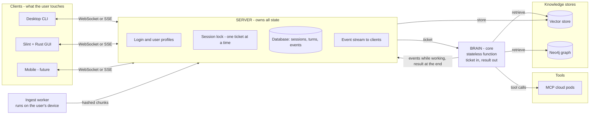
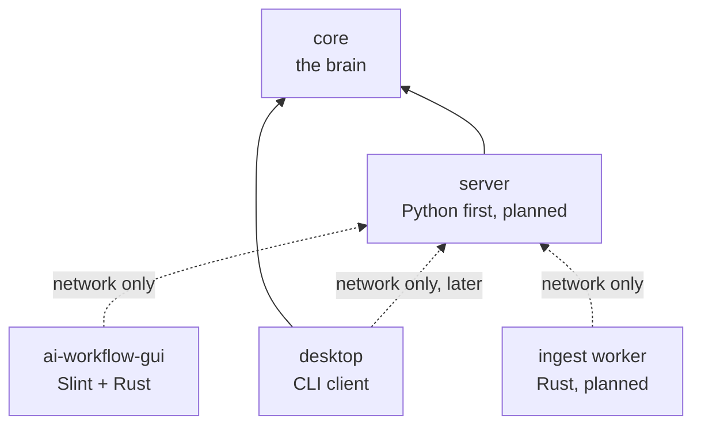
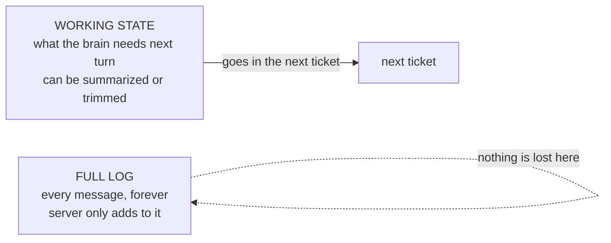
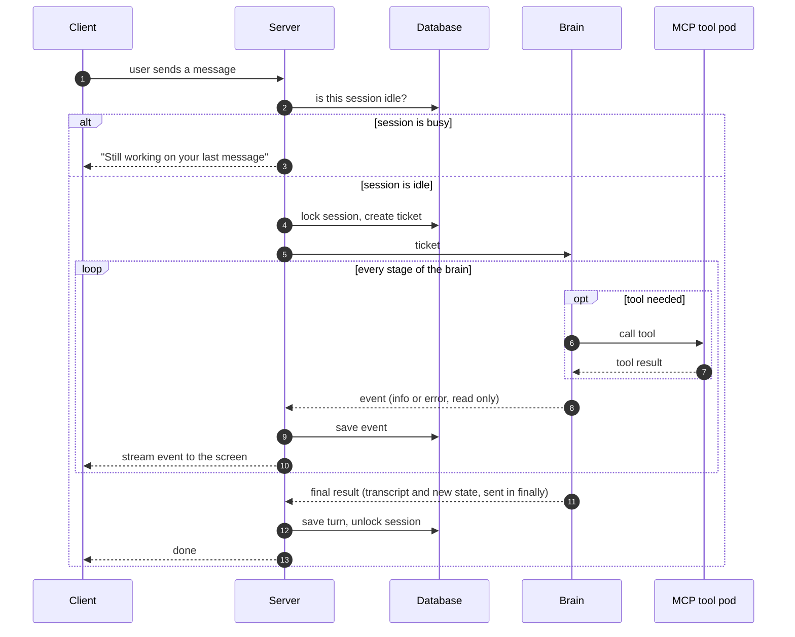
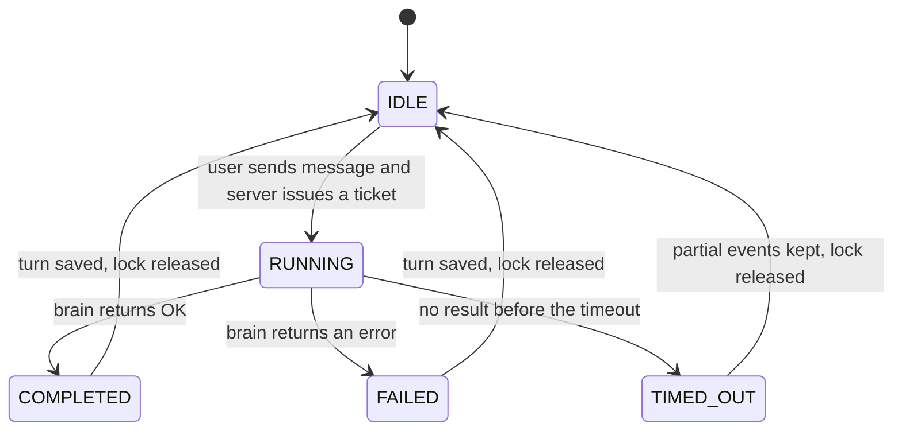
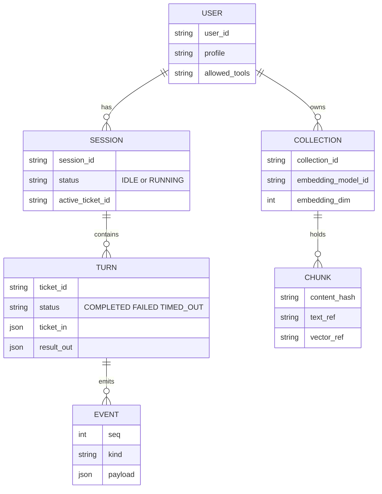
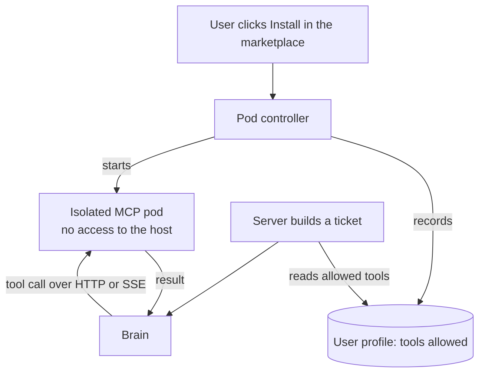
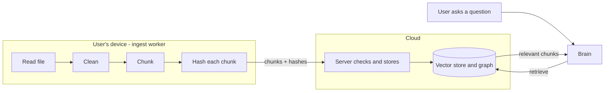
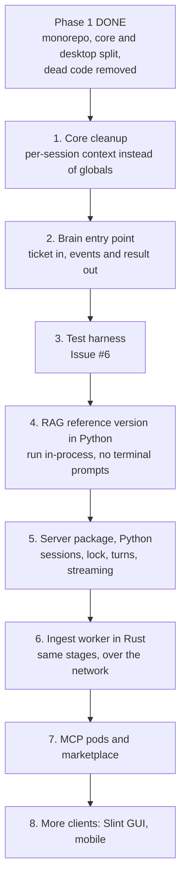

# 🌬️ Cold Wind AI — Architecture Base (Spec Cheat Sheet)

> **Report 1 of 2.** This one explains the whole system, A to Z.
> **Report 2** (next) goes deep on the RAG pipeline.
> Written for humans: pictures first, short words, no hidden jargon.

**Legend used in this document**

| Tag | Meaning |
|---|---|
| ✅ **Decided** | You (Piyush) already decided this |
| 💡 **Proposed** | A suggestion in this report, not yet decided |
| ❓ **Open** | Still needs a decision |

---

## 1. The whole system in one picture

Think of a restaurant:

- **Client** = the customer (the app the user touches)
- **Server** = the waiter (knows who the customer is, keeps the order book, carries messages)
- **Brain** = the kitchen (cooks the answer, remembers nothing between orders)



**The one sentence version:**
The server holds everything that must be remembered. The brain only thinks. The clients only show things.

---

## 2. Who does what (the four roles)

| Role | Owns | Never does |
|---|---|---|
| **Client** (CLI, Slint GUI, mobile) | Showing events, taking user input, reading local files (via the worker) | Talks to the brain directly. Stores long-term data. |
| **Server** | Users, login, sessions, the database, the session lock, timeouts, retries, streaming to clients | Runs agent logic or LLM reasoning |
| **Brain** (`core`) | Agent graphs, reasoning, tool calling, retrieval, producing events and a final result | Touches the database. Knows which client is connected. Prints to a screen. |
| **Workers and tools** | Ingest worker: reading, chunking, hashing documents on the user's device. MCP pods: running tools safely in the cloud. | Decide anything. They do what they are asked. |

---

## 3. The golden rules (never break these)

1. **Core never imports its users.** Core must not import desktop, server, or GUI code. They import core, never the other way around. ✅
2. **The brain is stateless.** Same ticket in, same kind of result out. Nothing remembered between turns. ✅
3. **The server owns all saved state.** Sessions, turns and events live in the server's database. ✅
4. **One ticket at a time per session.** While the brain works on a ticket, the user cannot send another. ✅
5. **Events only flow one way: brain to platform, read only.** The brain announces what it is doing; nobody changes the brain mid-turn through events. ✅
6. **Config and live objects are different things.** Fixed settings are validated once at start-up (`pydantic-settings`). Live things (database clients, model manager, MCP connections) are created *per session*, not stored in global variables. 💡

> **Why rule 6 matters:** The old design had global "registries" holding live objects. With one user that is fine. With many users, one person's context can leak into another's. Per-session context fixes that.

---

## 4. Repo layout: who depends on whom

Arrows point to **what you depend on**. Core sits at the bottom and depends on nobody.



- Solid arrow = code import.
- Dotted arrow = talks over the network, imports nothing.
- 💡 **Server starts in Python** and imports core as a library. No network hop between server and brain at first. The contract between them (ticket and events) is written so that a Rust server could replace it later.
- ❓ **Server language long term:** Python or Rust. Not needed to decide now.

---

## 5. The Ticket and the Result

The brain is just a function:

```text
brain( ticket )  →  events (while working)  +  result (at the end)
```

### What goes in the ticket 💡

| Field | Plain meaning |
|---|---|
| `ticket_id` | Unique ID of this one round |
| `session_id`, `user_id` | Whose conversation this is |
| `user_message` | What the user just said |
| `working_state` | What the brain needs to continue (recent messages, summary, plan) |
| `profile_slice` | Only the parts of the user's profile this turn needs |
| `allowed_tools` | Which tools this user may use, and where to reach them |
| `limits` | Timeout, max steps, max tokens |

### What comes out 💡

| Part | Plain meaning |
|---|---|
| **Events** (during) | Small read-only messages: "starting stage 2", "calling web_search", "warning: slow tool" |
| **Result** (end, sent in `finally`) | `status` (ok or error), `new_working_state`, `transcript` (full text of this turn), `usage` (tokens, time), `error_info` if any |

### Two kinds of history (keep them apart) 💡



If the brain trims or summarizes to fit the model's limit, the full log still has everything.

### One quick safety test ✅ (you said it serializes fine)

Before trusting it fully, run `json.dumps` on a real end-of-turn state once. Things that sometimes sneak in: exceptions (turn them into text), message objects, live clients.

---

## 6. Life of one turn



**Key point:** events are saved *as they arrive* (between stages). So if the brain dies halfway, the server already has everything up to the last stage.

---

## 7. The session lock (state machine)



- ✅ While `RUNNING`, the user cannot send another message.
- 💡 **The lock lives on the server**, not only in the UI. Greying out a button is not enough: a second device or a script could still send a message.

---

## 8. Data model (what the server stores)



**Why keep `ticket_in` and `result_out` for every turn?**
Because the brain is a function, you can **replay any turn** by feeding the saved ticket back in. That makes bugs far easier to reproduce.

(RAG parts — `COLLECTION` and `CHUNK` — are explained fully in Report 2.)

---

## 9. Events: how the brain talks while working

Your existing `debug_info` and `debug_error` already do this job. The plan is to turn them into a proper event stream the server can pass on.

| Kind 💡 | When | Example |
|---|---|---|
| `info` | Normal progress | "Stage 2 started" |
| `tool_started` / `tool_finished` | A tool is called | "web_search started" |
| `text` | Part of the final answer | "Here is what I found..." |
| `error` | Something went wrong (turn may continue) | "Tool timed out, retrying" |
| `done` | End of the turn | — |

**Rules for events**

- Plain data only. It must be possible to turn them into JSON.
- Read only. The platform may show them, never use them to steer the brain.
- Never assume a screen. No printing, no colors. Clients decide how to display.
- Errors must be turned into text (`type`, `message`, `traceback_text`) before leaving the brain.

---

## 10. Tools and the MCP marketplace



- Users never install `npx`, `uvx`, Node or Python just to use a tool.
- Each pod is isolated, so a bad tool cannot touch other users.
- ❓ **Heavy piece:** safely running arbitrary tool code in the cloud is a big security job. It is the last phase for a reason.

---

## 11. RAG at a glance (full details in Report 2)



Quick facts:

- ✅ The platform runs the heavy steps; the brain only asks "retrieve".
- ✅ No local copy of user data is kept on the device. Chunks are hashed and stored in the cloud.
- 💡 **One embedding model per collection.** Vectors from different models cannot be compared. The model id and size are saved with every collection.
- 💡 Default to a small local ONNX model so everyone shares one vector space. Bring-your-own API key is an option per collection.
- 💡 The cloud must **verify** what the device sends. A device is not trusted by default.

---

## 12. Data and privacy

(Not legal advice. Check the rules that apply to you, such as India's DPDP Act, before launching to real users.)

| Kind of data | Why we keep it | Needs |
|---|---|---|
| Profile, sessions, history | Needed to make the product work | Clear notice |
| Indexed documents (RAG) | Needed so retrieval works | Clear notice, delete on request |
| Browser and tool data | Only what the feature needs | Decide early what you will **not** store (passwords, banking pages) |
| Using data to train or improve models | A different purpose | **Its own separate consent**, withdrawable |

Isolation rules 💡:

- Every user gets their own namespace in the vector store.
- Database rows are restricted per user.
- Stored API keys are encrypted, or kept on the device only.

---

## 13. What can go wrong, and what the design does

| Problem | What happens | Status |
|---|---|---|
| Brain dies halfway | Events up to the last stage are already saved. Turn is marked `TIMED_OUT`. Lock is released. Tool side effects that already ran are **not** undone. | ✅ |
| Brain answers *after* it timed out | Server must ignore it: the `ticket_id` is no longer the session's active ticket. | 💡 |
| Server restarts while a ticket is out | On start-up, find `RUNNING` turns older than the timeout, mark them `TIMED_OUT`, release locks. Otherwise the user stays blocked forever. | 💡 |
| User sends from two devices | Lock is on the server, so the second device sees "busy". | ✅ |
| Same message sent twice (retry) | Server handles duplicates (idempotency). | ✅ |
| State fails to turn into JSON | Run the `json.dumps` test on real end-of-turn state. | 💡 |
| Code changes and old sessions no longer fit | No `schema_version` for now. Accepted risk. Cheap to add later: treat "missing" as version 0. | ✅ accepted |

---

## 14. Build order

The earlier vision had 4 phases. This is the same plan with the new architecture folded in.



Notes 💡:

- Steps 1 and 2 are cheap and unlock everything else.
- Write each stage's input and output as plain data classes from day one, so the same stages can later run over the network.
- Do **not** rewrite the Python RAG into Rust before the Python version exists. Port stages one at a time, only when measurements show a reason.

---

## 15. Decision log

| # | Decision | Status |
|---|---|---|
| 1 | Brain is Python, stateless: ticket in, result out | ✅ Decided |
| 2 | Server owns the database and all session state | ✅ Decided |
| 3 | One ticket in flight per session; user blocked until it returns or times out | ✅ Decided |
| 4 | Events saved between stages (`debug_info` / `debug_error` path) | ✅ Decided |
| 5 | Idempotency handled on the server | ✅ Decided |
| 6 | No `schema_version` for now | ✅ Decided (accepted risk) |
| 7 | Server is a separate workspace package, not "the brain turned into a server" | ✅ Decided |
| 8 | Server in Python first, calling brain as a library | 💡 Proposed |
| 9 | Rust used first for the ingest worker, not for the server | 💡 Proposed |
| 10 | Local ONNX embedding by default; bring-your-own key optional | ❓ Leaning |
| 11 | Server in Rust later | ❓ Open |
| 12 | Where ticket `working_state` trimming happens (brain or server) | ❓ Open |
| 13 | Sandbox design for MCP pods | ❓ Open |

---

## 16. Plain-words glossary

| Word | Meaning |
|---|---|
| **Brain** | The `core` package. Reasons and calls tools. Remembers nothing. |
| **Server** | Keeps users, sessions and the database. Hands tickets to the brain. |
| **Ticket** | Everything the brain needs for one round, packed into one message. |
| **Turn** | One round: user message in, answer out. |
| **Session** | A whole conversation = many turns, saved in order. |
| **Event** | A small read-only update the brain sends while working. |
| **Result** | The final package the brain sends back at the end of a turn. |
| **Lock** | The server's "busy" flag that stops a second message during a turn. |
| **Idempotent** | Doing it twice has the same effect as doing it once. |
| **Worker** | A program that does a heavy job on request (here: ingesting documents). |
| **Embedding** | A list of numbers that represents the meaning of a piece of text. |
| **Chunk** | A small piece of a document, stored and searched on its own. |
| **MCP pod** | A sandboxed cloud container that runs a tool for the brain. |

---

## 17. Next documents

- **Report 2:** RAG pipeline in detail (the 7 stages, the device/cloud split, protocol, embeddings, verification, storage, error recovery).
- After that: a short **"first milestone" checklist** for steps 1 to 3 of the build order.
