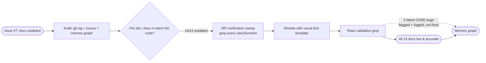

# 📚 Documentation Audit & Modernization — Final Report

**Cold Wind AI** (`cold-wind-ai` v2.0.0) · **Audit window:** 2026-10-07 → 2026-10-08 · **Status:** ✅ Complete

---

## Domain & Dependencies

| Item | Value |
|------|-------|
| **Covers** | All repository documentation: 1 root `README.md`, 11 core package READMEs, 2 desktop package READMEs — **14 files total** |
| **Closes** | GitHub issue **#7** — "📚 docs: Update and finalize user, API, and platform architecture documentation" |
| **Depends on** | `pyproject.toml` (version + workspace source of truth), `AGENTS.md` (invariants), git history (Phase 1 restructure), memory graph entity `Status: Docs Staleness Audit 2026-10-07` |
| **Touch points** | Core packages (`config`, `utils`, `system_logging`, `agents`, `agents/agentic_orchestrator`, `RAG`, `tools`, `engine`, `mcp`, `models`, `prompts`), desktop packages (`slash_commands`, `ui`) |
| **Out of scope** | Code changes (docs-only pass — latent code bugs were *flagged and logged*, not fixed), `tests/` docs, `server/` (not yet created) |

---

## Executive Summary

The Phase 1 monorepo restructuring (uv workspace, `coldwind.*` namespace packages, ~6,800-line purge) left every README in the repository describing a project that no longer existed. This audit verified every documented API against the real source code, then rewrote all 14 documentation files:

- **Every** README referenced deleted files, dead `src.*` import paths, or APIs that never existed.
- **One functional documentation bug fixed:** the MCP config example used the `"mcpServers"` key, but the loader reads `"servers"` — anyone copying the old docs got zero servers loaded.
- **All fictional APIs purged:** `ToolAgent`, `get_all_tools`, `neo4j_tool`, `file_reader`, `code_executor`, `MCPManager`, `tool_models.py`, `RichTracebackManager.install()` — none exist in the codebase.
- **Three latent code bugs flagged and logged** (not fixed — docs-only mandate): `display_banner`/`print_banner` signature mismatch, a stale `'chat'` emoji key, and old branding in a module docstring.
- **Validation:** post-write grep sweeps confirm zero live stale references; every README now documents only verified, importable APIs.

---

## System Context — Why Every Doc Was Stale

The repository changed shape faster than its docs. The relevant git timeline:

```text
Phase 1 restructure (recent history)
├─ merges a4459bb / fe77d79  → uv workspace, coldwind.* namespace packages
├─ purge 779881a             → ~6,800 lines deleted, including:
│     AgentGraphCore.py, config/settings.py, configure_logging.py,
│     utils/socket_manager.py, utils/error_transfer.py,
│     desktop debug_helpers.py, debug_message_protocol.py,
│     print_history.py, rich_error_print.py
├─ 1398c14                   → core↔desktop layering enforced (~23 files)
└─ 4012c3f                   → desktop dashboard modernized
```

After this, the docs still told the **old story**: a flat `src/` tree, a global `settings` module, a socket-based debug window, and a handful of tools and agents that were never real. GitHub issue #7 captured the requirement: READMEs must reference only valid paths and document uv-workspace onboarding.

---

## Detailed Analysis

The audit found staleness in two severity tiers across all 14 files.

### Tier 1 — Documented deleted or fictional architecture

| Doc | What it claimed | Reality |
|-----|----------------|---------|
| Root `README.md` | `pip install -r requirements.txt`, `python src/main_orchestrator.py`, `.env.example`, pre-monorepo tree | uv workspace; real entry `desktop/src/coldwind/desktop/main_orchestrator.py`; no requirements.txt/.env.example |
| `config/README.md` | Flat-global `src.config.settings` module | Deleted; now `CoreSettinngs`/`DesktopConfig` pydantic-settings + `ContextRegistry` |
| `utils/README.md` | `socket_manager.py`, `error_transfer.py` APIs | Both purged; real modules are ModelManager, OpenAIIntegration, listeners, 2 helpers |
| `system_logging/README.md` | Purged socket + debug-helpers pipeline | Real flow: `debug_callers_api` → `Dispatcher` → `Router` → `TextHandler` → `basic_logs/` |
| `agents/README.md` | File in **reversed line order**; `ToolAgent`, `get_all_tools` | Neither ever existed; rebuilt around real classify→route flow |
| `agents/agentic_orchestrator/README.md` | Pointed at deleted `AgentGraphCore.py` **file**; leftover AI-chat text | Class `AgentGraphCore` lives in `graphCore.py`; pipeline rebuilt with real `subAGENT_*` nodes |
| `RAG/README.md` | Six fictional modules (loader/embeddings/vector_store/retriever/indexer/chain) | Three real modules: `rag.py`, `neo4j_rag.py`, `sheets_rag.py` |
| `tools/README.md` | Fictional `neo4j_tool`, `file_reader`, `code_executor`, `get_all_tools` | Real: `ToolAssign` registry + 5 tools (search, shell, translate, RAG, browser) |
| Desktop `ui/README.md` | Purged debug window (`debug_helpers`, `debug_message_protocol`, `rich_error_print`, `error_transfer`, `settings.socket_con`) | Real 4 modules: `chatInputHandler`, `print_message_style`, `print_banner`, `rich_traceback_manager`; debug window → dashboard |

### Tier 2 — Stale paths and wrong names

| Doc | Stale claim | Verified correction |
|-----|-------------|---------------------|
| `engine/README.md` | `main_orchestrator` inside core; `src.core.*` paths | Entry lives in desktop; engine owns boot/loop/shutdown wiring |
| `mcp/README.md` | Config key `"mcpServers"`; class `MCPManager` | Loader reads `"servers"`; class is `MCP_Manager` |
| `models/README.md` | `AgentState`, `tool_models.py` | Real: `State` TypedDict + `StateAccessor` singleton; workflow models live in the orchestrator |
| `prompts/README.md` | `get_system_prompt`, `task_prompts`, `formatting`, `agent_prompts` | Real 9-module inventory verified method-by-method |
| Desktop `slash_commands/README.md` | `/chat` command; `/tool --name <tool>`; registration in core `chat_initializer`; `src.*` imports | Real command is `/llm`; `/tool` has no options yet; registration in `DesktopCommandParser.register_default_commands()`; `coldwind.desktop.*` imports |

### Common rot across all files

- `src.*` import paths (dead since the namespace migration)
- "Last Updated: December 24, 2025" and "AI-Agent-Workflow Team" branding
- Prompt-style prose walls instead of scannable structure

---

## Visual Diagrams

### Audit scope — what was checked and rewritten



### The one functional bug — before vs after

```text
OLD DOC (broken):                    REALITY (load_config.py:85):
{                                    config.get("servers", {})
  "mcpServers": { ... }                    ▲
}                                          └── "mcpServers" silently ignored
                                           └── users copied old docs → 0 servers loaded
NEW DOC (fixed):
{ "servers": { ... } }   ✅
```

---

## Root Cause Investigation

Why did every doc rot at once? Four causes, in order of impact:

1. **The purge outran the docs.** Commit 779881a deleted ~6,800 lines across core and desktop in one pass. Nine READMEs documented files that vanished overnight — nothing flagged the docs as broken because the docs still *read* fine.
2. **Fictional APIs accumulated silently.** Some docs described APIs that never existed at all (`ToolAgent`, `neo4j_tool`, `get_all_tools`). These were most likely written from imagination or from plans that never landed — with no verification loop, nothing ever contradicted them.
3. **No single source of truth.** Docs restated architecture instead of pointing at it. When the architecture moved (uv workspace, layering invariant, runtime context), every restatement became a separate stale copy.
4. **Imports moved twice.** `src.*` → namespace packages → `coldwind.*`, plus `main_orchestrator` migrating from core to desktop. Old paths appear valid to a reader who doesn't know the history.

The lesson this report encodes: **a doc that cannot be checked against the code will drift; a doc that can, can be audited.**

---

## Solution Design

Every rewritten README follows **one shared, visual-first template**, designed for beginners first:

```text
1. One-line pitch          "what is this, in plain English"
2. Where This Fits         mini ASCII map — who calls this, what it calls
3. Why This Exists         2–3 bullets, no jargon without a definition
4. Module Map              table: file → plain-English job
5. Architecture visual     big ASCII/mermaid diagram of the real flow
6. Step-by-step walkthrough numbered trace of one real request
7. Quick Start             verified, copy-pasteable code ONLY
8. FAQ / Gotchas           real quirks, real file names
9. Footer                  Cold Wind AI · package · Updated in the v2.0.0 docs pass
```

Three rules governed the rewrite:

- **Verification-first:** every class, function, field, and config key was grep-verified against source *before* being written down. Nothing in these docs is invented.
- **Visual relationships over paragraphs:** each doc leads with how it connects to its neighbors; jargon only appears with a plain-English gloss.
- **Relative paths only:** every path inside docs is relative so links render clickable in any viewer.

---

## Code Examples — Before / After

### 1. MCP config key (functional bug fix)

```json
// ❌ OLD DOC — key silently ignored by the loader
{ "mcpServers": { "github": { "command": "NPX", "args": ["..."] } } }

// ✅ NEW DOC — matches load_config.py:85  config.get("servers", {})
{ "servers": { "github": { "command": "NPX", "args": ["..."] } } }
```

### 2. Slash command set (name + ownership corrections)

```text
❌ OLD:  /chat  · registered in src/core/chat_initializer.py · /tool --name <tool>
✅ NEW:  /llm   · registered in DesktopCommandParser.register_default_commands()
                 (runtime/DesktopContext.py) · /tool has no options yet (todo in use_tool.py)
```

### 3. Crash-report API (fictional method removed)

```python
# ❌ OLD DOC — method does not exist
RichTracebackManager.install()

# ✅ NEW DOC — real entry points (rich_traceback_manager.py)
RichTracebackManager.initialize(show_locals=False, max_frames=10)
RichTracebackManager.initialize_debug_process(debug_console, ...)
```

---

## Testing and Validation

Each rewrite batch was followed by a **stale-token sweep** over the written files:

- **Tokens checked:** `src.*` legacy paths, `ToolAgent`, `get_all_tools`, `socket_manager`, `error_transfer`, `mcpServers`, `MCPManager`, `AgentGraphCore.py` (as live file), fictional RAG module names, `/chat`, `install()`, `December 24`, `AI-Agent-Workflow Team`, `settings.socket_con`, `debug_helpers`, `rich_error_print`, `tool_models.py`.
- **Pass policy:** a token may remain **only** inside an explicit correction note ("removed in the v2.0.0 purge", "never existed — the real API is X"). No live stale references survived.
- **Result:** clean on all 14 files. Residual grep hits are intentional historical notes and pre-existing migration comments inside *code* files (out of docs scope).
- **Cross-check:** memory graph entity `Status: Docs Staleness Audit 2026-10-07` carries the full per-file audit trail, including every verified API inventory used for these rewrites.

---

## Learning Outcomes

- **Docs are code.** They need the same verify-then-write discipline; a plausible-looking README with invented APIs is worse than no README.
- **One purge commit can invalidate ten docs.** After structural commits, doc audits are not optional cleanup — they are part of the change.
- **Show relationships, not catalogs.** The "Where This Fits" mini-map outlived every API list: even when names change, the reader still learns *where* a package sits in the flow.
- **Intentional history beats silent deletion.** Keeping one explicit "X was removed in v2.0.0" note prevents future audits from re-litigating whether something is stale.
- **Docs passes surface real code bugs.** Verifying signatures line-by-line exposed a latent `TypeError` (`display_banner` → `print_banner`) that no test currently catches.

---

## Quick Reference — The 14 Rewritten Docs

| # | Doc | One-line summary |
|---|-----|------------------|
| 1 | [`../../README.md`](../../README.md) | Cold Wind AI v2.0.0: uv workspace, layering, real quick start |
| 2 | [`../../core/src/coldwind/core/config/README.md`](../../core/src/coldwind/core/config/README.md) | Typed settings: `CoreSettinngs` → `DesktopConfig`, config-vs-runtime split |
| 3 | [`../../core/src/coldwind/core/utils/README.md`](../../core/src/coldwind/core/utils/README.md) | ModelManager, OpenAIIntegration, listeners, helpers |
| 4 | [`../../core/src/coldwind/core/system_logging/README.md`](../../core/src/coldwind/core/system_logging/README.md) | `debug_*` → Dispatcher → Router → `basic_logs/` |
| 5 | [`../../core/src/coldwind/core/agents/README.md`](../../core/src/coldwind/core/agents/README.md) | classify → route: chat / tool / agent / slash |
| 6 | [`../../core/src/coldwind/core/agents/agentic_orchestrator/README.md`](../../core/src/coldwind/core/agents/agentic_orchestrator/README.md) | Hierarchical pipeline in `graphCore.py`, sub-agent spawning |
| 7 | [`../../core/src/coldwind/core/RAG/README.md`](../../core/src/coldwind/core/RAG/README.md) | Chunks, embeddings, triples → Neo4j; Sheets ingestion |
| 8 | [`../../core/src/coldwind/core/tools/README.md`](../../core/src/coldwind/core/tools/README.md) | `ToolAssign` registry + the 5 real tools |
| 9 | [`../../core/src/coldwind/core/engine/README.md`](../../core/src/coldwind/core/engine/README.md) | Boot sequence, graph wiring, graceful shutdown |
| 10 | [`../../core/src/coldwind/core/mcp/README.md`](../../core/src/coldwind/core/mcp/README.md) | `"servers"` key, `MCP_Manager` lifecycle, tool discovery |
| 11 | [`../../core/src/coldwind/core/models/README.md`](../../core/src/coldwind/core/models/README.md) | `State` TypedDict + `StateAccessor` window |
| 12 | [`../../core/src/coldwind/core/prompts/README.md`](../../core/src/coldwind/core/prompts/README.md) | The 9 real prompt factories, who-feeds-whom map |
| 13 | [`../../desktop/src/coldwind/desktop/slash_commands/README.md`](../../desktop/src/coldwind/desktop/slash_commands/README.md) | Real command set (`/llm`!), ticket-based `/exit`, add-your-own |
| 14 | [`../../desktop/src/coldwind/desktop/ui/README.md`](../../desktop/src/coldwind/desktop/ui/README.md) | Input box, panels, banner, rich tracebacks → dashboard |

---

## Related Resources

- **Audit trail:** memory graph entity `Status: Docs Staleness Audit 2026-10-07` (per-file findings, verified API inventories, latent-bug details)
- **Issue:** GitHub #7 — "docs: Update and finalize user, API, and platform architecture documentation" (scope closed by this audit)
- **Repo rules:** [`../../AGENTS.md`](../../AGENTS.md) — invariants, docs path rules
- **Reports index:** [`../README.md`](../README.md)
- **Next major work:** [`./rag-ETL-infra/README.md`](./rag-ETL-infra/README.md) — the upcoming RAG ETL refinement (READMEs already flag it)

---

## Glossary

- **Purge (779881a):** the Phase 1 commit that deleted ~6,800 lines, including several files the docs still described.
- **Layering invariant:** desktop imports core; core never imports desktop; core knows only `core/interfaces/` contracts.
- **`ContextRegistry`:** the active runtime context lookup — settings, console, listeners, services all live there, never in globals.
- **Verification-first docs:** grep every symbol against source before writing it down.
- **Tier-1 / Tier-2 staleness:** Tier-1 = documents deleted or fictional architecture; Tier-2 = wrong paths/names around a correct structure.

---

## Q&A Log (user decisions that shaped the audit)

- **Is the missing `.mcp.json` stale info?** No — it is part of the MCP runtime flow (wired via `mcp_config_path` on `DesktopConfig`); kept as valid documentation.
- **Roadmap: Docker / REST API / multi-agent collab?** All still valid goals — kept.
- **"Prompts refinement" as a goal?** Already completed — excluded from goals.
- **Tests status?** Marked 🚧 Unmaintained / TODO (to be regenerated later).
- **Version?** 2.0.0 (user bumped `pyproject.toml`; docs follow it, never inline a version).
- **Scope pacing?** Core docs first, desktop in a second pass — both now complete.
- **Latent code bugs found during the docs audit?** Logged in detail to the memory graph, NOT fixed — this was a documentation-only mandate.
- **Docs style?** Visual-first, beginner-friendly, minimal jargon — relationships over paragraphs.

---

**Filed under:** `urgent_development/` · **Protocol:** `report-protocol` skill · **Maintainer note:** all paths in this report are relative so they render as clickable links in any markdown viewer.
