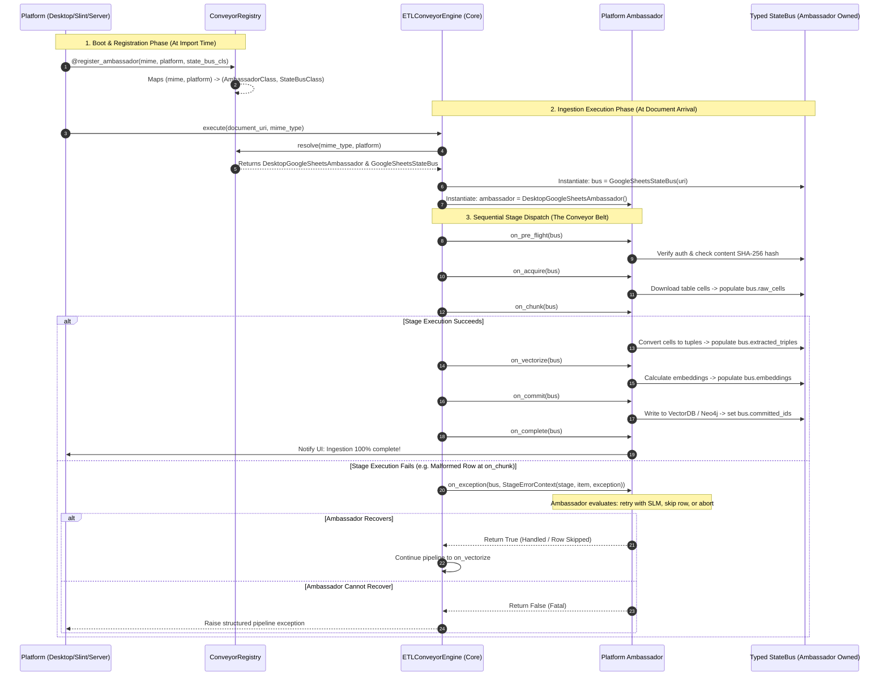

# 🏛️ Architecture Specification: Microkernel Conveyor Belt & Platform Ambassador RAG Engine

━━━━━━━━━━━━━━━━━━━━━━━━━━━━━━━━━━━━━━━━━━━━━━━━━━━━━━━━━━━━━━━━━━━━━━━━━━━━
📌 EXECUTIVE SUMMARY
━━━━━━━━━━━━━━━━━━━━━━━━━━━━━━━━━━━━━━━━━━━━━━━━━━━━━━━━━━━━━━━━━━━━━━━━━━━━

This specification formalizes the **Microkernel Conveyor Belt & Platform Ambassador Architecture** for Cold Wind AI's next-generation Retrieval-Augmented Generation (RAG) and document ETL infrastructure. 

Following our architectural audit in [`01-legacy-rag-bottlenecks-and-architectural-autopsy.md`](01-legacy-rag-bottlenecks-and-architectural-autopsy.md), this design permanently eliminates monolithic procedural scripts, platform lock-in, and fragile runtime reflection. 

### Core Architectural Decisions:
1. **The Microkernel Conveyor Belt**: Core functions strictly as an execution engine and lifecycle bus. Core bakes in **zero document format logic** (no PDF parsing, no Google Sheet scraping, no default text assumptions) and **zero UI printing**.
2. **The Platform Ambassador**: Plugins act as the platform's sovereign emissaries. An Ambassador encapsulates both **document-domain logic** (how to parse, chunk, and embed a specific format) and **platform consciousness** (how to stream progress to a terminal Rich console, a Slint + Rust IPC socket, or a FastAPI event stream).
3. **Type-Safe Decorator Auto-Mapping (`@register_ambassador`)**: Replaces the fragile dictionary/attribute reflection found in [`browser_tool/Handler.py`](../../../core/src/coldwind/core/tools/lggraph_tools/tools/browser_tool/Handler.py). All parameters (`mime_types`, `platform`, `fail_fast`, `state_bus_cls`) are explicitly declared and validated at import time.
4. **Ambassador-Defined State Bus (`BaseETLStateBus[T]`)**: The data packet traveling the conveyor belt is defined and typed by the Ambassador. Core passes the bus along stages without guessing or mutating domain-specific fields.
5. **Stage-Aware Error Diagnostics & AI Recovery**: When a stage fails, the conveyor belt packages a rich execution payload (`stage`, `item_index`, `payload_snapshot`, `exception`) and hands it to the Ambassador's `on_exception` hook, enabling localized retries or small-model (SLM) error recovery without killing the application.

---

## 🏛️ Domain & System Dependencies

- **Platform Scope**:
  - `core` — Provides `ETLConveyorEngine`, `ETLStage` enum, `@register_ambassador` decorator, and `BaseETLAmbassador` abstract base class.
  - `desktop` — Houses Desktop-specific Ambassadors (e.g., `DesktopPdfAmbassador`, `DesktopTextAmbassador`) that render progress directly to prompt_toolkit/Rich.
  - `client (Slint + Rust GUI)` — Houses GUI-specific Ambassadors communicating via IPC sockets.
  - `server` — Houses headless Ambassadors streaming Server-Sent Events (SSE) over HTTP.
- **Touched Subsystems**:
  - `core/src/coldwind/core/interfaces/` — New contracts for ETL pipelines and state buses.
  - `core/src/coldwind/core/rag/` — New modern RAG package replacing legacy procedural scripts.

---

## 🔬 Autopsy of Browser Handler Reflection vs. Decorator Auto-Map

In [`browser_tool/Handler.py`](../../../core/src/coldwind/core/tools/lggraph_tools/tools/browser_tool/Handler.py), driver registration relied on metaclass reflection that inspected class attributes dynamically:
```python
# Legacy browser_tool approach (Fragile Reflection):
class HandlerMeta(type):
    def __init__(cls, name, bases, namespace):
        # Physically inspected class attributes like enum_value and huge_error
        if hasattr(cls, 'enum_value') and cls.enum_value:
            enum_value = cls.enum_value
            huge_error = getattr(cls, 'huge_error', False)
```

### Critical Flaws of the Legacy Approach:
1. **Fragile Reflection**: Relied on string attribute checks (`hasattr(cls, 'enum_value')`) without compile-time or LSP type safety.
2. **Scattered Configurations**: A driver class had to declare disjointed class attributes (`enum_value = ...`, `huge_error = True`) that were easy for developers to miss or misspell.
3. **No Platform Scoping**: Could not differentiate between Desktop, Server, or GUI variations of the same driver.

### The Modern Decorator Auto-Map Solution:
Instead of class attribute scraping, Ambassadors declare their configuration cleanly via a typed decorator:
```python
@register_ambassador(
    mime_types=["application/pdf"],
    platform="desktop",
    fail_fast=True,
    state_bus_cls=DesktopPdfStateBus
)
class DesktopPdfAmbassador(BaseETLAmbassador[DesktopPdfStateBus]):
    ...
```
- **Type-Safe**: The decorator validates arguments against Pydantic or strict dataclass schemas on module import.
- **LSP / IDE Friendly**: Full autocompletion and type checking for all driver parameters.
- **Explicit Scoping**: Multiple platforms can register their own Ambassador for the same MIME type (`platform="desktop"` vs `platform="slint_gui"`).

---

## 🚌 The Ambassador-Owned State Bus (`BaseETLStateBus`)

Rather than forcing a rigid, monolithic data schema in Core, the data packet traveling the conveyor belt is defined by the Ambassador itself.

```text
┌────────────────────────────────────────────────────────────────────────┐
│                   AMBASSADOR-DEFINED STATE BUS TOPOLOGY                │
└────────────────────────────────────────────────────────────────────────┘

  BaseETLStateBus (Core Protocol Foundation)
  ├── document_uri: str
  ├── current_stage: ETLStage
  ├── stage_metrics: dict[str, float]
  └── error: Exception | None
          ▲
          │ (Inherits and Extends)
          │
  GoogleSheetsStateBus (Ambassador Domain Specialization)
  ├── sheet_id: str
  ├── raw_table_grid: list[list[str]]
  ├── semantic_triples: list[tuple[str, str, str]]
  └── cell_embeddings: list[list[float]]
```

### State Bus Implementation Pattern:
```python
from dataclasses import dataclass, field
from coldwind.core.rag.stages import ETLStage

@dataclass
class BaseETLStateBus:
    """Core bus tracking metadata common to all pipeline executions."""
    document_uri: str
    current_stage: ETLStage = ETLStage.ON_PRE_FLIGHT
    execution_history: list[dict] = field(default_factory=list)
    error: Exception | None = None

@dataclass
class GoogleSheetsStateBus(BaseETLStateBus):
    """Domain-specific bus defined and owned by the GoogleSheetsAmbassador."""
    sheet_id: str = ""
    raw_cells: list[list[str]] = field(default_factory=list)
    extracted_triples: list[tuple[str, str, str]] = field(default_factory=list)
    embeddings: list[list[float]] = field(default_factory=list)
```

Core inspects only `current_stage` and `error` to manage conveyor belt transitions. All domain data (`raw_cells`, `extracted_triples`) is accessed exclusively by the Ambassador's stage methods.

---

## 🔁 The 7 Immutable Conveyor Belt Stages

The Core Conveyor Belt dispatches execution across seven sequential lifecycle stages:

```text
┌────────────────────────────────────────────────────────────────────────────────────────────────────────────────┐
│                              THE 7 IMMUTABLE CONVEYOR BELT LIFECYCLE STAGES                                    │
└────────────────────────────────────────────────────────────────────────────────────────────────────────────────┘

  [1. PRE_FLIGHT] ──► [2. ACQUIRE] ──► [3. NORMALIZE] ──► [4. CHUNK] ──► [5. ENRICH] ──► [6. VECTORIZE] ──► [7. COMMIT]
         │                 │                 │                │               │                │               │
         ▼                 ▼                 ▼                ▼               ▼                ▼               ▼
    Auth & Hash      Fetch Bytes /     Sanitize Text    Segment Rows     Generate         Calculate       Upsert to Vector
    Check Cache      Download Cells     & Metadata        or Windows      Triples/Tags      Embeddings     Store & Manifest
```

| # | Stage Name | Responsibility | Ambassador Action Example |
|---|---|---|---|
| 1 | `ON_PRE_FLIGHT` | Pre-conditions, network auth, content hash checks | Verify file exists; check if SHA-256 hash matches cached manifest. |
| 2 | `ON_ACQUIRE` | Extract raw data into memory | Read PDF binary stream, download Google Sheet cells via export API. |
| 3 | `ON_NORMALIZE` | Clean artifacts, normalize encoding | UTF-8 repair, strip HTML table tags, stamp document metadata. |
| 4 | `ON_CHUNK` | Format-specific segmentation | Split text via sliding window, split table by rows or entity tuples. |
| 5 | `ON_ENRICH` | Contextual enrichment & Graph triples | Extract relationships for Neo4j, generate section summaries. |
| 6 | `ON_VECTORIZE` | Tensor embedding generation | Execute FastEmbed (ONNX) or cloud GenAI embeddings. |
| 7 | `ON_COMMIT` | Atomic persistence to database | Upsert vectors to vector store, write triples to Neo4j, update hash manifest. |

---

## ⚡ The Superpower: Stage-Aware Error Diagnostics & Localized AI Recovery

In legacy systems, if chunk #42 contains an invalid character, the entire 100-page document ingestion crashes. In the Ambassador model, errors are stage-aware:

```text
┌────────────────────────────────────────────────────────────────────────┐
│                   STAGE-AWARE ERROR RECOVERY WORKFLOW                  │
└────────────────────────────────────────────────────────────────────────┘

 Core Conveyor Belt                               Ambassador Hook
 ┌──────────────────────┐                         ┌──────────────────────┐
 │ Stage: ON_CHUNK      │                         │ on_exception(...)    │
 │ Execution fails on   │ ── Error Diagnostic ──► │ • Inspects chunk #42 │
 │ Chunk #42            │    Payload Packet       │ • Calls local SLM to │
 └──────────────────────┘                         │   clean syntax       │
                                                  │ • Retries stage      │
                                                  └──────────────────────┘
```

### The Error Diagnostic Contract:
```python
@dataclass
class StageErrorContext:
    document_uri: str
    failed_stage: ETLStage
    failed_item_index: int | None
    payload_snapshot: Any
    exception: Exception
    traceback_str: str

# In BaseETLAmbassador:
async def on_exception(self, bus: TBus, error_ctx: StageErrorContext) -> ErrorRecoveryDecision:
    """Ambassador decides: RETRY_STAGE, SKIP_ITEM_AND_CONTINUE, or ABORT_PIPELINE."""
    raise NotImplementedError
```

---

## 🏗️ Technical Specification: Core Engine Implementation Skeleton

### 1. Ambassador Decorator & Registry
```python
from typing import Type, TypeVar, Generic, Callable

TBus = TypeVar("TBus", bound=BaseETLStateBus)

class ConveyorRegistry:
    _registry: dict[tuple[str, str], Type["BaseETLAmbassador"]] = {}

    @classmethod
    def register(cls, mime_types: list[str], platform: str):
        def decorator(ambassador_cls: Type["BaseETLAmbassador"]):
            for mime in mime_types:
                cls._registry[(mime.lower(), platform.lower())] = ambassador_cls
            return ambassador_cls
        return decorator

    @classmethod
    def resolve(cls, mime_type: str, platform: str) -> Type["BaseETLAmbassador"]:
        key = (mime_type.lower(), platform.lower())
        if key not in cls._registry:
            raise KeyError(f"No Ambassador registered for MIME '{mime_type}' on platform '{platform}'")
        return cls._registry[key]
```

### 2. Base Ambassador Abstract Contract
```python
class BaseETLAmbassador(Generic[TBus]):
    """Abstract contract that all platform-specific document drivers must implement."""

    def __init__(self, platform_context: Any = None):
        self.platform_context = platform_context

    async def on_pre_flight(self, bus: TBus) -> None:
        raise NotImplementedError

    async def on_acquire(self, bus: TBus) -> None:
        raise NotImplementedError

    async def on_normalize(self, bus: TBus) -> None:
        raise NotImplementedError

    async def on_chunk(self, bus: TBus) -> None:
        raise NotImplementedError

    async def on_enrich(self, bus: TBus) -> None:
        raise NotImplementedError

    async def on_vectorize(self, bus: TBus) -> None:
        raise NotImplementedError

    async def on_commit(self, bus: TBus) -> None:
        raise NotImplementedError

    async def on_complete(self, bus: TBus) -> None:
        """Invoked when pipeline succeeds. Ambassador notifies platform UI."""
        pass

    async def on_exception(self, bus: TBus, ctx: StageErrorContext) -> bool:
        """Return True to resume/suppress, False to re-raise."""
        return False
```

### 3. Core Conveyor Belt Dispatcher
```python
class ETLConveyorEngine:
    """The immutable microkernel pipeline engine."""

    def __init__(self, platform: str):
        self.platform = platform

    async def execute(self, uri: str, mime_type: str, initial_bus: BaseETLStateBus) -> BaseETLStateBus:
        ambassador_cls = ConveyorRegistry.resolve(mime_type, self.platform)
        ambassador = ambassador_cls()
        bus = initial_bus

        stages = [
            (ETLStage.ON_PRE_FLIGHT, ambassador.on_pre_flight),
            (ETLStage.ON_ACQUIRE, ambassador.on_acquire),
            (ETLStage.ON_NORMALIZE, ambassador.on_normalize),
            (ETLStage.ON_CHUNK, ambassador.on_chunk),
            (ETLStage.ON_ENRICH, ambassador.on_enrich),
            (ETLStage.ON_VECTORIZE, ambassador.on_vectorize),
            (ETLStage.ON_COMMIT, ambassador.on_commit),
        ]

        for stage, handler in stages:
            bus.current_stage = stage
            try:
                await handler(bus)
            except Exception as exc:
                bus.error = exc
                err_ctx = StageErrorContext(
                    document_uri=uri,
                    failed_stage=stage,
                    failed_item_index=None,
                    payload_snapshot=None,
                    exception=exc,
                    traceback_str=traceback.format_exc()
                )
                recovered = await ambassador.on_exception(bus, err_ctx)
                if not recovered:
                    raise exc

        await ambassador.on_complete(bus)
        return bus
```

---

## 🎯 Verification & Next Steps

1. **Layering Invariant Verified**: Core never imports `DesktopContext`, `rich`, or platform UI components. Platform ambassadors import Core interfaces.
2. **Next Milestone**: Scaffold `core/src/coldwind/core/rag/` implementing the `ETLConveyorEngine`, `ETLStage`, and `BaseETLAmbassador` abstractions.
3. **First Platform Ambassador**: Implement `DesktopTextAmbassador` under `desktop/src/coldwind/desktop/rag/` to validate end-to-end ingestion with zero terminal prompts.

---

## ❓ Questions & Answers (Q&A Log)

### 🔍 Deconstructing `BaseETLAmbassador[GoogleSheetsStateBus]`

The square brackets `[...]` in a class definition can look like a list, but in Python they represent **Python Generics (Type Parameterization)**, not a runtime list.

> **💡 Core Rule:** Square brackets on classes (`Generic[T]`) tell the **editor and type checker** what specific shape to expect, while passing the class to the decorator gives the **runtime engine** the actual constructor factory to instantiate it in memory.

---

### 1. Why Square Brackets `[...]`? (It is NOT a List)

In everyday Python, you write:
- `list[str]` $\rightarrow$ Tells the editor: *"This is a list, and every item inside is a string."*
- `dict[str, int]` $\rightarrow$ Tells the editor: *"This is a dictionary mapping string keys to integer values."*

In object-oriented Python (PEP 484 & PEP 585), `BaseETLAmbassador[GoogleSheetsStateBus]` does the exact same thing for classes:
```python
# TBus is a Generic TypeVar representing "Whatever StateBus this Ambassador uses"
class BaseETLAmbassador(Generic[TBus]):
    async def on_chunk(self, bus: TBus) -> None:
        raise NotImplementedError
```
When you inherit it as:
```python
class DesktopGoogleSheetsAmbassador(BaseETLAmbassador[GoogleSheetsStateBus]):
    async def on_chunk(self, bus: GoogleSheetsStateBus) -> None:
        # Autocomplete works here!
        for row in bus.raw_cells:
            ...
```
The square brackets `[GoogleSheetsStateBus]` specialize the generic class. Your Language Server (LSP, Pyright, VS Code, Cursor) immediately knows `bus` has attributes like `raw_cells` and `extracted_triples`, providing instant autocomplete and catching typos before the code ever runs.

---

### 2. Why Did It Appear in Both Places?

You rightfully asked: *“If we passed it in the decorator, why pass it again in the class definition?”*

This comes down to the split between the **Static World (Your Editor)** and the **Dynamic World (Python's Runtime Engine)**:

| World | Syntax | Why It Exists |
|---|---|---|
| **Static World** (Compile-time / Editor) | `BaseETLAmbassador[GoogleSheetsStateBus]` | Python **erases** generic types at runtime (*Type Erasure*). This syntax only exists to help your IDE give you autocomplete and catch bugs while typing. |
| **Dynamic World** (Runtime Execution) | `@register_ambassador(state_bus_cls=...)` | Core's engine needs to physically instantiate the bus in memory (`bus = state_bus_cls(...)`). It cannot do `bus = TBus()` because `TBus` is just an abstract symbol erased by Python. |

---

### 3. The Quality-of-Life Fix: Auto-Extracting It in the Decorator

We can eliminate having to pass it twice! Using Python's `__orig_bases__`, the `@register_ambassador` decorator can automatically extract the inner type argument from `BaseETLAmbassador[TBus]`:

```python
import typing

def register_ambassador(mime_types: list[str], platform: str):
    def decorator(cls):
        # Automatically extract GoogleSheetsStateBus from BaseETLAmbassador[GoogleSheetsStateBus]!
        orig_base = getattr(cls, "__orig_bases__", [None])[0]
        state_bus_cls = typing.get_args(orig_base)[0] if orig_base else BaseETLStateBus
        
        # Save to registry automatically without passing it twice!
        ConveyorRegistry.register(mime_types, platform, cls, state_bus_cls)
        return cls
    return decorator
```

Now developers only write it **once**:
```python
@register_ambassador(mime_types=["application/pdf"], platform="desktop")
class DesktopPdfAmbassador(BaseETLAmbassador[PdfStateBus]):
    ...
```

---

### 4. End-to-End Pseudo Flow (Execution Sequence Diagram)


