# 🔍 Cold Wind AI — RAG Pipeline (Spec Cheat Sheet)

> **Report 2 of 2.** Report 1 explained the whole system (brain, server, clients).
> This one explains how documents get *into* Cold Wind and how the brain *finds* them again.
> Written for humans: pictures first, easy words.

**Legend**

| Tag | Meaning |
|---|---|
| ✅ **Decided** | You (Piyush) already decided this |
| 💡 **Proposed** | A suggestion in this report, not yet decided |
| ❓ **Open** | Still needs a decision |

**What RAG means here, in one line:** take the user's documents, cut them into small pieces, turn each piece into numbers that capture its meaning, store them, and later find the pieces most related to a question.

---

## 1. The whole pipeline in one picture

Back to the restaurant. The **prep cook** (Rust worker) works in the customer's own kitchen: opens the files, cleans, chops, labels. The **cloud kitchen** checks the prep, turns each piece into its "meaning numbers", and shelves everything. When the brain needs something, it asks the shelf.

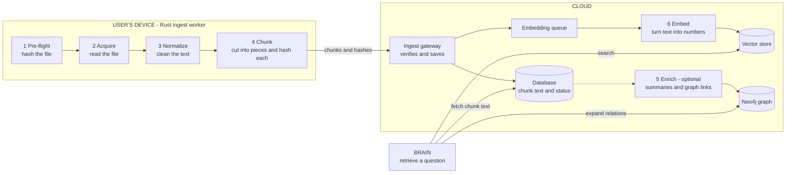

**One sentence version:** the device cuts and labels, the cloud verifies, embeds and stores, and the brain only ever *asks questions of the shelf*.

---

## 2. Who does what

| Role | Owns | Never does |
|---|---|---|
| **Ingest worker** (Rust, on device) | Stages 1 to 4: hash, read, clean, chunk. Sends chunks. Reports progress. | Embeds. Keeps a copy of user data. Asks the user questions. Calls `exit()`. |
| **Ingest gateway** (server) | Checks what the worker sends, saves chunk text, queues embedding, enforces limits | Trusts the worker blindly |
| **Embedding service** (cloud) | Turns chunk text into vectors, handles rate limits and retries | Chunking decisions |
| **Stores** | Database = source of truth for text. Vector store = fast search. Neo4j = relations. | |
| **Brain** | Retrieval: embed the question, search, return chunks with sources | Ingestion. Parsing files. |

---

## 3. Golden rules

1. **Chunking happens in the user's environment; embedding happens in the cloud.** They are separate jobs, so either can change without touching the other. ✅
2. **No prompts, no `exit()`.** The pipeline never asks the user a question mid-run and never kills the app. Every problem becomes a structured error. ✅
3. **Chunking must be deterministic.** Same file plus same rules gives exactly the same chunks. Everything else (change detection, dedup) depends on this. 💡
4. **Chunk text is saved in the cloud database.** It is the source of truth. Vectors can always be rebuilt from it. 💡
5. **One embedding model per collection.** Numbers from different models cannot be compared. 💡
6. **Ingestion is not a chat turn.** It does not use the ticket or session lock from Report 1. It has its own job lifecycle. 💡
7. **The worker keeps no copy of user content and needs no local database.** The server is the source of truth for "what is already ingested". ✅ (no local storage)

---

## 4. The 7 stages

Same 7 stages as your earlier spec. What changes is *where* each one runs.

| # | Stage | Plain meaning | Runs on | Language | v1 scope |
|---|---|---|---|---|---|
| 1 | **Pre-flight** | Hash the file. Ask the server "do you already have this exact version?" | Device | Rust | text and Markdown |
| 2 | **Acquire** | Read the bytes, check size, detect encoding | Device | Rust | text and Markdown |
| 3 | **Normalize** | Fix encoding, line endings, strip junk | Device | Rust | text and Markdown |
| 4 | **Chunk** | Cut into pieces, hash each piece, add labels | Device | Rust | text and Markdown |
| 5 | **Enrich** | Summaries, graph links (LLM work) | Cloud | Python | optional, after saving |
| 6 | **Embed** | Text into vectors | Cloud | Hosted API or your own small model | all |
| 7 | **Commit** | Verify, save text, save vectors, update manifest | Cloud | Python | all |

---

## 5. What survives from the old Ambassador spec

Your earlier spec (`02-ambassador-conveyor-architecture-specification.md`) ran everything *inside one Python program*. Now the work crosses a network, so some pieces change shape.

| Old idea | What happens to it |
|---|---|
| 7 stages | **Kept**, same names and order |
| Hash check first (PRE_FLIGHT) | **Kept**, now a question to the server |
| No UI printing inside core | **Kept**, and stronger: no UI in the worker either |
| Stage-aware error report (stage, item, exception) | **Kept**, sent to the server as an error event |
| Ambassador = one handler per file type | **Kept as a "Handler"**: Rust handlers for text and Markdown, Python handler for PDF later |
| Platform consciousness (how to show progress) | **Moved**: the worker sends progress events, each client decides how to display them |
| `@register_ambassador` decorator and `__orig_bases__` tricks | **Replaced** by a plain list of handlers in the Rust worker |
| Typed Python state bus passed between stages | **Replaced** by a small per-document struct inside the worker, and by **message schemas** between device and server |
| Engine calls `await handler(bus)` in one process | **Replaced** by messages over the network |

---

## 6. The messages between device and server 💡

Four messages, one direction each. All plain JSON (or an equivalent format).

| Message | From | Meaning |
|---|---|---|
| `StartIngest` | Worker | "I have this document. Here is its hash and the rule versions I used." |
| `Proceed` or `Skip` | Server | "Send it" or "I already have this exact version" |
| `ChunkBatch` | Worker | A group of chunks with their hashes |
| `Accepted` or `Rejected` | Server | Per batch, with a reason if rejected |
| `Finish` | Worker | "That was everything. Total chunks and a summary hash." |
| `Done` | Server | "Verified and saved" |

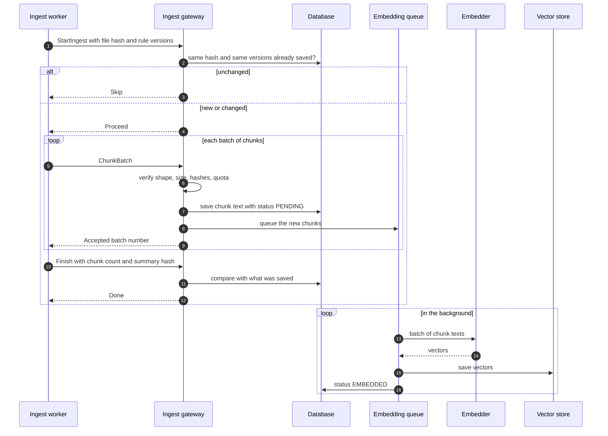

**Illustrative shape of a chunk** (names are proposals):

```json
{
  "document_id": "doc_123",
  "chunk_index": 4,
  "text": "…the chunk text…",
  "chunk_hash": "…hash of the normalized text…",
  "heading_path": ["Setup", "Install"],
  "start": 5120,
  "end": 6310
}
```

---

## 7. Hashes, change detection, and "don't redo work"

Three hashes, three jobs:

| Hash | Of what | Used for |
|---|---|---|
| **File hash** | The raw file bytes | "Has this file changed at all?" (stage 1) |
| **Chunk hash** | The normalized text of one chunk | "Do I already have an embedding for this exact text?" |
| **Manifest hash** | The ordered list of chunk hashes plus rule versions | "Did the worker send everything, in order?" |

**Rule versions** are stored with every document: `normalizer_version`, `chunker_version`, `handler_version`. If you improve the chunking rules, bump the version. Documents get re-chunked, but any chunk whose text did not change still has the same hash, so it **keeps its old embedding and costs nothing**.

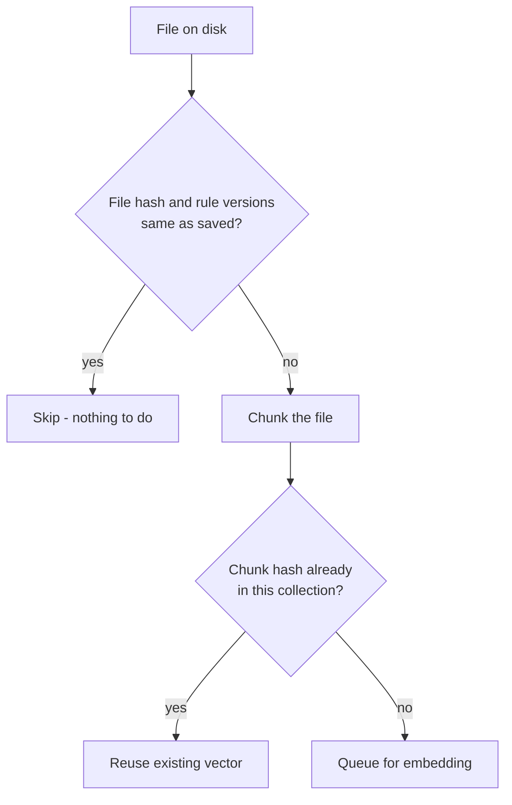

Notes 💡:

- Use a fast, standard hash such as BLAKE3 or SHA-256 (pick one and keep it).
- **Dedup only inside one user's collection**, never across users. Sharing across users leaks who has which text.
- Editing one paragraph of a long file re-embeds only the changed chunks.

---

## 8. Chunking rules for text and Markdown 💡

**Why chunk at all?** Search works best on small, focused pieces. A whole book as one vector is too vague.

**Sizes** (starting points to benchmark and tune, not magic numbers). The worker does not know the embedding model's tokenizer, so sizes use **characters**:

| Setting | Starting value |
|---|---|
| Target size | about 1,200 characters |
| Hard max | about 2,000 characters (server rejects bigger) |
| Overlap | about 150 characters, only when a section had to be split mid-way |

**Markdown** (split by structure first):

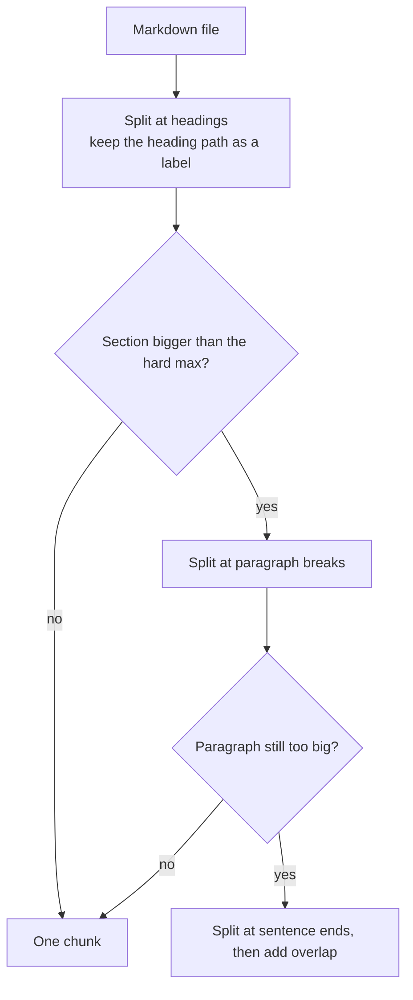

- Keep code blocks and tables whole where possible.
- Every chunk carries its `heading_path` (for example `Setup > Install`). This helps search and lets the brain show where an answer came from.

**Plain text:** split at blank lines (paragraphs), then sentences, with the same size rules.

**Normalization (stage 3):** fix invalid UTF-8, remove a leading BOM, unify line endings, apply a standard Unicode form, trim stray whitespace. Offsets in chunks refer to the *normalized* text.

---

## 9. How much should the server trust the worker?

This was the open question from earlier. My recommendation: **verify cheaply, don't re-do the work.**

**Why the risk is smaller than it sounds:** every user has their own collection. A bad or hacked device can only damage *its own user's* data, as long as per-user isolation is solid. The real risks are abuse (huge uploads, cost) and junk data, not "wrong chunks".

| Check | Always? |
|---|---|
| Text is valid UTF-8 and within size limits | ✅ always |
| `chunk_hash` matches the hash of the text (cheap to recompute) | ✅ always |
| Batch and total counts within the user's quota | ✅ always |
| Rate limit per user | ✅ always |
| Manifest hash matches the saved chunks at `Finish` | ✅ always |
| Re-chunk the document on the server and compare | ❌ not in v1 |
| Content safety scanning | ❓ open |

One more note: stored text can contain **prompt injection** ("ignore your instructions..."). That is true of any document store, so the brain must treat retrieved text as *data, not instructions*. Keep this in mind when you design the retrieval node.

---

## 10. Embedding service

Embedding is a **background job**, not part of the upload. The device is done as soon as chunks are accepted.

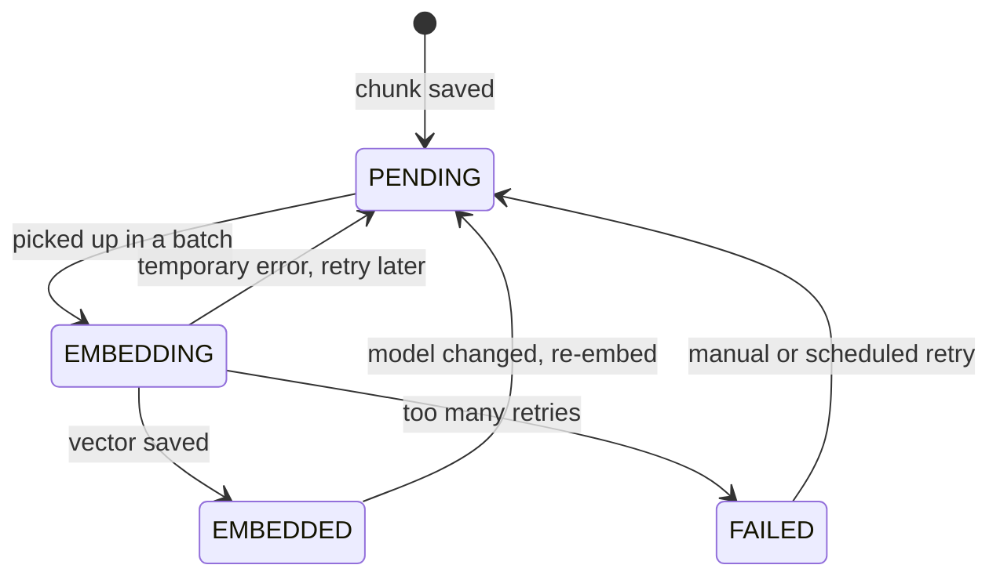

Rules 💡:

- **Batch** many chunks per request.
- **Rate limits:** when the provider says "too fast", pause and retry with growing waits (and a little randomness). Never drop chunks.
- **Fairness:** one user's big upload must not starve everyone else. Take turns between users.
- **Idempotent:** the chunk hash is the key, so retrying never creates duplicates.
- **Pinned model:** every collection saves `embedding_model_id` and `embedding_dim`. Changing the model means a re-embed job from the saved chunk text.

**Provider options** (❓ open):

| Option | Good | Watch out for |
|---|---|---|
| Hosted API with your key | Simplest | Cost, rate limits, chunk text goes to a third party |
| Hosted API with the user's own key | You don't pay, no shared rate limit | You must store keys safely (encrypted), or let them stay on the device only |
| Small model on your own server | No per-call fee, text stays with you | You run and scale it |

If you use a hosted API, **say so in your privacy policy.**

---

## 11. Storage

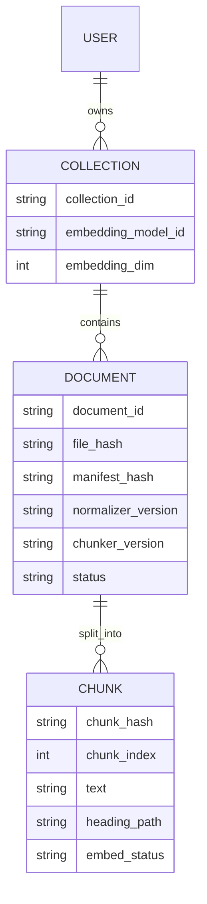

| Store | Holds | Why |
|---|---|---|
| **Database** | Chunk text, hashes, statuses, manifests | Source of truth. Everything can be rebuilt from this. |
| **Vector store** | Vector plus `chunk_id` plus small labels | Fast "find similar" search |
| **Neo4j** | Entities and relations, each linked back to a `chunk_id` | Follow relationships between ideas |

💡 Suggestion: Chroma is fine for local development; look at Qdrant (or similar) when you need a real multi-user server. ❓ Final choice is open.

💡 **Isolation:** each user gets their own collection or namespace. Filter every query by `user_id`. A bug that skips the filter would leak data, so test this on purpose.

---

## 12. Enrichment (stage 5, optional)

Summaries, tags and graph links come from LLM calls. They are slow, cost money, and can fail.

- Run **after** the chunks are saved, as a separate background job. ✅ for v1, skip it entirely if needed.
- A failure here **never** marks the ingest as failed.
- Every graph item points back to its `chunk_id`, so answers can show their source.
- Written in Python in the cloud.

---

## 13. Retrieval: how the brain asks

Single shot. One call in, results out. No questions to the user.

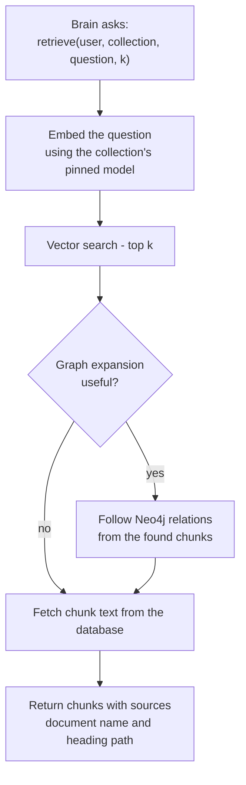

Rules 💡:

- **The question must be embedded with the same model as the collection.** Otherwise results are nonsense. If the user brings their own key, the question uses that key too.
- Return **source info** (document, heading path) with every chunk so the brain can cite it.
- Treat returned text as **data, never instructions**.
- Later options: keyword search alongside vector search ("hybrid"), and re-ranking.

---

## 14. Ingest job lifecycle and progress

An ingest job is like a download: it can be paused, resumed, or cancelled.

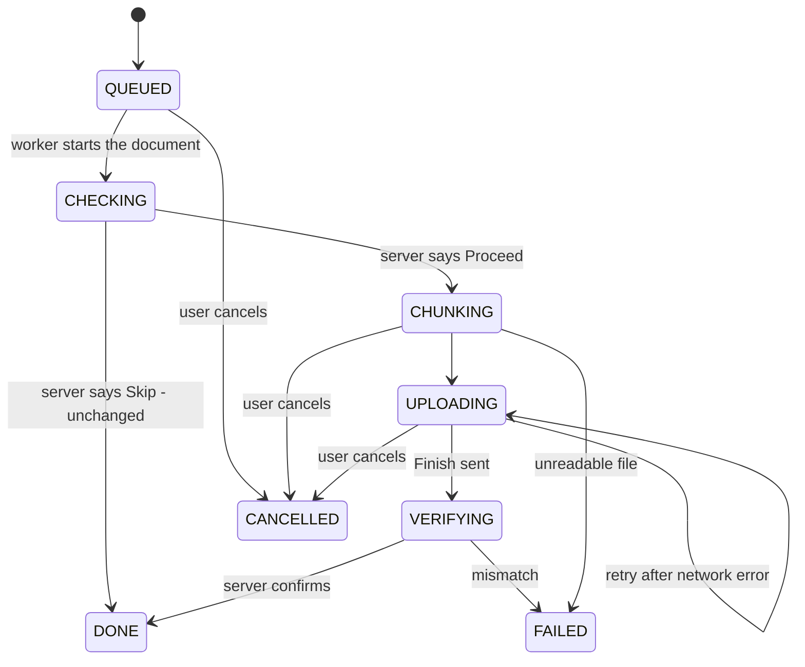

Embedding continues in the background after `DONE`. Progress is shown with events (names are proposals):

| Event | Meaning |
|---|---|
| `ingest_started` | Document accepted for processing |
| `doc_skipped_unchanged` | Nothing to do |
| `chunking_progress` | "120 of 300 chunks cut" |
| `batch_accepted` | Server saved a batch |
| `embedding_progress` | "250 of 300 chunks have vectors" |
| `ingest_done` | Document fully ingested |
| `ingest_error` | Stage, document, reason |

These events flow to the clients through the server, like the brain events in Report 1. Each client decides how to show them.

---

## 15. Resume, updates, and deletes

| Situation | What happens |
|---|---|
| App crashes mid-upload | On restart, the worker asks the server which batches it already has for that document, then sends the rest. Re-sending a batch is harmless because hashes make it idempotent. |
| File edited | New file hash, so it re-chunks. Only changed chunks get new embeddings. |
| File deleted | Worker sends a delete message. Server removes the chunks, vectors and graph links. |
| User deletes all their data | Cascade delete: documents, chunks, vectors, graph. Must be tested. |
| Chunking rules improved | Bump `chunker_version`. Documents re-chunk, unchanged chunks keep their vectors. |
| Embedding model changed | Re-embed job from the saved text. |

---

## 16. The Rust worker, inside

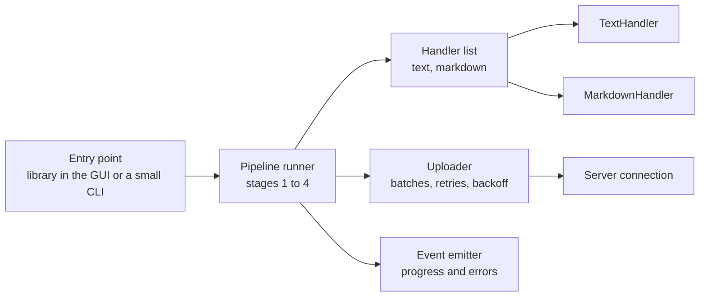

- **One `Handler` per file type.** Each handler knows how to read, clean and chunk its type. Adding PDF later means adding a handler, not rewriting the pipeline.
- **Handler list is written in code**, not discovered at runtime. Simple and checked by the compiler.
- **Likely crates** (verify before choosing): `tokio` (async), `reqwest` or `tonic` (network), `serde` (JSON), `blake3` or `sha2` (hashing), `pulldown-cmark` (Markdown), `unicode-normalization`.
- **No panics, no `exit()`.** Every failure becomes an error value that turns into an `ingest_error` event.
- **No local content storage.** Resume state comes from the server.
- The worker can be a **library inside your Slint app** or a standalone program. Same code, same protocol.

**Testing plan** 💡:

1. Build a **Python reference chunker** first.
2. Create a folder of sample files (the "golden fixtures") and save the expected chunks and hashes.
3. The Rust worker must produce **the same chunk hashes** on those files.
4. Run the same fixtures in CI so the two never drift.

This also gives you your benchmark: Rust vs Python speed and memory on the same files.

---

## 17. PDFs and other formats, later

You said PDFs will come later through Python. The worker already says which file types it can handle; everything else needs another route.

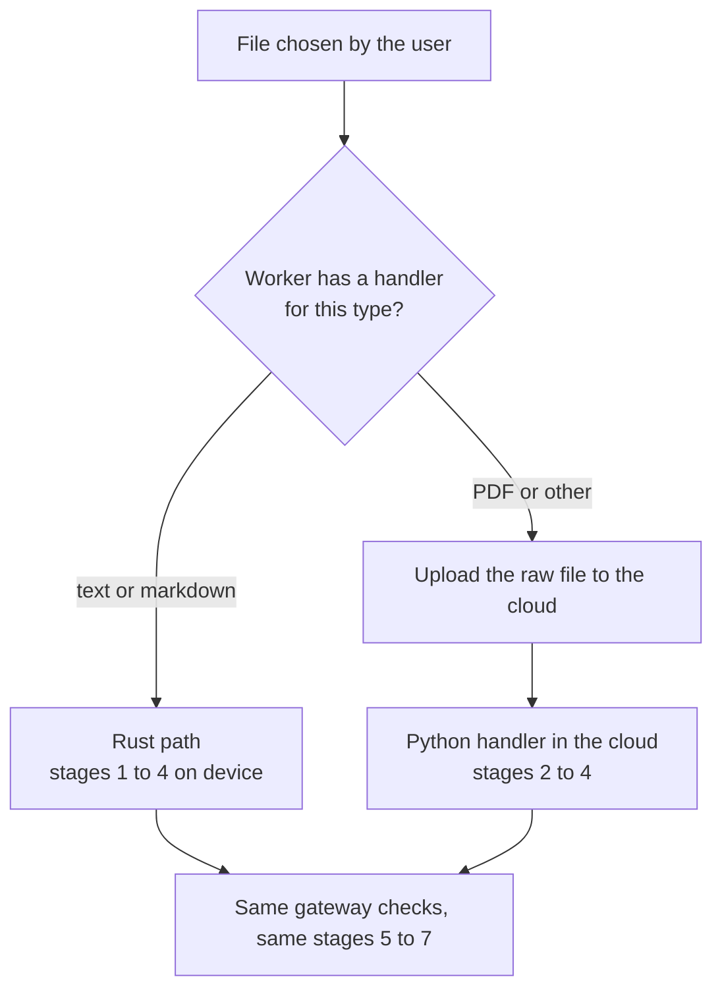

❓ **Open:** uploading the raw PDF means the *whole file* leaves the device, not just chunks. That is simple to build, but it must be clear in your policy. The other route (shipping a Python parser to the device) is much heavier. I would start with the upload route.

---

## 18. When things go wrong

| Problem | What the pipeline does |
|---|---|
| File unreadable or not valid text | Mark that document `FAILED` with a reason. **Keep going with other documents.** |
| Network drops during upload | Retry with growing waits. Resume from the last accepted batch. |
| Server rejects a batch | Report the reason as an event. Do not retry the same bad data forever. |
| Embedding provider rate-limits | Chunks stay `PENDING`, retry later with backoff. |
| Embedding provider is down | Same. Chunks wait. Ingest is still "done" from the user's point of view; search just lags. |
| Too many failed retries | Chunk becomes `FAILED`. Visible in a status view. Can be retried. |
| Enrichment fails | Ignore for ingest status. Try again later. |
| Hash mismatch at `Finish` | Document `FAILED`. Re-ingest. |
| Worker crashes | Next start resumes using the server's record. |

Every error carries: **stage, document, item index, reason.** This keeps the useful idea from your old `StageErrorContext`. (Smart recovery, such as a small model fixing a bad chunk, can come later.)

---

## 19. Legacy problems and how they are fixed

| Legacy problem (Report 01) | Fix |
|---|---|
| About 1 GB PyTorch just for similarity | No PyTorch anywhere. Embedding is a cloud job. |
| 16 CLI prompts halting the agent | None. Single shot, events only. |
| `exit()` killswitches | Structured errors. The app never dies because of one file. |
| Whole JSON rewritten on every change | Database rows, saved in batches |
| Embeddings recalculated on the fly | Computed once, stored, reused by chunk hash |
| Deprecated Google SDK | Embedding provider is behind a service. Use the current SDK if you pick Google. |
| Pipeline welded to the terminal | Events out, any client can display them |

---

## 20. Privacy and limits

(Not legal advice. Check the rules that apply to you before real users.)

- Chunk text is stored in your cloud. Say so plainly in your policy. ✅ decided
- If a hosted embedding API is used, **say that chunk text goes to that provider.**
- Training or improving models on user documents is **a separate purpose** and needs its own consent.
- Per-user quotas: maximum file size, documents, total chunks, upload rate.
- Encrypt in transit and at rest. If you store users' API keys, encrypt them, or keep them on the device only.
- Support delete-by-user and delete-by-document from day one.

---

## 21. What to measure

Don't guess performance. Write these down from real runs:

| Measure | Why |
|---|---|
| Chunking speed (files per second) in Python vs Rust | Is Rust worth it at your scale? |
| Worker memory use while chunking | Should stay small on user machines |
| Upload batch size vs speed | Find a good default |
| Embedding throughput and cost per million tokens | Plan your budget |
| Search quality on a small test set (does the right chunk appear in the top 5?) | Tune chunk size and overlap |

---

## 22. Build order

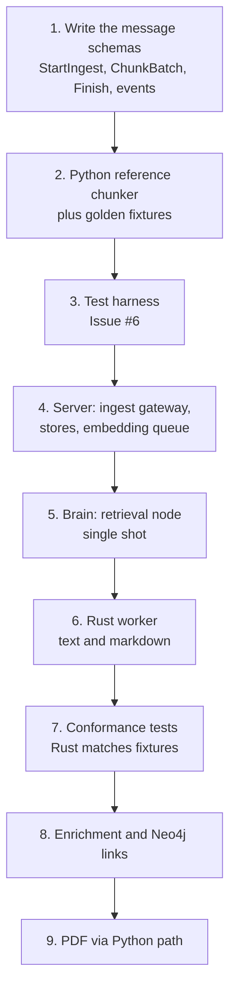

💡 Steps 1 to 5 work without Rust: the gateway can be fed by the Python reference chunker. That lets you test the whole system end to end, then swap the Rust worker in.

---

## 23. Decision log

| # | Decision | Status |
|---|---|---|
| 1 | Chunking runs in the user's environment (Rust worker, stages 1 to 4) | ✅ Decided |
| 2 | Embedding runs in the cloud, not on the device | ✅ Decided |
| 3 | v1 file types: plain text and Markdown | ✅ Decided |
| 4 | PDFs later, through a Python path | ✅ Decided |
| 5 | No local storage of user content on the device | ✅ Decided |
| 6 | Chunk text stored in the cloud database as source of truth | 💡 Proposed |
| 7 | Server verifies cheaply (shape, size, hash, quota), does not re-chunk | 💡 Proposed |
| 8 | Embedding runs as a background queue with retries | 💡 Proposed |
| 9 | One embedding model per collection, saved with the collection | 💡 Proposed |
| 10 | Dedup by chunk hash, inside one user only | 💡 Proposed |
| 11 | Python reference chunker plus golden fixtures first | 💡 Proposed |
| 12 | Embedding provider (hosted with your key, user's key, or own small model) | ❓ Open |
| 13 | Vector store for production (Chroma, Qdrant, other) | ❓ Open |
| 14 | PDF route: upload raw file to the cloud vs a helper on the device | ❓ Open (leaning upload) |
| 15 | Content safety scanning on uploads | ❓ Open |
| 16 | Collection granularity: one per user, or one per project/workspace | ❓ Open |
| 17 | Hybrid keyword plus vector search | ❓ Open (later) |

---

## 24. Plain-words glossary

| Word | Meaning |
|---|---|
| **RAG** | Find relevant pieces of the user's documents, then give them to the AI so it answers with real information |
| **Ingest** | Take a document in and prepare it for search |
| **Chunk** | A small piece of a document, stored and searched on its own |
| **Embedding / vector** | A list of numbers that captures the meaning of a text |
| **Collection** | One user's set of documents and vectors, tied to one embedding model |
| **Hash** | A short fingerprint of some data. Same data gives the same fingerprint. |
| **Manifest** | The ordered list of a document's chunk hashes |
| **Handler** | The code that knows how to read and chunk one file type |
| **Worker** | A program that does a heavy job when asked (here: ingesting on the device) |
| **Idempotent** | Doing it twice has the same effect as doing it once |
| **Golden fixtures** | Sample files with saved "correct" results, used to test that two implementations agree |
| **Rate limit** | A provider's cap on how fast you can send requests |
| **Prompt injection** | Text in a document that tries to give the AI orders |

---

## 25. Next steps

1. Decide the ❓ items that block early steps: embedding provider (#12) and collection granularity (#16).
2. Write the message schemas (step 1 of the build order) before any code. They are the contract everything else depends on.
3. Build the Python reference chunker with 10 to 20 golden fixture files.
