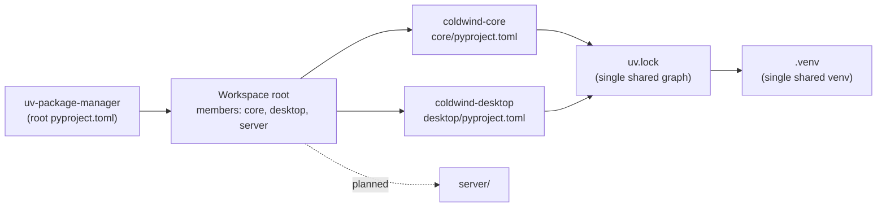

# UV Package Manager

## Domain

- **shared** — uv workspace and dependency management is cross-domain glue: it configures `core`, `desktop`, and the planned `server` equally. This is the only system whose reports live entirely in `shared/`.

## Overview

The essentials-only **uv curriculum for Cold Wind AI**. This is not a general uv tutorial — every lesson is grounded in this repository's real files: the root `pyproject.toml` (workspace declaration), `core/pyproject.toml` and `desktop/pyproject.toml` (member definitions), and `uv.lock` (the single resolved graph).

Six domains, taught in strict dependency order — each domain only uses vocabulary a previous domain already taught:

| # | Domain | What you learn | Status |
|---|--------|----------------|--------|
| 0 | Packaging Foundations | virtualenv, site-packages, wheel vs sdist, editable install, `.pth` files, namespace packages — the invisible vocabulary everything else needs | ✅ Published |
| 1 | uv Setup & Bootstrap | installing uv, `uv init` vs converting an existing pip project | ✅ Published |
| 2 | Dependency Lifecycle | `uv add` vs `uv pip install`, `uv sync`, `uv run`, `uv remove` — which file each touches | ✅ Published |
| 3 | pyproject.toml Deep Dive | `[project]`, `[build-system]`, hatchling, `src = ""`, entry points, `[tool.*]` tables | ✅ Published |
| 4 | Lockfile Mechanics | `uv.lock` anatomy, `uv lock` vs `uv sync`, upgrading one package, untangling resolver conflicts | ✅ Published |
| 5 | uv Workspace (capstone) | `[tool.uv.workspace]` members, `[tool.uv.sources]`, shared `.venv`, how `coldwind-core` binds to `desktop` | ✅ Published |

## Interdependence Map

## Ownership Table

| Domain | Folder | Files | Documents |
|--------|--------|-------|-----------|
| shared | [`shared/`](shared/) | [`01-packaging-foundations.md`](shared/01-packaging-foundations.md) | Packaging Foundations: virtualenv, wheels, editable installs, `.pth` pointers, namespace packages |
| shared | [`shared/`](shared/) | [`02-uv-setup-bootstrap.md`](shared/02-uv-setup-bootstrap.md) | uv Setup & Bootstrap: what uv replaces, `uv init`, pip→uv conversion |
| shared | [`shared/`](shared/) | [`03-dependency-lifecycle.md`](shared/03-dependency-lifecycle.md) | Dependency Lifecycle: `uv add` triple-write vs `uv pip install` cash sale, eviction trap, `uv run` |
| shared | [`shared/`](shared/) | [`04-pyproject-deep-dive.md`](shared/04-pyproject-deep-dive.md) | pyproject Deep Dive: ID card / builder / config parking lot, hatchling, full `src = ""` decode |
| shared | [`shared/`](shared/) | [`05-lockfile-mechanics.md`](shared/05-lockfile-mechanics.md) | Lockfile Mechanics: real `uv.lock` anatomy, lock verbs, single-package updates, conflict protocol |
| shared | [`shared/`](shared/) | [`06-uv-workspace.md`](shared/06-uv-workspace.md) | uv Workspace capstone: members, sources, shared venv, the birth of `server/`, end-to-end boot |

## Index

- [Domain 0 — Packaging Foundations](shared/01-packaging-foundations.md) — where libraries live, what a wheel is, how editable installs and `.pth` pointers work (including this repo's real `.pth` mispointing bug), and how `coldwind.*` namespace packages stay one family across separate folders.
- [Domain 1 — uv Setup & Bootstrap](shared/02-uv-setup-bootstrap.md) — what uv replaces, installing it, `uv init` flavors, and the pip→uv conversion this repo actually took.
- [Domain 2 — Dependency Lifecycle](shared/03-dependency-lifecycle.md) — `uv add` (triple write) vs `uv pip install` (cash sale + eviction trap), `uv sync`, `uv run`, and the decision table.
- [Domain 3 — pyproject.toml Deep Dive](shared/04-pyproject-deep-dive.md) — every section of the repo's pyprojects: `[project]` ID card, hatchling contractor, the `src = ""` fix fully decoded, and the `[tool.*]` parking lot (including what lint is).
- [Domain 4 — Lockfile Mechanics](shared/05-lockfile-mechanics.md) — real `uv.lock` anatomy (manifest, hashes, editable entries), the lock verbs, single-package upgrades, and the resolver-conflict protocol.
- [Domain 5 — uv Workspace (capstone)](shared/06-uv-workspace.md) — one repo / one lock / one venv: workspace roster, `sources` routing, the birth recipe for `server/`, and the end-to-end boot trace.

All six domains are published. Reading order is 0 → 5; each domain only uses vocabulary its predecessors taught.
