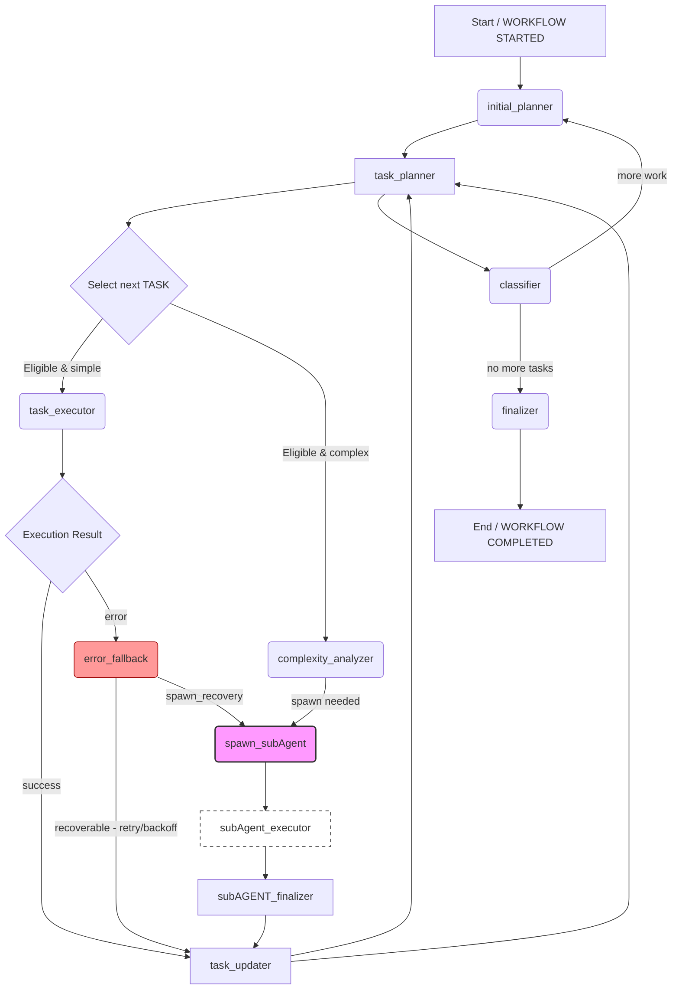

Agentic Orchestrator — Documentation

Overview
--------
The Agentic Orchestrator package implements a hierarchical multi-agent workflow used by Agent Mode (/agent). It provides:
- A planner that decomposes high-level goals into executable tasks.
- A complexity analyzer that decides whether to execute a task directly or spawn a scoped sub-agent to decompose and handle it.
- A robust spawning system for sub-agents, with parent/child task tracking and final aggregation.
- Error recovery including retries, backoff, and the ability to spawn recovery sub-agents for complex failures.
- Built-in synthesis tools to combine results from multiple tasks into a final consolidated response.

This README documents the package contents, runtime data shapes, node catalog and responsibilities, observability events, failure/retry policies, and recommended operational practices to ensure maintainability and safe operation.

Package contents
----------------
- AgentGraphCore.py — Core orchestrator that implements the main workflow loop, task models, helper utilities, and synthesis logic.
- hierarchical_agent_prompts.py — Depth-aware prompt templates used by planner, sub-agent nodes, synthesis and validators.
- __init__.py — Package entry file.

Node catalog (explicit)
------------------------
This catalog lists the primary nodes used by the orchestrator. Each node is described with purpose, inputs, outputs and preconditions.

- initial_planner
  - Purpose: Accept the original user goal and decompose it into a first set of TASKs.
  - Inputs: workflow original_goal, optional user context.
  - Outputs: TASK list injected into workflow state.
  - Preconditions: WORKFLOW_STATUS == 'STARTED'.

- complexity_analyzer
  - Purpose: Analyze a TASK and decide whether to execute directly or spawn a sub-agent.
  - Inputs: TASK.description, tool schemas, heuristics (token cost, time estimate).
  - Outputs: decision (execute | spawn) and recommended tool list.
  - Preconditions: invoked by task_executor before execution.

- task_executor
  - Purpose: Execute atomic tasks by invoking tools or calling the LLM for synthesis.
  - Inputs: TASK.execution_context (tool_name + parameters), recommended tool list.
  - Outputs: TASK.execution_context.result, status updates.
  - Preconditions: TASK.status in {pending, in_progress} and persona indicates execution.

- spawn_subAgent
  - Purpose: Create a sub-agent (scoped workflow) for complex tasks; inject sub-tasks and track parent->child relationship.
  - Inputs: parent TASK, sub-agent persona, decomposition strategy.
  - Outputs: new TASKs appended to workflow.tasks with parent_task_id set; returns subagent_id.
  - Preconditions: complexity_analyzer decided to spawn.

- subAgent_executor (sub-agent runtime)
  - Purpose: Run tasks within the sub-agent scope; mirrors task_executor logic but scoped by subAgent_id.
  - Inputs/Outputs: same shapes; subAgent context tracked on TASK.subAgent_context.

- task_updater
  - Purpose: Apply result to TASK (status, execution_context.result) and update workflow.
  - Inputs: a TASK with new result.
  - Outputs: updated workflow tasks, executed_nodes list.

- task_planner
  - Purpose: Choose the next pending task and manage parent-child relationships (mark parent complete when children done).
  - Inputs: workflow.tasks and current_task pointer.
  - Outputs: sets CURRENT_TASK_ID and possibly triggers planner actions.

- classifier
  - Purpose: When no pending tasks remain, classify whether more work is needed, or the workflow should finalize.
  - Inputs: final task results, workflow status.
  - Outputs: either triggers new planning cycle or passes to finalizer.

- error_fallback
  - Purpose: Handle repeated failures on a TASK. May perform retries, exponential backoff, or spawn recovery sub-agent.
  - Inputs: TASK.failure_context, fail_count.
  - Outputs: recovery actions, updated next_attempt_at, or spawn instructions.

- finalizer
  - Purpose: Produce the final consolidated response using synthesis of task results and perform any final cleanup.
  - Inputs: all TASK.execution_context.result items, workflow.original_goal.
  - Outputs: final_response and workflow status = COMPLETED/FAILED.

### Visual Flow (Mermaid)

Below is a visual representation of the orchestrator routing and spawning lifecycle. This diagram helps illustrate the normal execution path, the spawn/rejoin cycle for sub-agents, and the error/fallback branch.

Notes on diagram:
- Sub-agent execution is shown as a separate, scoped executor with its own finalizer; the parent task waits until children are reconciled via task_updater.
- Error fallback can either retry with backoff or route to spawning a recovery sub-agent depending on policy mapping.
- The diagram omits maintenance tasks (checkpointing, metrics) for clarity; those are periodically invoked by the router as maintenance steps.

### Routing Logic — design and operation

Why routing logic exists
-----------------------
The orchestrator is a hierarchical, stateful workflow that must reliably coordinate many moving parts (planners, executors, sub-agents, error handlers). Routing logic is the deterministic decision layer that maps the current workflow state to the next node to execute. It exists to:
- Ensure repeatable, auditable behavior (so the same workflow state leads to the same next action).
- Encapsulate policy decisions (when to spawn sub-agents, when to retry, when to finalize).
- Separate orchestration concerns from tool implementations so tools remain stateless and interchangeable.

Core principles
---------------
1. State-first determinism: routing decisions are derived exclusively from the workflow state model (WorkflowStateModel / TASK objects) and configured policies; no hidden side-effects.
2. Idempotency-aware actions: routing must prefer idempotent transitions or use locks to ensure actions are not executed twice.
3. Minimal surprise: the routing layer emits explicit events and reasons for each transition to aid observability and debugging.
4. Persona-driven routing: personas (e.g., AGENT_PERFORM_TASK) act as role hints to choose node behavior and permission scopes.

High-level state machine
------------------------
Routing is implemented as a state-machine over the workflow state. At each scheduling tick (or event), the router evaluates nodes in priority order to decide which node should run next. The generic priority order looks like:

1. Finalization check (are we done?)
2. Error handling escalation (tasks needing immediate fallback)
3. Task execution (pending tasks eligible by backoff/timeouts)
4. Planner/classifier (when no pending tasks exist)
5. Maintenance tasks (checkpointing, metrics)

Selection algorithm (pseudocode summary)
---------------------------------------
1. If workflow.workflow_status in {COMPLETED, FAILED} → route to finalizer.
2. If any TASK has failure_context and fail_count > threshold and error_fallback conditions met → route to error_fallback for that task.
3. Filter TASKS where status in {pending, in_progress} and now >= next_attempt_at (if set) and depth <= max_depth.
4. Sort eligible tasks by priority rules (explicit priority field if present, then depth ascending, then creation timestamp).
5. Pick top task and route to task_executor; if complexity_analyzer deems it complex, route to spawn_subAgent instead.

Persona-driven routing
----------------------
Personas add routing context and intent: a task executed under AGENT_PERFORM_ERROR_FALLBACK will prefer safer tools and recovery workflows; tasks with AGENT_SUBAGENT persona are restricted to sub-agent scoped resources. The router enforces persona-specific heuristics (e.g., sub-agent resource caps).

Spawn and sub-agent routing
---------------------------
- On spawn decision: the router injects sub-task entries with parent_task_id and depth incremented.
- The router then schedules subAgent_executor tasks under the sub-agent persona; those tasks are logically grouped by subAgent_id.
- The parent remains in 'in_progress' until the router confirms all child tasks finished (successful or accepted failed state) and then the parent can transition.
- Rejoin is explicit: when all child tasks complete, router triggers a reconciliation step (task_updater + task_planner) to aggregate results and update parent status.

Error handling and fallback
---------------------------
Routing includes an error policy evaluation step:
- For each failed task, map error type → policy (retry with backoff, spawn recovery, escalate to human, mark failed).
- If policy is 'retry', router sets next_attempt_at = now + base * (2 ** (fail_count-1)).
- If policy is 'spawn_recovery', router will route to spawn_subAgent with a recovery persona and limited resources.

Concurrency & locking considerations
-----------------------------------
- The router is safe to run in a single coordinator process. For multi-worker setups, you must ensure atomic task claims (DB row lock or distributed lock) to prevent duplication.
- Recommended pattern for multi-worker operation:
  - Use an atomic compare-and-swap on TASK.status when claiming a task (pending -> in_progress) in the backing store.
  - Use a short-lived lease token and renew on heartbeat; release the token on completion/failure so other workers can pick up the task.
  - Avoid float IDs; use string-path IDs for deterministic ordering and to avoid numeric precision issues.

Observability hooks
-------------------
Every routing decision should emit an event with:
- routing_decision: {workflow_id, chosen_node, reason, task_id (if any), persona}
This allows external systems to reconstruct exactly why a particular node was executed and trace failures.

Instrumentation & metrics
-------------------------
Track the following metrics exposed by the router:
- queue_length (pending tasks)
- active_tasks (in_progress)
- failed_tasks (fail_count > 0)
- subagents_active
- average_task_latency

Security and safety checks performed during routing
--------------------------------------------------
- Enforce list_allowed_directories for filesystem tasks prior to scheduling task_executor for file operations.
- Apply a denylist for dangerous tool names unless explicitly enabled in .mcp.json for a given environment.
- Enforce per-task resource/timeouts: if a task exceeds its timeout, mark it failed and route to error_fallback.

Spawning lifecycle & parent-child semantics
-----------------------------------------
- Spawn decision: complexity_analyzer evaluates the TASK and if it decides to decompose, spawn_subAgent is called.
- Injection: spawn_subAgent injects new TASKs with parent_task_id set to the parent task id and an increased depth value.
- Parent state: parent TASK remains in status 'in_progress' while child TASKs are pending; parent only transitions to 'completed' when all child TASKs are completed (or marked failed with acceptable fallback).
- Reconciliation: when child tasks finish, task_planner reconciles results and updates parent; if children fail, error_fallback can attempt recovery or escalate.

Backoff & retry semantics
-------------------------
- Each TASK has max_retries and failure_context.fail_count. When a failure occurs:
  - Update failure_context with last failure info, increment fail_count.
  - Compute next_attempt_at using exponential backoff formula: next = now + base * (2 ** (fail_count - 1)) (configurable base in settings).
  - If fail_count > max_retries → trigger error_fallback which may spawn a recovery sub-agent or mark the task failed.
- Ensure task selection logic respects next_attempt_at and will skip tasks until the cooldown expires.

Persistence and checkpointing
-----------------------------
For production reliability, the workflow state should be checkpointed periodically and on critical state changes. Recommendations:
- WorkflowStateModel.save_checkpoint(path) — serialize to JSON atomically (write to tmp file then atomic move).
- Include a schema_version field in the checkpoint for migration compatibility.
- On startup, provide a restore path to resume incomplete workflows.

Observability & events
----------------------
Emit structured events for tracing and debugging. Recommended event list and sample payload fields:

- task_started
  {"event":"task_started","workflow_id":"wf-...","task_id":"1","node":"task_executor","timestamp":"...","persona":"..."}

- task_succeeded
  {"event":"task_succeeded","workflow_id":"...","task_id":"1","result_summary":"...","duration_ms":123}

- task_failed
  {"event":"task_failed","workflow_id":"...","task_id":"1","error":"TimeoutError","fail_count":2}

- subagent_spawned
  {"event":"subagent_spawned","workflow_id":"...","subagent_id":"1.1","parent_task_id":"1","tasks_count":3}

- workflow_checkpoint
  {"event":"workflow_checkpoint","workflow_id":"...","path":"...","timestamp":"..."}

- workflow_finalized
  {"event":"workflow_finalized","workflow_id":"...","status":"COMPLETED","final_response_length":1024}

Include correlation identifiers: workflow_id, trace_id, and task_id. Send events to logging system, Sentry, or a metrics backend.

Tool schema & validation
------------------------
- Each tool should expose an argument schema. Use get_tool_argument_schema(tool) to retrieve the schema and validate tool results accordingly.
- Before accepting a tool output as authoritative, validate it against the expected schema; invalid outputs should trigger a retry or invoke a fallback tool.

Synthesis & LLM calls
---------------------
- perform_internal_synthesis currently calls the default ModelManager synchronously. For long-running workflows you should: 
  - Support async/streaming LLM calls.
  - Catch rate-limit and timeout exceptions and implement structured fallback (retry with backoff, smaller prompt, or partial synthesis).
  - Use a configurable timeout and fall back to a reduced-scope synthesis if the full synthesis fails.

Error classification & policies
-------------------------------
Define an error-policy mapping in configuration that maps error types (Timeout, RateLimit, BadResponse, PermissionError) to actions (retry, spawn_recovery, escalate, mark_failed). Keep the mapping editable via settings and expose a default conservative policy.

Testing guidance
----------------
Unit tests to add:
- ID generation and sorting tests for string-path IDs.
- next_attempt/backoff enforcement.
- spawn_subAgent parent-child lifecycle (parent waits until children complete).
- Tool recommender returns only allowed tools and respects virtual tools.

Integration tests:
- Complete workflow test using mock ModelManager and mock tool servers (filesystem, memory): initial_planner -> spawn_subAgent -> subagent completes -> finalizer.
- Failure injection tests: simulate tool failures and assert error_fallback behavior.

Security & sandboxing
---------------------
- Tool execution must be sandboxed. Recommended practices:
  - Limit filesystem roots via list_allowed_directories and enforce them in filesystem wrapper.
  - Run shell or untrusted tools in restricted environments or containers. Avoid passing user-supplied strings to shell without sanitization.
  - Protect secrets: do not log raw tokens; use masked logging for secrets.

Prompts & templates
-------------------
- hierarchical_agent_prompts.py contains depth-aware prompt templates used by planner and sub-agents. Keep prompts strict (provide clear output format, JSON schema) to avoid unpredictable LLM outputs.
- Example prompt responsibilities:
  - complexity analysis prompt
  - parameter generation prompt
  - synthesis prompt (used by perform_internal_synthesis)

Implementation TODOs (recommended code changes)
----------------------------------------------
- Add checkpoint save/load methods to WorkflowStateModel and call them periodically.
- Add task-level locking or adopt an external datastore with atomic update semantics for multi-worker setups.
- Add configurable constants in settings (DEFAULT_BACKOFF_BASE_SECONDS, DEFAULT_MAX_CONCURRENT_SUBAGENTS, DEFAULT_TASK_TIMEOUT).

Example end-to-end sample (brief)
---------------------------------
1. User: "/agent find and save top 3 Python tutorials"
2. initial_planner creates TASKs: ["search tutorials", "evaluate results", "save best link to file"].
3. complexity_analyzer marks "evaluate results" as complex → spawn_subAgent for deeper analysis.
4. sub-agent runs its tasks and returns synthesized summary.
5. Parent task completes after children finish; finalizer synthesizes the complete answer and returns to user.

Contact & maintenance notes
---------------------------
- Keep the prompt templates and tool schemas in source control and review them with any model changes.
- When adjusting the ID scheme or checkpoint format, bump the workflow checkpoint schema_version and document migration steps in reports/MIGRATION_GUIDE.md

If you want, I can now:
- 1) Add the Node Catalog as a mermaid flowchart and update README (visual flow). (I can insert the mermaid diagram into this same README file.)
- 2) Implement a Spawn_subAgent helper (code + tests) and ID helpers (string-path ID generator) in AgentGraphCore.py and add unit tests.
- 3) Add save/load checkpoint helpers to WorkflowStateModel in AgentGraphCore.py (and tests).

Which of the above (1/2/3 or combination) should I implement next? I will proceed immediately and make the code+documentation changes and run validations/tests as required.
